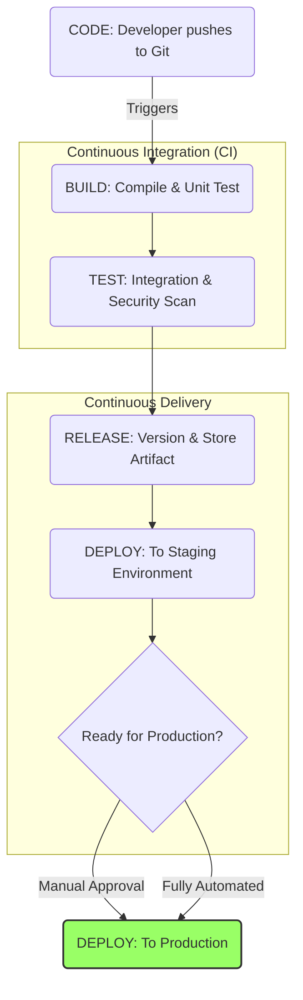

#DevOps #Process #Release #Deployment #CI #CD #CICD

>  The **[[RELEASE]]** phase is the bridge between a successfully **[[The TEST Phase|tested]]** application and its deployment to users. It involves versioning the artifact, storing it in a central repository, and orchestrating its promotion through various environments via a **[[CI]]**/**[[CD pipeline]]**.

---

> [!note] The Core Analogy: The Certified and Packaged Module
> The prefabricated bathroom module has passed all its crash tests.
> -   It is now assigned an official version number (e.g., `v2.1.3`) and a serial number.
> -   It's shrink-wrapped and placed in a secure warehouse (**the artifact repository**) alongside all other certified modules.
> -   The foreman now has a release plan, which details the exact, automated steps to deliver and install this module into a customer's house (**the deployment plan**).

---

## The Heart of the Release: CI/CD

This is the central, orchestrating concept that defines modern software delivery.

-   **`CI` (Continuous Integration):**
    > The practice of developers merging their code changes into a central repository frequently. Each merge triggers an automated **[[The BUILD Phase|build]]** and **[[The TEST Phase|test]]** sequence.
    -   **Goal:** To detect integration issues as early and as quickly as possible.

-   **`CD` (Continuous Delivery vs. Continuous Deployment):**
    > An extension of CI that automates the entire software release process.

    -   **Continuous Delivery:** Every change that passes all automated tests is automatically prepared and delivered to a "staging" environment. The final deployment to **production** is a **manual, one-click button push**. This allows for a final human check or for business-timed releases.
    -   **Continuous Deployment:** The ultimate level of automation. Every single change that passes all stages of the pipeline is **automatically deployed to production** without any human intervention. This is the goal for high-velocity teams.

### The CI/CD Pipeline Visualized

---

## Common Tools of the Trade

These are the orchestration engines that run the CI/CD pipelines.

-   **[[Jenkins]]** The original, highly extensible, and still one of the most popular open-source automation servers.
-   **[[GitLab CI]]**/**[[CD]]:** A powerful and tightly integrated CI/CD tool that is part of the GitLab platform.
-   **[[GitHub Actions]]** A modern, flexible, and very popular CI/CD solution that lives directly within GitHub.
-   **[[CircleCI]]** A popular cloud-based CI/CD platform.
-   **[[Argo CD]]** A declarative, GitOps continuous delivery tool specifically for Kubernetes.

---

## Why This Matters to a Developer

The release pipeline is not just an "ops" concern. As a developer, you are a primary user and beneficiary of a well-oiled CI/CD process.

-   **✔️ Automates Toil and Reduces Human Error:** A CI/CD pipeline automates the repetitive, boring, and error-prone tasks of building, testing, and preparing an application for release. This frees you up to focus on what you do best: writing code and solving problems. It also ensures that the release process is consistent and repeatable every single time.

-   **✔️ Faster Feedback and Higher Velocity:** Continuous Delivery dramatically shortens the "code to customer" cycle. Instead of waiting for a massive, quarterly "release day," your features can be delivered to users as soon as they are ready. This creates a tight feedback loop, allowing you to iterate quickly, validate your work with real users, and deliver value faster.

-   **✔️ Increased Confidence and Lower Risk:** By automating the entire process and having a series of quality gates (build, unit tests, integration tests), you have much higher confidence that what you are releasing is stable. The risk of each release is also much lower, as you are deploying small, incremental changes instead of a massive "big bang" release with hundreds of new features.