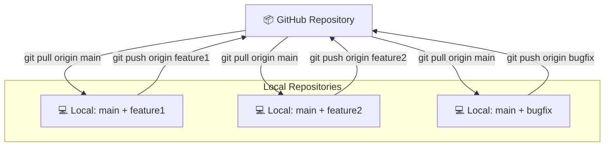

#Git #GitHub #VCS #CoreConcept #Collaboration

>  **[[Git]]** is the version control tool you run on your computer to track changes. **GitHub** is the website where you store your Git projects online to share them and collaborate with others. They are not the same thing.

This is a very common point of confusion. Let's make the difference crystal clear.

---

## 💻 Git: The Local Tool

**Git is the software, the version control system itself.**

-   **What it is:** A command-line tool that you install and run on your local machine.
-   **Where it runs:** On your laptop or desktop.
-   **Internet Required?** ❌ **No.** You can use Git to track the entire history of a project on your machine without ever connecting to the internet.
-   **Account Required?** ❌ **No.** It's just a program, like a text editor or a calculator.

> [!tip] Analogy: Microsoft Word
> Git is like the Microsoft Word application on your computer. You use it to create and edit documents (`.docx` files) locally.

---

## ☁️ GitHub: The Cloud Service

**GitHub is a service, a platform for hosting and collaborating on Git projects.**

-   **What it is:** A website (and a company, now owned by Microsoft) that provides cloud hosting for Git repositories.
-   **Where it runs:** In the cloud, accessed via your web browser.
-   **Internet Required?** ✅ **Yes.** You need an internet connection to interact with GitHub.
-   **Account Required?** ✅ **Yes.** You need to sign up for a GitHub account.

> [!tip] Analogy: Google Docs
> GitHub is like Google Docs. It's a platform that takes your Word documents and stores them online, allowing you to share them, see revision history, and let multiple people edit them at the same time.

---

## 🤝 How They Work Together: The Collaboration Loop

GitHub is designed to be the central hub for your Git projects, enabling collaboration. You work locally with Git, and then use GitHub to sync your work with your team.

1.  I work on my project locally using **Git** to create [[Commits]].
2.  When I'm ready to share my work, I "push" my changes to **GitHub**.
3.  My collaborators can then "pull" my changes from **GitHub** down to their own local machines.
4.  They make their own changes locally using **Git** and then "push" them back up to **GitHub**.
5.  I can then "pull" their contributions down to my machine, and the cycle continues.

---

> [!summary] The Key Takeaway
> **GitHub is built *on top of* Git.** You cannot use GitHub effectively without first understanding how Git works.
>
> You can be a proficient Git user your entire life and never touch GitHub, managing all your projects locally. However, the moment you want to collaborate with others or back up your code online, a service like GitHub becomes essential.
>
> In this course, we will learn **Git first**, and then we will learn the **GitHub workflow** for collaboration.