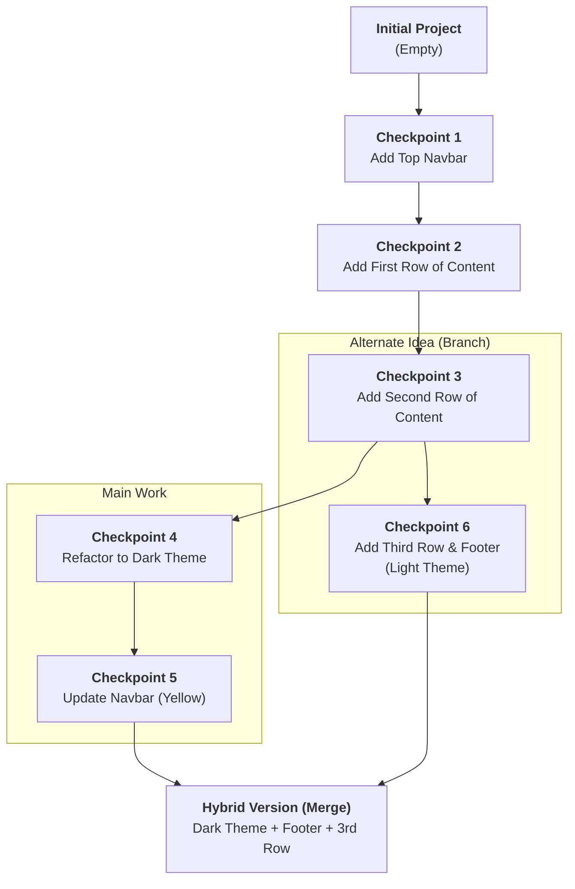

#Git #VCS #CoreConcept #Workflow

>  Git lets you save "checkpoints" (called **[[Commits]]**) of your project's history. This allows you to "time travel" to old versions, undo mistakes, experiment safely on alternate timelines (**[[Branches]]**), and combine work from multiple people (**[[Merging]]**).

---

## The Core Superpowers of Git

Git provides a set of powerful features that address the fundamental challenges of working on any project, especially in a team.

-   💾 **Track Changes:** Records the history of every file in your project.
-   ⚖️ **Compare Versions:** Allows you to see the exact differences between any two checkpoints in your history.
-   ⏳ **Time Travel:** Instantly revert your entire project or individual files back to any previous state.
-   🤝 **Collaborate & Share:** This is arguably the most important feature. Git is designed from the ground up to facilitate collaboration, allowing teams to work on the same codebase simultaneously and merge their changes together seamlessly.

---

## Understanding Git Through Analogies

### 🎮 The Video Game Save Point
The simplest way to think about Git is like a video game with a save system.

> [!tip] Analogy: The Checkpoint
> Using Git is like creating **save points** for your project. You work for a bit, reach a good state, and you create a save. If you then proceed to fight a difficult boss (or write some risky code) and fail spectacularly, it's no problem. You can simply reload from your last save point and try again, without losing all your progress.

### 📝 The Messy Essay Folder
Before version control, managing different versions of a document was a manual, chaotic process.

> [!danger] The Old Way
> You've likely done this before: `essay_v1.doc`, `essay_final.doc`, `essay_final_FOR_REAL.doc`, `essay_final_print_this_one.doc`. This is a primitive, error-prone form of version control. It's unmanageable at scale.

> [!success] The Git Way
> Git manages all these versions neatly within a single project folder. You have one "final" version (your current working files), but Git holds the entire history of every "Save As" you've ever made, allowing you to access and compare them at any time.

---

## A Realistic Workflow: The "Checkpoint" System

Let's visualize a more realistic development process for a website. In Git, these "checkpoints" are officially called **[[Commits]]**.

### 1. Making Progress and Saving Checkpoints
As you build the website, you periodically save your work by creating checkpoints (commits). Each checkpoint has a descriptive message explaining the change (`Add Top Navbar`, `Add First Row`, etc.). This creates a linear history of your progress.

### 2. Handling Feedback and "Time Traveling"
Imagine you show your boss the yellow navbar (Checkpoint 5) and they hate it. No problem. With Git, you can instantly revert your project back to any previous checkpoint, like Checkpoint 3, before the dark theme was ever introduced. The work isn't lost, it's just part of the history you can revisit later.

### 3. Branching: Creating an Alternate Timeline
This is where Git's true power shines. Instead of just going back in time, you can go back to Checkpoint 3 and start a *new, parallel line of development*. This is called creating a **[[Branch]]**.

-   Your "Dark Theme" work still exists safely on its own branch.
-   You can now create a new branch to continue adding features (like the footer and third row) based on the original light theme.

You now have two co-existing versions of your website that you can switch between instantly.

### 4. Merging: Combining Timelines
What if your boss likes the new content from the light theme branch, but also decides they like the dark theme after all? Git allows you to **[[Merging|merge]]** these two separate branches.

Git will intelligently combine the changes: it takes the new content (footer, third row) from one branch and the new styling (dark theme) from the other, creating a single, hybrid version that has the best of both worlds.

---

> [!summary] The Real World: Scaling Collaboration
> Now, imagine this isn't just you. It's a team of 100 developers. Each developer can create their own branch to work on a new feature in isolation. When their feature is complete and approved, they merge it back into the main project. Git is the engine that coordinates and combines all of this parallel work, making large-scale collaboration possible.