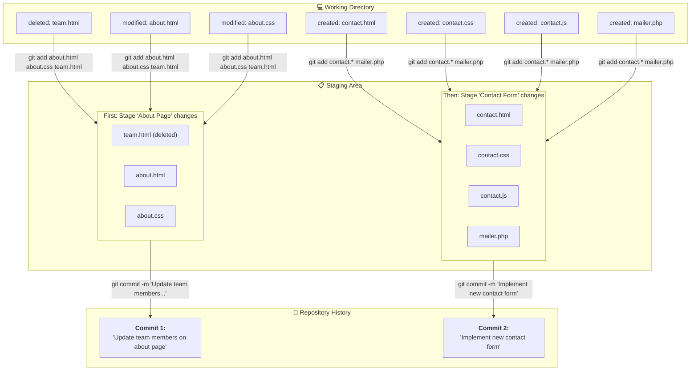

#Git #CoreConcept #VCS #Workflow

>  A **commit** is the fundamental "save point" in [[Git]]. It's a snapshot of your project's files at a specific moment in time, bundled with a message that describes the changes you made.

---

## ❓ What is a Commit?

In the early introductions, we used the term "checkpoint" to describe the snapshots you save of your project's history. **In Git, the official term for one of these checkpoints is a "commit."**

A [[Git Repository]] is primarily a collection of these commits, organized chronologically. This history of commits is what allows you to "time travel" back to earlier versions, compare changes, and understand how your project has evolved.

Each commit contains:
-   The snapshot of all tracked files at that point in time.
-   A reference to the commit that came before it (its "parent").
-   A unique identifier (a SHA-1 hash).
-   A message describing the changes.

## ⚠️ Commit vs. Saving a File

This is a critical distinction to make.

> [!warning] A Commit is More Than "Save"
> **Making a commit is not the same as saving a file (Ctrl+S / Cmd+S).** Saving a file is a prerequisite; it updates the file on your computer's filesystem. A commit is a deliberate action to record a *set* of saved changes into the project's permanent, versioned history within the repository.

You will save your files hundreds of times, but you will only make a commit when you've reached a logical, complete checkpoint in your work.

---

## The Two-Step Workflow: Why Committing is a Deliberate Process

Making a commit is not a single action. It's a multi-step process designed to give you precise control over your project's history.

> [!tip] The "Tweezers" Analogy
> Instead of a single "save everything" button, Git gives you tweezers. It allows you to inspect all the changes you've made and carefully select which ones to group together into a single, logical commit.

Imagine you've been working all morning and have changed seven different files. These changes actually relate to two different features: updating the "About" page and adding a new "Contact" form. Instead of one messy commit, Git's workflow allows you to create two clean, separate commits.

### Visualizing the Workflow

### The Commands for Committing
This selective, two-step process is accomplished with two core commands:

1.  **[[git add]]**: This is the "tweezers." You use it to select changes and move them from your Working Directory to the **Staging Area**.
2.  **[[git commit]]**: This command takes everything that is currently in the Staging Area and saves it as a new snapshot (a new commit) in your repository's history.

---

> [!summary] Key Takeaway
> A **commit** is a snapshot of your project. The process of creating one is deliberately split into two steps (`add` then `commit`) to empower you to create a clean, logical, and meaningful project history. In the next videos, we'll dive into the specifics of these two commands.