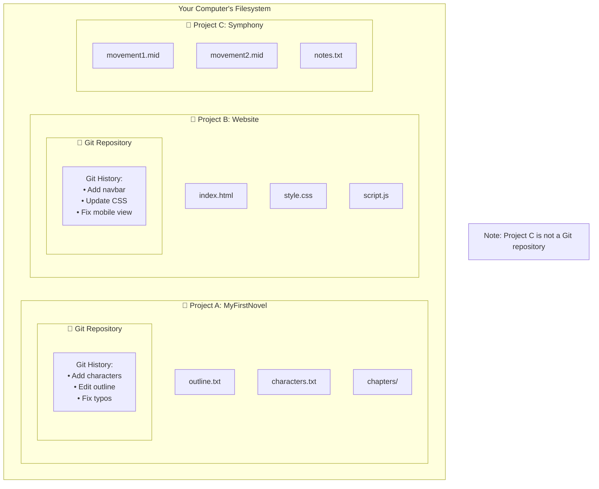

>  A **Git Repository** (or "repo") is a self-contained "bubble" for a single project. It's a folder on your computer that Git is actively tracking, containing the project's files and its entire, independent history of changes.

---

## ❓ What is a Repository?

Simply installing [[Git]] on your computer doesn't mean it's actively doing anything. You have to explicitly tell Git which projects you want it to track. You do this by creating a **repository**.

> [!info] The Core Definition
> A **Git repository** is a directory on your filesystem that contains your project's files, along with a special hidden sub-directory named `.git`. This `.git` folder holds all the metadata and the complete history for the repository.

You can have as many repositories as you need on your machine, one for each project (a novel, a website, a symphony, etc.).

## 🏛️ The Principle of Isolation

This is the most important concept to understand about repositories: **each one is completely separate and independent.**

-   The history of one repository is not linked to or aware of any other repository.
-   The commands you run in one repo only affect that repo.
-   They are like encapsulated bubbles, each containing its own unique project and timeline.

*In this diagram, "MyFirstNovel" and "Website" are both Git repositories, each with its own separate history. "Symphony" is just a regular folder that Git is not tracking.*

---

## 🔬 A Practical Example: Two Different Histories

Let's look at two different projects on the same machine:
1.  **`YelpCamp`**: A large, complex web application with many files and a long history of changes from multiple collaborators.
2.  **`Animals`**: A very simple project with a single file listing animals.

Even though they live on the same computer, their Git histories are completely different and unrelated.

-   The history for the **`Animals`** repo contains only commits related to adding and modifying animal names.
-   The history for the **`YelpCamp`** repo is vast and contains commits about user authentication, database models, styling, etc.

You can view these separate histories using the command line (with commands like `git log`) or with a visual Git client (like GitKraken or Sourcetree). The key point is that the work done in one does not and cannot affect the other.

---

> [!summary] Key Takeaway
> A repository is the fundamental workspace in Git. You create one for each project you want to version control. In the next step, we will learn the command that actually creates these self-contained project bubbles: `[[git init]]`.