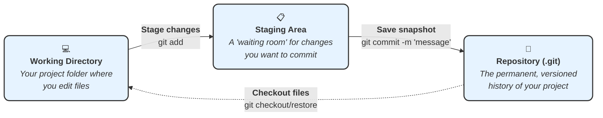

#Git #CoreCommand #StagingArea

>  `git add` is the command you use to select which of your file changes you want to include in your next [[Commit]]. It moves changes from your **Working Directory** to a "waiting room" called the **Staging Area**.

---

## The Two-Step Process for Committing

To make a [[Commit]] in Git, you always use two commands:
1.  **`git add`**: To stage the changes.
2.  **`git commit`**: To save the staged changes to your repository's history.

> [!info] Why Two Steps? The "Tweezers" Analogy
> This two-step process allows you to be selective. Imagine you've worked on five different files, but the changes relate to two different features. The staging area lets you use "tweezers" to pick out only the files related to the first feature, `git add` them, and then commit them with a specific message. You can then `git add` the remaining files for a separate, second commit. It allows you to create clean, logical, and focused commits.

---

## The Three Git Zones

To understand `git add`, you must understand the three conceptual "zones" where your files live.



1.  **💻 Working Directory:** This is simply your project folder. It's where you create, edit, and delete files.
2.  **📋 Staging Area (or "Index"):** This is an intermediate area where Git tracks the changes you've selected to be part of your *next* commit. It's a draft of your upcoming save point.
3.  **💾 Repository (.git folder):** This is the heart of Git. It's the hidden `.git` directory that contains the entire history of your project—all of your commits. The `git commit` command is what permanently adds the contents of the staging area to the repository.

---

## Hands-On Demo: Staging Files

Let's walk through the process using the "MyFirstNovel" example.

### Step 1: Make Some Changes
First, we need to do some work in our working directory. Let's create two new files for our novel: `outline.txt` and `characters.txt`.

```txt
// In outline.txt
Chapter 1: Meet the main characters.
```
```txt
// In characters.txt
Jay Gatsby - Mysterious millionaire.
Nick Carraway - The narrator.
Daisy Buchanan - The object of Gatsby's affection.
Tom Buchanan - Daisy's brutish husband.
```

### Step 2: Check the Status
Now that we've saved our new files, let's ask Git what it thinks about our project's state with `[[git status]]`.

```bash
git status
```
**Output:**
```
On branch main
No commits yet

Untracked files:
  (use "git add <file>..." to include in what will be committed)
        characters.txt
        outline.txt

nothing added to commit but untracked files present (use "git add" to track)
```
Git sees two **"untracked files"**. This means they exist in the Working Directory, but Git isn't tracking their history yet. Git helpfully tells us to use `git add` to start tracking them.

### Step 3: Stage a Single File
Let's stage just one file to see what happens. We'll add `characters.txt` to the staging area.

```bash
git add characters.txt
```
Now, check the status again.

```bash
git status
```
**Output:**
```
On branch main
No commits yet

Changes to be committed:
  (use "git rm --cached <file>..." to unstage)
        new file:   characters.txt

Untracked files:
  (use "git add <file>..." to include in what will be committed)
        outline.txt
```
Notice the change! `characters.txt` is now listed under **"Changes to be committed"**—this means it's in the Staging Area. `outline.txt` is still just an untracked file in the Working Directory.

### Step 4: Stage the Second File
We want both files in our first commit, so let's stage the other one.

```bash
git add outline.txt
```
Check the status one last time.

```bash
git status
```
**Output:**
```
On branch main
No commits yet

Changes to be committed:
  (use "git rm --cached <file>..." to unstage)
        new file:   characters.txt
        new file:   outline.txt
```
Perfect. Both files are now in the Staging Area, greenlit and ready to be saved permanently into our repository's history.

---

> [!summary] Next Step
> We have successfully used `git add` to move our changes from the Working Directory to the Staging Area. The next logical step is to use `[[git commit]]` to take everything in the staging area and create our first official checkpoint.