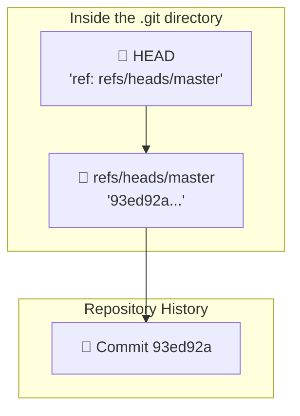

#Git #CoreConcept #Internals #Advanced

>  Git's magic isn't magic at all. `HEAD` and branch pointers are just simple text files inside the `.git` directory that point to other things. `HEAD` points to your current branch file, and that branch file points to a specific commit hash.

---

> [!info] 100% Optional Deep Dive
> This is a behind-the-scenes tour of your [[.git Directory]]. You will **never** need to manually interact with these files to use Git effectively. However, seeing how it works under the hood can provide a powerful "aha!" moment and solidify your understanding of these concepts.

## Tracing the Pointers

We've established that `HEAD` is a pointer to your current branch, and a branch is a pointer to a commit. Let's prove it by looking at the actual files inside our `.git` directory.

### Step 1: Find Our Starting Point
First, let's get our bearings. In our `road-trip-playlist` repository, we'll switch to the `master` branch and look at the log.

```bash
git switch master
git log --oneline
```
**Output:**
```
93ed92a (HEAD -> master) Add two ABBA songs
a1b2c3d Add playlist header
```
Okay, we are on `master`, and the latest commit hash starts with `93ed92a`. Remember that hash.

### Step 2: The `HEAD` File
Now, let's look directly at the `HEAD` file inside the `.git` directory.

```bash
cat .git/HEAD
```
**Output:**
```
ref: refs/heads/master
```
This is the big reveal. The `HEAD` file is just a simple text file containing a single line: the path to *another* file, which represents the current branch.

### Step 3: The Branch Reference File
Let's follow the path from the `HEAD` file. What's inside `.git/refs/heads/master`?

```bash
cat .git/refs/heads/master
```
**Output:**
```
93ed92a...[rest of the hash]...
```
There it is! The branch pointer for `master` is just another simple text file that contains the full hash of the latest commit on that branch.

### The Chain of Pointers Visualized

This is the entire mechanism. It's a simple, two-step chain of text-based pointers.



## How `git switch` Works

When you switch branches, all Git does is change the text inside that one `HEAD` file. This is why switching branches is so incredibly fast.

1.  **Switch to the `oldies` branch:**
    ```bash
    git switch oldies
    ```

2.  **Look inside `HEAD` again:**
    ```bash
    cat .git/HEAD
    ```
    **Output:**
    ```
    ref: refs/heads/oldies
    ```
    Git simply updated the reference inside the `HEAD` file.

3.  **Check the `oldies` branch file:**
    If we look at the latest commit on the `oldies` branch with `git log --oneline`, we'll see it has a different hash (e.g., `7ffd...`). If we then look inside the branch reference file...
    ```bash
    cat .git/refs/heads/oldies
    ```
    **Output:**
    ```
    7ffd...[rest of the hash]...
    ```
    ...it will contain that exact commit hash.

---

> [!summary] Key Takeaway
> - **A branch pointer** (e.g., `master`, `oldies`) is just a file in `.git/refs/heads/` that stores a commit hash. It's a "bookmark."
> - **`HEAD`** is a file in `.git/` that stores the path to the current branch pointer. It's the "currently open page."
> - **Switching branches** is the simple, fast operation of updating the text in the `HEAD` file to point to a different branch's reference file.
>
> This simple, file-based system is the foundation of Git's powerful and lightweight branching model.