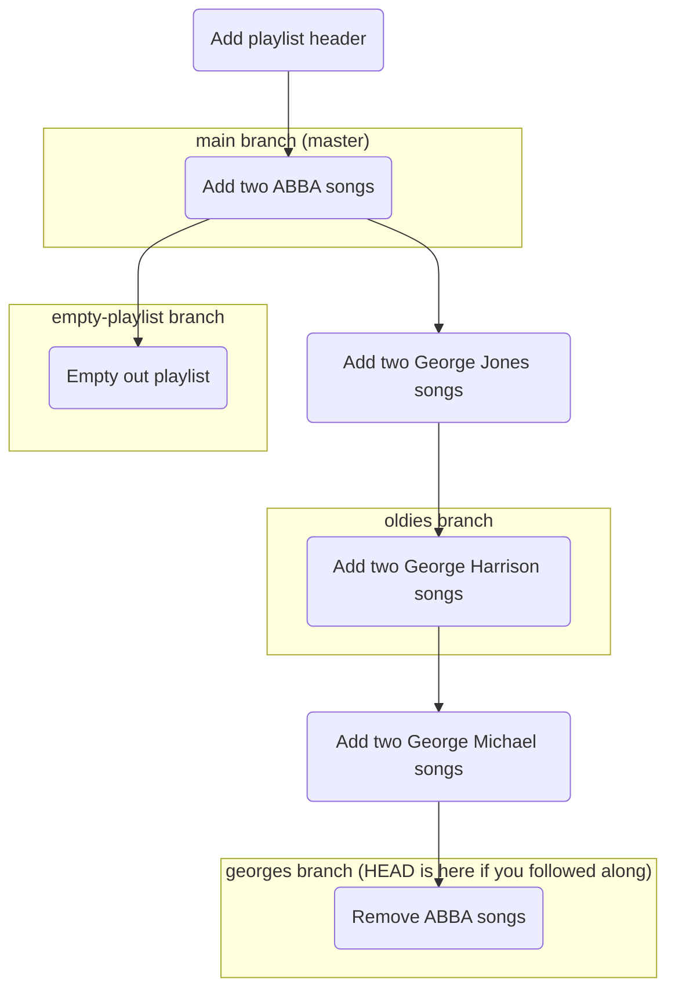

#Git #CoreCommand #Branching #Workflow #HandsOn #Tutorial

>  Use `git branch <name>` to create a new branch and `git switch <name>` to move to it. The most important rule is that a new branch is created as a snapshot of your **current location (`HEAD`)**, so where you are when you create a branch matters immensely.

---

## The Core Commands for Branching

Managing branches involves two primary actions: creating a new branch and switching your current working context to a different branch.

### 1. `git branch <branch-name>` (To Create)
This command creates a new branch pointer with the specified name.

> [!info] The "New Bookmark" Analogy
> Think of this command as placing a **new bookmark** on the exact same page you are currently reading in your project's "book." It creates a new reference point, but **it does not turn the page for you**.

-   Your `HEAD` pointer does **not** move. You remain on the branch you were on before.
-   The new branch will point to the exact same commit as your current `HEAD`.

### 2. `git switch <branch-name>` (To Switch)
This is the modern command used to switch between existing branches.

> [!info] The "Turning the Page" Analogy
> This command is like closing the book to its current page and reopening it at a different bookmark. Your working directory's files will instantly change to reflect the state of the commit that the new branch points to.

-   This command moves the `HEAD` pointer to the specified branch.
-   Any new commits you make will now be on this new branch.

> [!tip] The Old Way: `git checkout`
> For years, the command `git checkout <branch-name>` was used for switching branches. While `git switch` is the new, clearer command for this specific task, you will still see `git checkout` used everywhere in older tutorials and by experienced developers. It's good to be aware of both.

---

## 🛠️ Hands-On Tutorial: The Road Trip Playlist

To truly understand branching, let's build a simple project from scratch.

### Step 1: Project Setup
Create a new repository and make two initial commits on the default `master` branch.

```bash
# Create and enter the project folder
mkdir road-trip-playlist && cd road-trip-playlist

# Initialize the repo
git init

# Create the playlist file with a header
echo "Song-Artist" > playlist.txt
git add playlist.txt
git commit -m "Add playlist header"

# Add two songs
echo "SOS-ABBA" >> playlist.txt
echo "One of Us-ABBA" >> playlist.txt
git add playlist.txt
git commit -m "Add two ABBA songs"
```
Our history now looks like this (`git log --oneline`):
```
b1a2c3d (HEAD -> master) Add two ABBA songs
a1b2c3d Add playlist header
```

### Step 2: Create and Switch to a New Branch (`oldies`)
Let's create an `oldies` branch to experiment with a different set of songs.

```bash
# Create the branch
git branch oldies

# List the branches to see what happened
git branch
```
**Output:**
```
* master
  oldies
```
Notice the `*` is still next to `master`. We've created the `oldies` branch, but we're still on `master`. `git log --oneline` would show both `(HEAD -> master)` and `(oldies)` pointing to the same commit.

Now, let's switch to our new branch.
```bash
git switch oldies
```
Your terminal now says `Switched to branch 'oldies'`. `git branch` now shows the `*` next to `oldies`.

### Step 3: Make a Commit on the `oldies` Branch
Let's add some George Jones songs.

```bash
echo "He Stopped Loving Her Today-George Jones" >> playlist.txt
echo "The Grand Tour-George Jones" >> playlist.txt

# Add and commit the changes
git add playlist.txt
git commit -m "Add two George Jones songs"
```
Now, let's look at the log. Our history has diverged!
```bash
git log --oneline
```
**Output:**
```
c4d5e6f (HEAD -> oldies) Add two George Jones songs
b1a2c3d (master) Add two ABBA songs
a1b2c3d Add playlist header
```
`HEAD` and `oldies` have moved forward, while `master` has been left behind at the previous commit.

### Step 4: Witness the Magic of Switching
Your `playlist.txt` file currently contains ABBA and George Jones. Now, switch back to the `master` branch.

```bash
git switch master
```
**Look at your `playlist.txt` file!** The George Jones songs have vanished. Your working directory has been instantly reverted to the state of the `master` branch. This is the power of branches.

---

## The Most Important Rule: Where You Branch From Matters

> [!danger] A new branch is a copy of your **current `HEAD`**. The branch you are on when you run `git branch <new-branch>` determines the starting point for your new branch's history.

Let's prove this.

#### Step 5: Branching from `oldies`
Switch back to the `oldies` branch and add another commit.

```bash
git switch oldies
# Add two George Harrison songs to playlist.txt
# ...

# A handy shortcut to add all modified files and commit in one line
git commit -a -m "Add two George Harrison songs"
```
> The `-a` flag in `git commit` automatically stages all *modified* files before committing. Note: It does not stage new, *untracked* files.

Now, from the `oldies` branch, create a `georges` branch.
```bash
git branch georges
```
Because we were on `oldies`, the new `georges` branch starts with the full history of `oldies` (including ABBA, Jones, and Harrison). We can now switch to it and make it a "Georges only" playlist by removing the ABBA songs and committing.

#### Step 6: Branching from `master`
Now, let's switch all the way back to `master`.

```bash
git switch master
```
Remember, `master` only has the two ABBA songs. If we create a new branch from here, it will only have that short history.

```bash
git branch empty-playlist
git switch empty-playlist

# Now delete the ABBA songs and commit
# ...
git commit -a -m "Empty out playlist"
```
If you run `git log --oneline` on the `empty-playlist` branch, you will only see three commits in its history, because it branched from the much shorter `master` branch.

### Final State Visualization


This diagram shows how each branch has its own unique history based on where it was created.