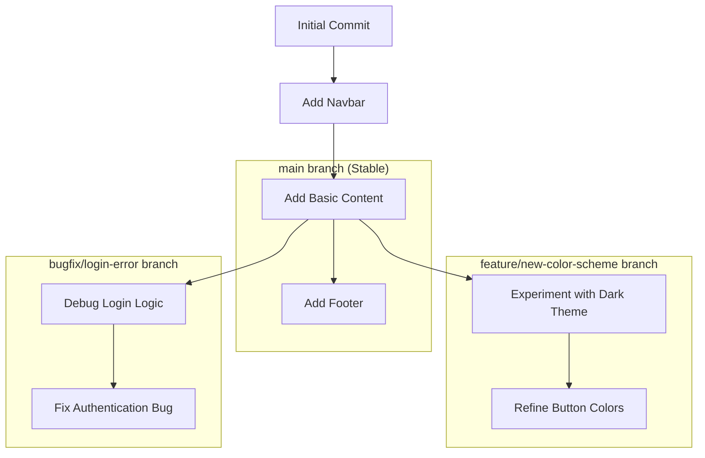

#Git #CoreConcept #Branching #Workflow #VCS

>  A **branch** is a lightweight, movable pointer to a specific [[Commit]]. It represents an independent line of development, allowing you to work on new features, bug fixes, or experiments in isolation without affecting the main codebase.

---

## A Quick Look Under the Hood

Before we can understand branching, it's helpful to know how Git's history is structured at a very basic level.

-   Every [[Commit]] has a unique ID, a long string of characters called a **hash**.
-   Every commit also contains a **pointer to its parent commit**—the one that came before it.

This creates a linked list of commits, forming a linear history. The very first commit is the only one with no parent.

## 😫 The Problem: The Limitations of a Linear History

In any real-world project, multiple things are happening at once:
-   You're experimenting with a new color scheme.
-   A teammate is fixing a critical bug that requires them to temporarily break parts of the code.
-   Another teammate is working on a long-term, experimental redesign that won't be ready for weeks.
-   Someone else is adding a small, stable feature like a chatbot widget.

> [!danger] The Chaos of a Single Timeline
> If everyone worked on the same single, linear timeline, it would be impossible. The bug-fixer's broken code would prevent the feature developer from working. The experimental redesign would destabilize the entire application for everyone. There is no isolation.

## ✨ The Solution: Branches

This is the exact problem that Git branches solve.

> [!success] Branches as Alternate Timelines
> A branch is a new, independent line of history that "splinters off" from the main timeline. It allows you to work in a separate, isolated context.
>
> - You can experiment, break things, and make a mess on your own branch.
> - Whatever you do on one branch has **zero impact** on other branches until you decide to combine them (a process called [[Merging]]).

This allows all the parallel work from our previous example to happen simultaneously, in isolation, without anyone interfering with anyone else.

*Here, work on the main branch, a new feature, and a bug fix all happen in parallel, starting from the same point in history but evolving independently.*

---

## The Default Branch: `master` (or `main`)

Even if you've never explicitly created a branch, you've been using one all along.

> [!info] You Are Always on a Branch
> When you initialize a new repository with [[git init]], Git automatically creates a default branch for you and places you on it.

Historically, this default branch has always been named **`master`**. This is why your [[git status]] command has been reporting `On branch master`.

-   **`master` has no special powers.** From Git's perspective, it's just a branch like any other. You can rename it or even delete it.
-   **It's a convention.** By convention, many teams treat the `master` branch as the official, stable, "source of truth" for their project.

### A Note on Naming: `master` vs. `main`

> [!tip] The Shift to `main`
> In 2020, in an effort to use more inclusive language, [[GitHub]] changed its default branch name from `master` to `main` for all new repositories created on its platform.
>
> -   **Local `git`:** Your local Git installation may still create `master` by default when you run `git init`.
> -   **`GitHub`:** Will create `main` by default for new projects.
>
> This course will show you how to rename your local `master` branch to `main` to align with modern conventions, but it's important to understand why you will see both terms used in tutorials and documentation.

### A Common Workflow: Feature Branching

> [!best-practice] Feature Branching
> A very common and effective workflow is to keep your `main` (or `master`) branch clean and always in a working state. For any new piece of work (a feature, a bug fix, an experiment), you create a **new branch**. Once the work is complete and tested on that branch, you merge it back into `main`.

---

> [!summary] Next Up: What is `HEAD`?
> We know that a branch is a pointer to a specific commit. But how does Git know which branch *we* are currently working on? That's the job of another, even more important pointer called **`HEAD`**.