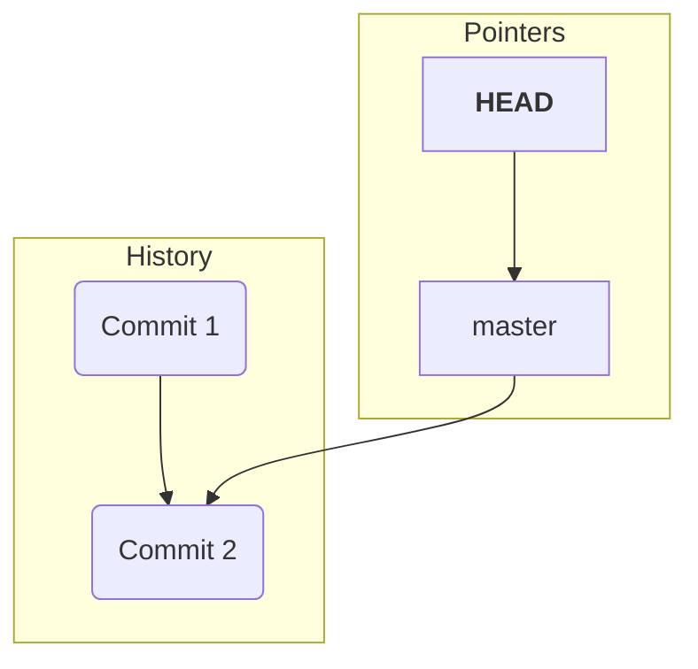
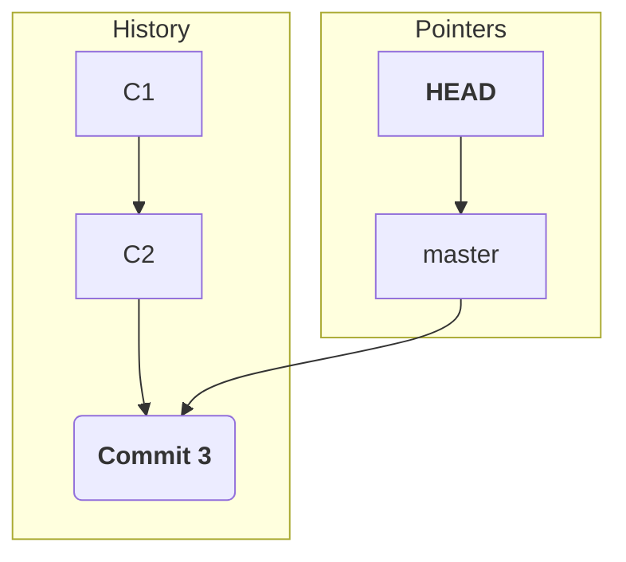
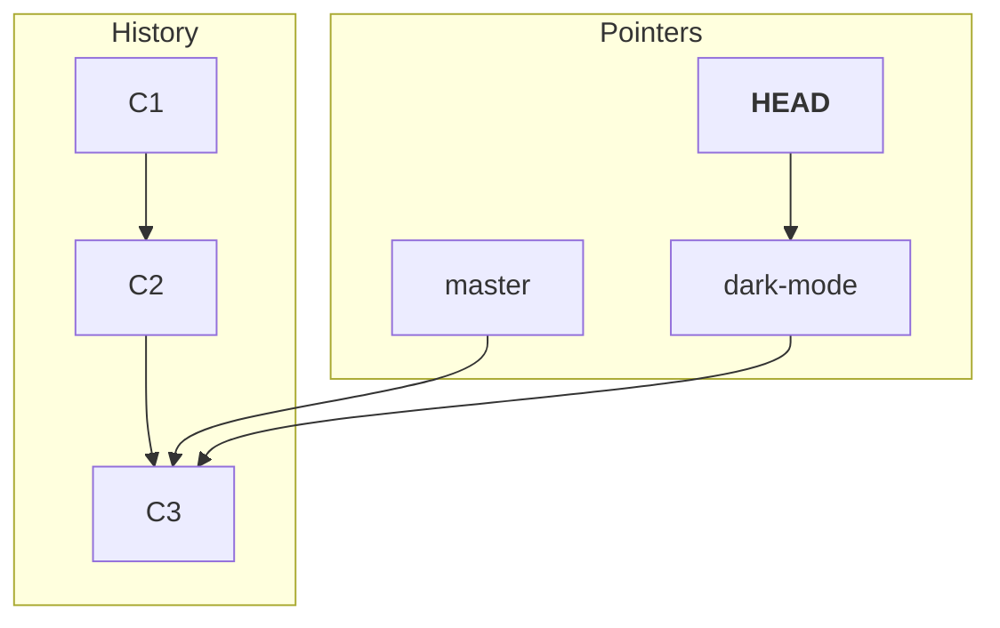
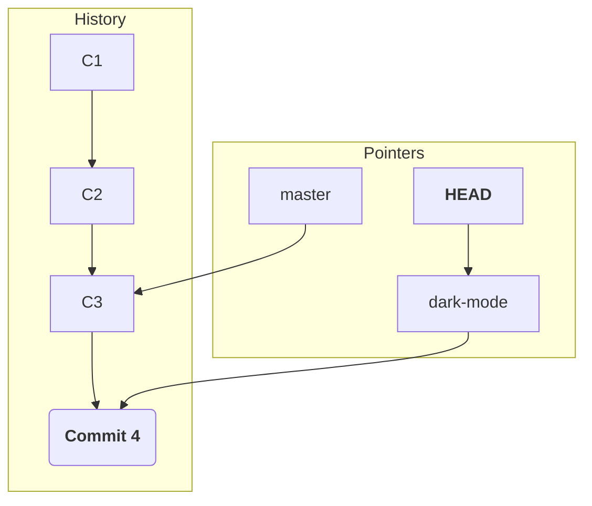

#Git #CoreConcept #Branching #Pointer

>  `HEAD` is a special pointer in Git that indicates your **current location** in the repository. It almost always points to the branch you are currently working on. It answers the question, "Where am I right now?"

---

## ❓ What is `HEAD`?

When you look at the output of `git log`, you've likely seen the `(HEAD -> master)` label next to your most recent commit. `HEAD` is one of Git's most important internal pointers.

-   A **[[Branch]]** is a pointer to a specific **[[Commit]]**.
-   `HEAD` is a pointer to the **[[Branch]]** you currently have "checked out" or are working on.

This creates a two-step reference: `HEAD` -> `current branch` -> `latest commit on that branch`.

### 📖 The Bookmark Analogy

This is the easiest way to understand the relationship between branches and `HEAD`.

> [!tip] Analogy: The Book and its Bookmarks
> - Imagine your project's history is a large **book**.
> - Each **[[Branch]]** is a different **bookmark** placed on a specific page (a commit) to mark a significant spot. You can have many bookmarks in the book at once.
> - **`HEAD`** is the page the book is **currently open to**. You can only read or write on one page at a time.
>
> When you "switch branches," you are telling Git to close the book to its current page and re-open it to the page marked by a different bookmark.

---

## Visualizing the Workflow

Let's see how `HEAD` and branch pointers move as you work.


**1. Starting Point:** You are on the `master` branch. The `master` branch pointer points to your latest commit (`C2`), and `HEAD` points to `master`.

---


**2. New Commit:** You make a new commit (`C3`). The `master` branch pointer automatically moves forward to this new commit, and `HEAD` follows along because it's still pointing to `master`.

---


**3. Create & Switch Branch:** You create a new branch called `dark-mode` and switch to it. A new `dark-mode` pointer is created, pointing at the same commit as `master`. Crucially, **`HEAD` now moves to point to `dark-mode`**. You are now working on the `dark-mode` branch.

---


**4. New Commit on Branch:** You make a new commit (`C4`). Because `HEAD` was pointing to `dark-mode`, only the `dark-mode` branch pointer moves forward. The `master` branch pointer stays behind at `C3`. The history has now diverged.

---

## 🛠️ The `git branch` Command: Seeing Your Pointers

So how do you see all the branches (bookmarks) in your repository and find out where `HEAD` (the open page) is?

> [!info] The `git branch` command, when run with no arguments, lists all the local branches in your current repository.

```bash
git branch
```
-   It will list all branch names.
-   It will highlight the branch that `HEAD` is currently pointing to with an asterisk (`*`) and a different color.

### Example Output

**In our `MyFirstNovel` repository:**
```bash
git branch
```
**Output:**
```
* master
```
This tells us we have only one branch, `master`, and `HEAD` is currently pointing to it.

**In a project with multiple branches:**
```bash
git branch
```
**Output:**
```
  birds
  california-mammals
  master
* owls
  stashtest
```
This tells us there are many branches, but we are currently on the `owls` branch. Any new commits we make will be added to the `owls` timeline. (To exit this view, press `q`).

---

> [!summary] Key Takeaway
> - A **branch** is a named pointer to a commit.
> - **`HEAD`** is a special pointer that indicates which branch you are currently on.
> - **`git branch`** is the command to list all branches and see where `HEAD` is pointing.
>
> Now that we understand these concepts, we're ready to learn the commands to create and move between these branches.