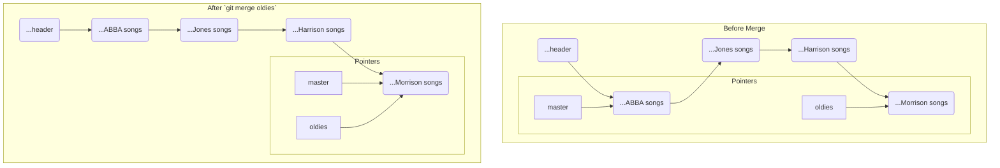

#Git #Workflow #Merging #HandsOn #Tutorial

>  A fast-forward merge is the simplest merge scenario. It happens when the branch you're merging *into* has no new commits since the other branch was created. To perform it, switch to the receiving branch (e.g., `git switch master`), then run `git merge <branch-to-merge-in>`.

---

## Conceptual Recap

A **fast-forward merge** is not a different command, but a specific, simple *type* of merge. It occurs when the history of the two branches has not truly diverged. One branch is simply "ahead" of the other on the same path.

In this case, all Git has to do is move the pointer of the "behind" branch forward to catch up with the "ahead" branch.

## 🛠️ Hands-On Demo: Merging `oldies` into `master`

In our `road-trip-playlist` repository, our `master` branch is behind our `oldies` branch. Let's merge the work from `oldies` into `master`.

### Step 0: The Initial State
Let's verify the state of our branches.

-   **Check the `master` branch:**
    ```bash
    git switch master
    git log --oneline
    ```
    **Output:**
    ```
    b1a2c3d (HEAD -> master) Add two ABBA songs
    a1b2c3d Add playlist header
    ```
    `master` has only two commits and its `playlist.txt` only contains ABBA songs.

-   **Check the `oldies` branch:**
    ```bash
    git switch oldies
    git log --oneline
    ```
    **Output:**
    ```
    d3a4b1c (HEAD -> oldies) Add two Van Morrison songs
    ...
    b1a2c3d Add two ABBA songs
    a1b2c3d Add playlist header
    ```
    `oldies` contains the original two commits *plus* several new ones. Since `master` has no new commits of its own, this is a perfect setup for a fast-forward merge.

### Step 1: Switch to the Receiving Branch
The first rule of merging is to be on the branch you want to merge *into*. We want to update `master`, so we must switch to it.

```bash
git switch master
```

### Step 2: Run the Merge Command
Now, from the `master` branch, we tell Git to pull in the history from the `oldies` branch.

```bash
git merge oldies
```

### Step 3: Analyze the Output

Git will give you a clear message indicating the type of merge it performed.
**Output:**
```
Updating b1a2c3d..d3a4b1c
Fast-forward
 playlist.txt | 8 +++++++-
 1 file changed, 7 insertions(+), 1 deletion(-)
```
> [!success] The "Fast-forward" Message
> Git explicitly tells you that it performed a "Fast-forward" merge. This confirms that it simply moved the `master` pointer forward to catch up with `oldies`.

### Step 4: Verify the Results

**1. Check the File Contents:**
If you look at `playlist.txt` while on the `master` branch, you will see that it now contains all the songs from the `oldies` branch (ABBA, George Jones, George Harrison, Van Morrison).

**2. Check the History:**
This is the most important verification.
```bash
git log --oneline
```
**Output:**
```
d3a4b1c (HEAD -> master, oldies) Add two Van Morrison songs
...
b1a2c3d Add two ABBA songs
a1b2c3d Add playlist header
```
Notice that the `master` pointer has "fast-forwarded" to the exact same commit as the `oldies` branch. `master`'s history now includes all the commits that were previously only on `oldies`.

### The "Before" and "After" Visualized



---

### Important Post-Merge Note

> [!info] The Original Branch Still Exists
> Merging the `oldies` branch into `master` does **not** delete the `oldies` branch. It still exists as a separate pointer. You could switch back to `oldies`, add more commits, and its history would again diverge from `master`.
>
> It is a common practice to delete the feature branch after a successful merge to keep the repository clean.
> ```bash
> # After merging 'oldies' into 'master', you can safely delete it
> git branch -d oldies
> ```