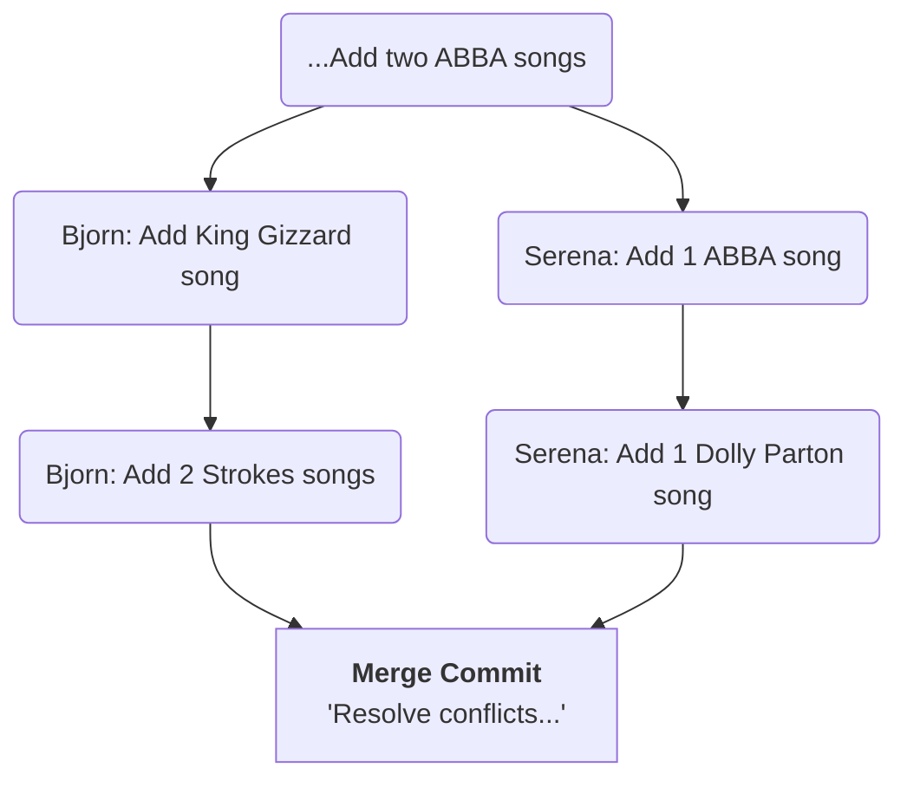

#Git #HandsOn #Tutorial #Merging #Troubleshooting

>  This is a step-by-step walkthrough of how to intentionally create and then manually resolve a merge conflict in Git. The process is: **Merge -> Conflict -> Edit -> Add -> Commit**.

---

## 🛠️ Step 0: Setting the Stage

To demonstrate a conflict, we need two branches with diverging histories that edit the same lines of the same file. We'll use our `PlaylistTake2` repository.

#### 1. Clean Up
First, let's clean up our repository by deleting the old `ABBA` branch, since it was successfully merged in the last exercise.

```bash
# We must not be on the branch we want to delete
git switch master

# Use the safe delete (-d) flag. This works because ABBA is fully merged.
git branch -d ABBA
```

#### 2. Create Two New, Diverging Branches
We'll simulate two collaborators, Bjorn and Serena, working on their own playlists. We create both branches from the current state of `master`.

```bash
# Create Serena's branch and switch to it
git switch -c serena

# Switch back to master to create the second branch from the same starting point
git switch master

# Create Bjorn's branch and switch to it
git switch -c bjorn
```
We now have two new branches, `serena` and `bjorn`, that are identical to `master`.

#### 3. Create Conflicting Commits
Now, let's have both Bjorn and Serena edit the `songs.txt` file in different ways on their respective branches.

**On Bjorn's Branch:**
1.  Switch to his branch: `git switch bjorn`.
2.  He edits `songs.txt` to include King Gizzard and The Strokes, but keeps "Dancing Queen".
3.  He makes two commits for his work.

**On Serena's Branch:**
1.  Switch to her branch: `git switch serena`.
2.  She edits `songs.txt` to add more ABBA and a Dolly Parton song.
3.  She makes two commits for her work.

> [!info] The Conflict is Now Inevitable
> We have created a classic merge conflict scenario. Both branches have unique commits, and both have edited the `songs.txt` file in different ways since they diverged.

---

## 🔥 Step 1: Initiating the Merge and Hitting the Conflict

To combine their work, we'll create a new branch called `combo` to act as the integration point, leaving the original branches untouched.

1.  **Create the `combo` branch** from Bjorn's work:
    ```bash
    git switch -c combo
    ```
    (Since we were on `bjorn`, `combo` is now an exact copy of `bjorn`'s branch).

2.  **Attempt to merge Serena's work:**
    ```bash
    git merge serena
    ```

**Git stops and reports the conflict:**
> [!danger] Conflict Detected!
> ```
> Auto-merging songs.txt
> CONFLICT (content): Merge conflict in songs.txt
> Automatic merge failed; fix conflicts and then commit the result.
> ```
Git has paused the merge and is waiting for you to resolve the problem.

---

## ✅ Step 2: The Manual Resolution

Now we follow the three-step process to fix the conflict.

#### 1. Edit the Conflicted File
Open `songs.txt` in your editor. VS Code and other modern editors will highlight the conflict clearly. You will see the conflict markers Git has inserted:

```diff
<<<<<<< HEAD
Dancing Queen-ABBA
The Adult is Talking-The Strokes
Last Nite-The Strokes
Rattlesnake-King Gizzard & The Lizard Wizard
=======
SOS-ABBA
One of Us-ABBA
Mamma Mia-ABBA
Dancing Queen-ABBA
Gimme Gimme-ABBA
Here You Come Again-Dolly Parton
>>>>>>> serena
```

-   The content between `<<<<<<< HEAD` and `=======` is from our current branch (`combo`, which was a copy of `bjorn`).
-   The content between `=======` and `>>>>>>> serena` is from the branch we are trying to merge in.

Our job is to edit this section until it's correct, and **remove all the conflict markers**. In this case, we want to combine both playlists but remove the duplicate "Dancing Queen" entry.

**Resolved File:**
```txt
Dancing Queen-ABBA
The Adult is Talking-The Strokes
Last Nite-The Strokes
Rattlesnake-King Gizzard & The Lizard Wizard
SOS-ABBA
One of Us-ABBA
Mamma Mia-ABBA
Gimme Gimme-ABBA
Here You Come Again-Dolly Parton
```
Now, **save the file**.

#### 2. Stage the Resolution
Tell Git that you have fixed the conflict by `add`ing the resolved file. This moves it to the staging area and marks the conflict as resolved.

```bash
git add songs.txt
```
If you run `git status` now, it will show `All conflicts fixed but you are still merging.`

#### 3. Commit the Merge
Finalize the process by creating the merge commit. You can simply run `git commit` and accept the default message, or provide your own.

```bash
git commit -m "Resolve merge conflict between Bjorn and Serena playlists"
```

---

## 🏆 Step 3: Verifying the Result

The conflict is resolved, and the merge is complete.
-   `git status` will report a clean working tree.
-   `git log --oneline --graph` will show the new merge commit, successfully tying the `bjorn` and `serena` histories together into the `combo` branch.

### Final History Visualization


You have successfully navigated one of the most common and intimidating parts of using Git!