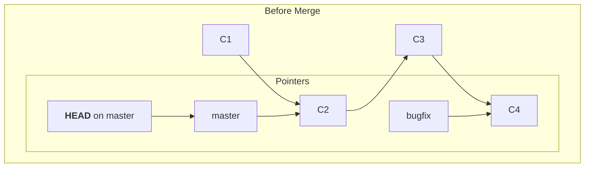
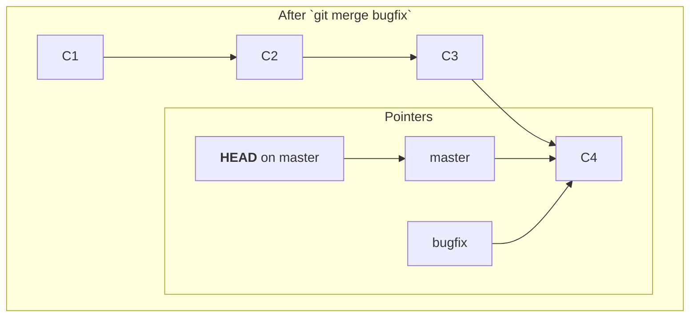

#Git #CoreConcept #Branching #Merging #Workflow

>  Merging is the process of integrating the work from one branch into another. The standard workflow is to switch to the branch you want to update (e.g., `master`) and then run `git merge <other-branch>` to bring in the changes.

---

## 🤔 Why Do We Merge?

The whole point of [[Git Branches|branching]] is to work on features or fixes in an isolated context. However, this isolation is usually temporary. Once a feature is complete and tested, or a bug is fixed, you'll want to incorporate that work back into your main, stable branch. Merging is the fundamental Git operation for combining these separate lines of history.

> [!best-practice] The Feature Branch Workflow
> A common professional workflow is:
> 1. Treat your `main` or `master` branch as the stable "source of truth."
> 2. For any new work, create a separate **feature branch** (e.g., `feature/user-login`).
> 3. Do all your work and make all your commits on that feature branch.
> 4. Once the feature is complete and approved, **merge** it back into `main`.

---

## The Core Principles of Merging

There are two simple but crucial rules to remember about how merging works:

1.  **You merge *branches*, not commits.** You don't pick and choose individual commits to combine. The `git merge` command operates on entire branches, bringing in all the unique commits from one branch into another.
2.  **You always merge *into* your current location (`HEAD`).** The workflow is always to move to the *receiving* branch first, and then pull in the changes from the *source* branch.

## The `git merge` Command

The command to perform a merge is straightforward:
```bash
git merge <branch-name-to-merge-in>
```
This command tells Git: "Take all the commits from `<branch-name-to-merge-in>` and integrate them into the branch I am currently on (`HEAD`)."

### The Two-Step Workflow

Let's say you've finished your work on a `bugfix` branch and want to merge it into `master`.

**Step 1: Switch to the Receiving Branch**
You must first check out the branch that will receive the changes.

```bash
git switch master
```
`HEAD` is now pointing to `master`.

**Step 2: Run the Merge Command**
Now, from the `master` branch, you tell Git to merge in the `bugfix` branch.

```bash
git merge bugfix
```
Git will now integrate the history from `bugfix` into `master`.

---

## The Simplest Case: A "Fast-Forward" Merge

The easiest type of merge occurs when the receiving branch has no new commits since the feature branch was created.

Imagine this scenario:
1.  You are on `master` at commit `C2`.
2.  You create a `bugfix` branch and add two new commits, `C3` and `C4`.
3.  Meanwhile, **no new commits have been made on `master`**. `master` is still pointing at `C2`.



In this case, `master` is a direct ancestor of `bugfix`. To merge, all Git has to do is "fast-forward" the `master` branch pointer up to the same commit that `bugfix` is pointing to (`C4`).


No new "merge commit" is needed. Git simply moves the pointer, and `master` now contains all the work from the `bugfix` branch.

> [!info] More Complex Merges
> A "fast-forward" merge is only possible when the branches haven't truly diverged. If new commits had been made on `master` *while* you were working on `bugfix`, Git would need to perform a more complex, three-way merge, which we will cover next.