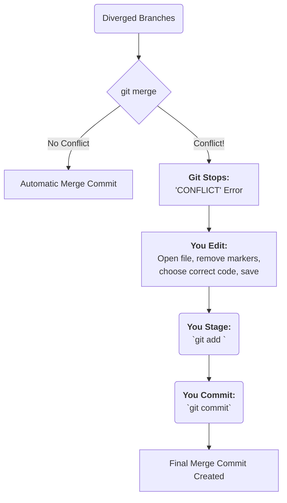

#Git #Troubleshooting #Merging #CoreConcept #Workflow

>  A **merge conflict** happens when Git can't automatically combine changes because two branches have edited the same part of the same file. Git will stop the merge, insert "conflict markers" into the file, and ask you to manually fix it. The process is: 
>  **Edit -> Add -> Commit**.

---

## 🤔 When Do Conflicts Happen?

While Git is incredibly smart at merging, it can't read your mind. A merge conflict arises when Git encounters a change that it cannot resolve automatically.

> [!danger] Common Causes of Merge Conflicts
> - **Concurrent Line Edits:** You and a teammate both edit the exact same lines in the same file on different branches. When you try to merge, Git asks: "Which version is correct?"
> - **Modify vs. Delete:** One branch modifies a file, while another branch deletes that same file. Git asks: "Should I keep the modified file or delete it?"

When this happens, Git stops the merge process and hands control back to you.

---

## 🏛️ Anatomy of a Conflict

When a merge fails, Git doesn't just give up. It modifies the conflicted file(s) by inserting **conflict markers** to show you exactly where the problem is.

> [!warning] What to Look For
> Git will pause the merge and your `git status` will show a state of `unmerged paths`. You must then open the conflicted files and look for these markers.

Here is what a conflict looks like inside a file:

```diff
<<<<<<< HEAD
This is the content from your current branch.
The change you made is here.
=======
This is the conflicting content from the branch you are trying to merge in.
The other developer's change is here.
>>>>>>> name-of-the-other-branch
```

Let's break it down:
-   **`<<<<<<< HEAD`**: This marks the beginning of the conflicting lines from **your current branch** (the branch you are merging *into*). `HEAD` is your current location.
-   **`=======`**: This line separates the two conflicting versions.
-   **`>>>>>>> <branch-name>`**: This marks the end of the conflicting lines from the **other branch** (the branch you are merging *from*).

Your job is to act as the human tie-breaker.

---

## 🛠️ The 3-Step Process for Resolving Conflicts

Resolving a conflict is a manual process, but it follows a clear, repeatable pattern.

### Step 1: The Merge Fails
You run `git merge` and Git stops you.

```bash
git merge bugfix
```
**Output:**
```
Auto-merging styles.css
CONFLICT (content): Merge conflict in styles.css
Automatic merge failed; fix conflicts and then commit the result.
```
Git tells you exactly which file has the conflict (`styles.css`).

### Step 2: Edit the File to Resolve the Conflict
Open the conflicted file (`styles.css`) in your editor. You will see the conflict markers.

**Your only job is to edit the file until it looks exactly the way you want it to look.**
-   You might decide to keep only your version.
-   You might decide to keep only the other branch's version.
-   You might decide to combine them, or write something completely new.

**Before (Conflicted):**
```css
<<<<<<< HEAD
  color: blue;
=======
  color: red;
>>>>>>> feature/new-theme
```

**After (Resolved):**
You must delete all the conflict markers and leave only the code you want to keep.
```css
  color: blue; /* Kept the version from HEAD */
```
Once the file looks correct, **save it**.

### Step 3: Stage and Commit the Resolution
After you've saved the resolved file, you need to tell Git that you've fixed the problem.

**1. Stage the resolved file:** This is how you signal to Git, "I'm done fixing this file."
```bash
git add styles.css
```
**2. Finalize the merge:** Run `git commit`. You do **not** need to provide a `-m` message.
```bash
git commit
```
Git will open your default editor with a pre-populated commit message like `Merge branch 'feature/new-theme'`. You can simply save and close the editor to create the merge commit and complete the process. Your conflict is now resolved!

### Workflow Visualization

