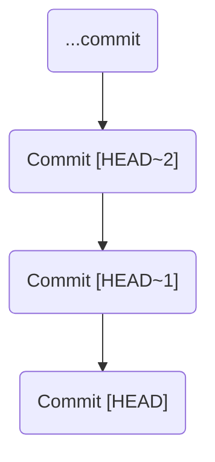

#Git #CoreCommand #History #Workflow #Advanced

>  Git provides a shortcut, `HEAD~<n>`, to refer to previous commits relative to your current position. This allows for quick "time travel" without needing to look up a specific commit hash.

---

While you can always use a commit hash with `git checkout`, Git provides a more convenient syntax for referencing commits that are direct ancestors of your current location (`HEAD`).

## The `HEAD~<n>` Syntax

The tilde (`~`) character allows you to traverse backwards from `HEAD`.

-   **`HEAD~1`**: Refers to the **parent** of the current commit (one commit before `HEAD`).
-   **`HEAD~2`**: Refers to the **grandparent** of the current commit (two commits before `HEAD`).
-   **`HEAD~n`**: Refers to the *n*th ancestor of the current commit.



This syntax can be used with any command that accepts a commit reference, but it's most commonly used with `git checkout`.

---

## 🛠️ Hands-On: Relative Time Travel

Let's use our `MyFirstNovel` repository to jump back in time using this relative syntax.

### Step 1: Get Your Bearings
First, let's see where we are on the `master` branch.

```bash
git switch master
git log --oneline
```
**Output:**
```
a1b2c3d (HEAD -> master) Begin Chapter 3
b4e5f6g Add headings to all files
c7h8i9j Fix typo in outline
...
```
Our current `HEAD` is at "Begin Chapter 3".

### Step 2: Jump Back One Commit
Instead of copying a hash, let's use `HEAD~1` to go back to the "Add headings" commit.

```bash
git checkout HEAD~1
```
**Output:**
```
Note: switching to 'HEAD~1'.
You are in 'detached HEAD' state.
...
HEAD is now at b4e5f6g Add headings to all files
```
Just like checking out a hash, this puts you in a [[`git checkout <commit>` & The Detached HEAD State|detached HEAD state]]. If you inspect your files, you'll see `chapter3.txt` is gone, because it was created in the commit we just left behind.

### Step 3: Jump Back Again
The `HEAD~<n>` syntax is always relative to your *current* `HEAD`. Since our `HEAD` is now at commit `b4e5f6g`, running `git checkout HEAD~1` again will take us back one *more* step to the "Fix typo" commit.

```bash
# We are currently detached at 'b4e5f6g'
git checkout HEAD~1
```
Now we are detached at commit `c7h8i9j`. If you inspect your files, you'll see the headings we added in the previous step are now gone.

---

## The `-` Shortcut: Toggling Between Branches

When you're exploring history in a detached HEAD, you might forget which branch you came from. Git provides a fantastic shortcut to get back.

> [!success] The "Go Back" Shortcut: `git switch -`
> The command `git switch -` (or `git checkout -`) is like the "last channel" button on a TV remote. It switches you back to the branch you were on *immediately before* your current one.

### Workflow Example

1.  Start on a branch, for example `chapter-two-redo`.
    ```bash
    git switch chapter-two-redo
    ```
2.  Jump back in time, entering a detached HEAD state.
    ```bash
    git checkout HEAD~8
    # You are now in a detached HEAD, far in the past.
    ```
3.  You're done exploring and want to get back to where you were working, but you've forgotten the branch name. Instead of running `git branch` to find it, just use the shortcut:
    ```bash
    git switch -
    ```
    **Output:**
    ```
    Switched to branch 'chapter-two-redo'
    ```
    This instantly takes you back to the branch you were on before you started time-traveling, re-attaching your `HEAD`. It's an incredibly useful and efficient command.

---

> [!summary] Key Takeaways
> - `HEAD~<n>` is a convenient way to reference recent parent commits without needing a hash.
> - Using `git checkout HEAD~<n>` will put you in a detached HEAD state.
> - `git switch -` is a powerful shortcut to return to the previously checked-out branch, making it easy to exit a detached HEAD and get back to work.