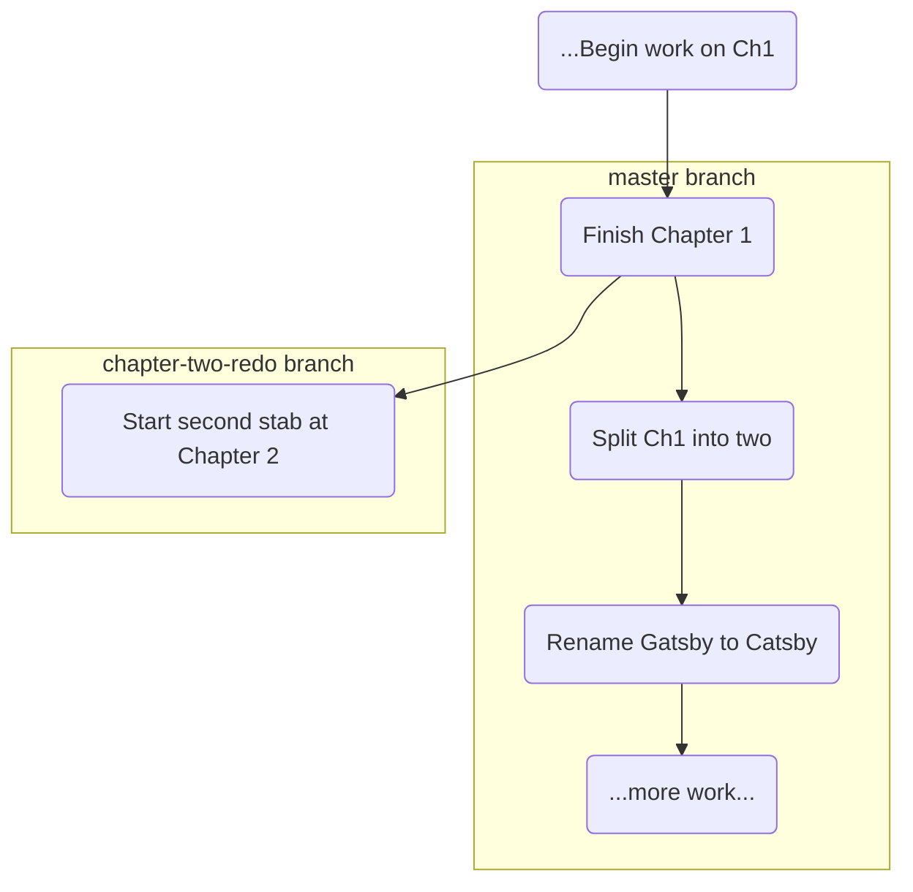

#Git #Workflow #History #Branching #Advanced

>  A detached HEAD lets you either temporarily **view** the past and return safely, or **create a new branch** from that point to start an alternate history.

---

Once you've time-traveled to a past commit using `git checkout <commit-hash>`, you're in the [[`git checkout <commit>` & The Detached HEAD State|detached HEAD state]]. So, what can you actually *do* here? There are two primary use cases.

## Option 1: The Observer - Just Look and Return

This is the simplest and most common use case for a detached HEAD. You are simply a tourist in your project's past.

> [!info] Use Case: Read-Only Inspection
> You want to examine the state of your project at a specific point in history without making any changes. This is useful for:
> - Understanding how a bug was introduced.
> - Reviewing how a feature was implemented in the past.
> - Copying a piece of code from an old version to use in your current work.

### The Workflow

1.  **Time Travel:** `git checkout <commit-hash>` to enter the detached HEAD state.
2.  **Explore:** Look at the files, read the code. Your working directory is now a read-only snapshot of that past moment.
3.  **Return to the Present:** When you're done, simply switch back to any existing branch. All your recent commits and work are completely safe and untouched.

    ```bash
    git switch master
    ```

> [!success] Your History is Safe
> This entire process is non-destructive. You are simply moving your `HEAD` pointer around to look at different points in time. Switching back to `master` re-attaches `HEAD` and restores your project to its latest state.

---

## Option 2: The Time Traveler - Branching from the Past

This is a more advanced and powerful use case. It allows you to effectively "go back in time" and start a new, alternate timeline from that point.

> [!tip] Use Case: Creating an Alternate History
> You realize that several of your recent commits were a mistake, but you don't want to delete them. Instead, you want to go back to a known "good" commit and start a new line of development from there.

### The Workflow

Let's say we want to go back to the commit where we finished Chapter 1 and try a completely different approach to Chapter 2.

1.  **Time Travel to the Starting Point:** Find the hash for your desired commit and check it out.
    ```bash
    git log --oneline
    # Find the hash, e.g., 'b81b3a3 Finish Chapter 1'
    
    git checkout b81b3a3
    # You are now in a detached HEAD state at this old commit.
    ```

2.  **Create a New Branch to "Save" Your Location:** This is the crucial step. While in the detached HEAD state, create and switch to a new branch. This new branch's starting point will be your current, historical location.

    ```bash
    git switch -c chapter-two-redo
    ```
    > [!info]Re-attaching the HEAD
    > This command does two things:
    > 1. It creates a new branch pointer named `chapter-two-redo` that points to your current commit (`b81b3a3`).
    > 2. It **re-attaches `HEAD`** to this new branch. You are no longer in a detached state. `git status` will now report `On branch chapter-two-redo`.

3.  **Start Your New Timeline:** You are now free to work and make new commits. These commits will be added to your new `chapter-two-redo` branch, creating an alternate history.
    ```bash
    # Make your changes (e.g., create a new version of chapter2.txt)
    git add .
    git commit -m "Start second stab at Chapter 2"
    ```

### Visualizing the Result

Your project history now has two separate timelines. The original `master` branch is completely unaffected, and your new experimental work is safely isolated on the `chapter-two-redo` branch.


You can now switch back and forth between `master` and `chapter-two-redo` (`git switch master`, `git switch chapter-two-redo`) to compare the two alternate histories.