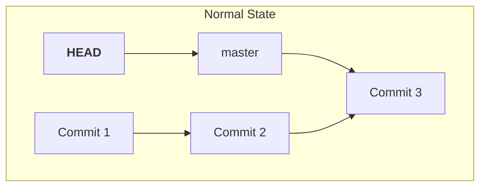
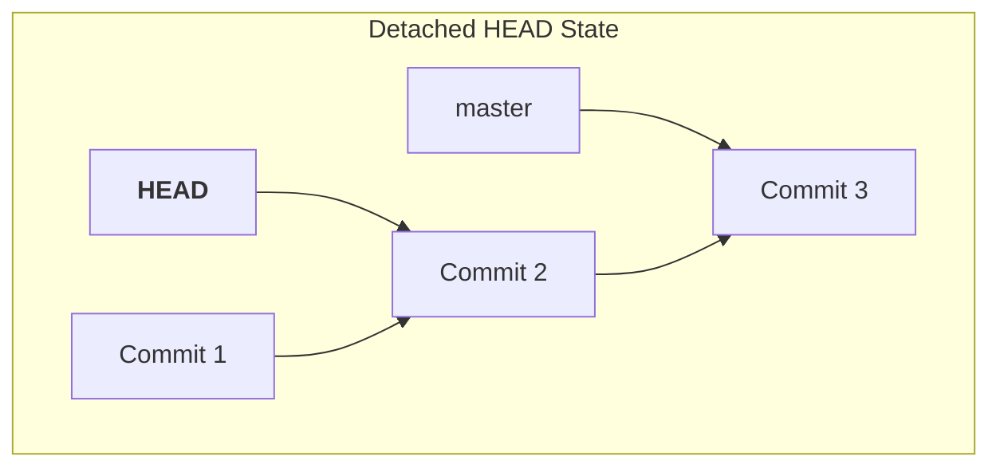

#Git #CoreCommand #History #Troubleshooting #Advanced

>  Using `git checkout` with a specific commit hash (instead of a branch name) allows you to "time travel" to view your project's state at that exact point in history. This puts you in a special state called a **"detached HEAD,"** where you are not on any branch.

---

## The "Swiss Army Knife": `git checkout` Revisited

As we've discussed, `git checkout` is a versatile command. While the modern `[[git switch]]` is preferred for changing branches, `checkout` has other powerful uses. One of its primary "other" functions is to view past commits directly.

## 🤔 What is a "Detached HEAD"?

When you run `git checkout <commit-hash>`, Git gives you a verbose and slightly alarming message: `You are in 'detached HEAD' state.`

> [!info] Don't Panic! It's Not a Bad Thing.
> A "detached HEAD" is not an error. It's Git's term for a state where `HEAD` is pointing **directly to a specific commit** instead of pointing to a branch name. You are effectively "floating" in your project's history, viewing a snapshot from the past without being on a particular timeline (branch).

### The Normal State vs. The Detached State

Understanding this is key to understanding what's happening under the hood.

**Normal State (`HEAD` is attached to a branch):**
`HEAD` points to a branch name, which in turn points to the latest commit on that branch. New commits move the branch pointer forward, and `HEAD` follows automatically.



**Detached HEAD State (`HEAD` is detached):**
`HEAD` bypasses the branch pointer and points *directly* at a specific commit hash. You are no longer on a branch.



---

## 🛠️ Hands-On Demo: Time Traveling

Let's use our `MyFirstNovel` repository to go back in time to before we renamed "Gatsby" to "Catsby."

### Step 1: Find Your Destination Commit
First, use `git log` to find the hash of the commit you want to visit. We want the commit *before* the rename.

```bash
git log --oneline
```
**Output:**
```
a1b2c3d (HEAD -> master) Add headings to all files
c4d5e6f Rename Gatsby to Catsby  <-- This is the change we want to undo
4f1b8a9 Split Chapter 1 into two parts <-- This is our destination!
...
```
We need the hash `4f1b8a9`. You only need the first 7 characters.

### Step 2: Check Out the Commit
Now, use `git checkout` with that hash.

```bash
git checkout 4f1b8a9
```
**Output:**
```
Note: switching to '4f1b8a9'.

You are in 'detached HEAD' state. You can look around, make experimental
changes and commit them, and you can discard any commits you make in this
state without impacting any branches by performing another checkout.
...
HEAD is now at 4f1b8a9 Split Chapter 1 into two parts
```

### Step 3: Observe the Effects
Your repository has now reverted to this past state.

-   **Files:** If you open `characters.txt`, you will see the name is "Gatsby," not "Catsby." Your working directory now perfectly reflects that moment in history.
-   **`git status`:** Shows `HEAD detached at 4f1b8a9`.
-   **`git log`:** The log will now be shorter, only showing commits up to and including the one you checked out.

### Peeking Under the Hood
We can prove that `HEAD` is pointing to a commit directly.
-   **Normal State:** `cat .git/HEAD` would show `ref: refs/heads/master`.
-   **Detached State:** `cat .git/HEAD` will now show the raw commit hash: `4f1b8a9...`

---

## How to Get Back to Normal

> [!success] The Escape Hatch
> You haven't lost any work! Your `master` branch and all its recent commits are still safe. To return to the present, simply switch back to any of your branches.

```bash
git switch master
```
Your files will revert to their latest versions, and `git log` will show the full history again. `HEAD` is now re-attached to the `master` branch.

---

> [!summary] Key Takeaway
> - `git checkout <commit-hash>` is the primary tool for **viewing** a past state of your project.
> - This puts you in a **detached HEAD** state, which is normal and temporary.
> - While in this state, you are not on any branch. `HEAD` points directly to a commit.
> - To return to your normal workflow, simply `git switch` back to a branch.
>
> In the next section, we'll see what happens if you try to make *new* commits while in this detached state and how you can use that to your advantage.