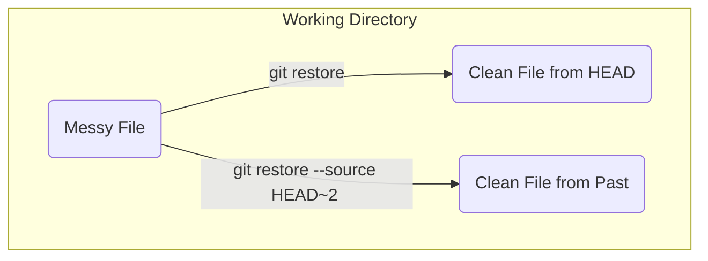

#Git #CoreCommand #Workflow #UndoingChanges #Troubleshooting

>  `git restore` is the new, dedicated command for undoing changes to files. It's a safer and clearer replacement for the "file-reverting" functionality that was confusingly overloaded onto `git checkout`.

---

## Why a New Command? `restore` vs. `checkout`

For years, the `git checkout` command was a "Swiss Army knife" that did too many unrelated things: switching branches, viewing old commits, and discarding file changes. This was a common source of confusion.

> [!success] The Split: `switch` and `restore`
> To make Git's commands more intuitive, two new, more focused commands were introduced:
> - **[[git switch]]**: Exclusively for switching branches.
> - **`git restore`**: Exclusively for restoring files (undoing changes).

While `[[Discarding Changes with git checkout -- <file>|git checkout -- <file>]]` still works, `git restore` is the modern and recommended way to perform these actions.

---

## Use Case 1: Discarding Uncommitted Changes (to `HEAD`)

This is the most common use case. You've made a mess of a file in your working directory and want to revert it back to the version in your last commit.

> [!info] The Command
> `git restore <file-name>`

This command tells Git: "Discard all the changes I've made to `<file-name>` since my last commit."

> [!danger] This is a Destructive Operation
> This command will permanently delete your uncommitted work in that file. Git has no record of these changes, so they cannot be recovered. Only use this if you are sure you want to discard your work.

### Demo:
1.  **Make a mess:** Open `dog.txt` and add a bunch of garbage text, then save the file. `git status` will show `modified: dog.txt`.
2.  **Restore the file:**
    ```bash
    git restore dog.txt
    ```
3.  **Verify:** Open `dog.txt` again. All the garbage text is gone, and the file is back to its clean, last-committed state. `git status` will show a clean working tree.

---

## Use Case 2: Restoring a File from a Past Commit

Sometimes, you don't want the version from your last commit; you want the version from an even older commit, without time-traveling your whole repository.

> [!tip] The Command with `--source`
> `git restore --source <commit> <file-name>`

-   `--source`: This flag tells `restore` to get the file from a specific point in history, not from `HEAD`.
-   `<commit>`: Can be a full commit hash or a relative reference like [[Relative Commits: Referencing the Past with HEAD~|HEAD~2]].

### Important Distinction: `restore` vs. `checkout <commit>`
This is a critical difference:
-   `git checkout <commit>`: Changes your **entire working directory** to match that past commit and puts you in a **[[`git checkout <commit>` & The Detached HEAD State|detached HEAD state]]**.
-   `git restore --source <commit> <file>`: **Only changes that one file** and keeps you on your **current branch**. The restored file is now simply a "modified" change in your working directory.

### Demo:
1.  **Get your bearings:** Our last commit was "third commit". Let's restore `dog.txt` to the state it was in at "first commit", which is two commits before `HEAD` (`HEAD~2`).
2.  **Restore from the past:**
    ```bash
    git restore --source HEAD~2 dog.txt
    ```
3.  **Verify:**
    -   Open `dog.txt`. It now only contains the line "first commit".
    -   Run `git status`. It will show `modified: dog.txt`. Git sees this as a new change you've made in your working directory.
    -   Run `git log`. You are **still on the `master` branch** at the "third commit". You have not entered a detached HEAD.

You have successfully plucked a version of a file from the past and brought it into your present working directory. From here, you can either commit this "reverted" version as a new change or discard it by restoring it back to `HEAD`: `git restore dog.txt`.

### Workflow Visualization

