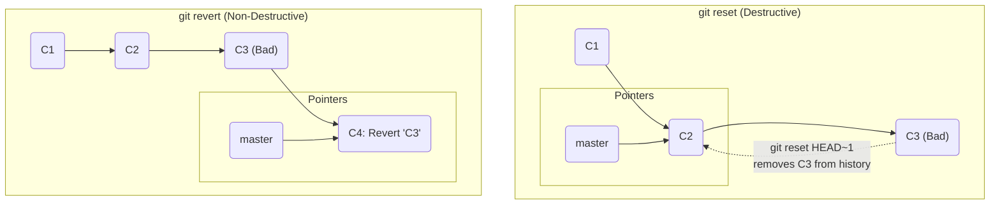

#Git #CoreCommand #UndoingChanges #Workflow #Collaboration

>  `git revert` undoes the changes introduced by a previous commit by creating a **brand new commit**. Unlike `git reset`, it does not delete or rewrite history, making it the safe and standard way to undo changes on a shared, public branch.

---

We now have three commands that sound similar but do very different things: `restore`, `reset`, and `revert`. `git revert` is used to undo an entire commit.

## The Critical Difference: `revert` vs. `reset`

Both `git revert` and `git reset` can be used to "undo" a commit, but they operate in fundamentally different ways.

> [!danger] `git reset`: Rewrites the Past
> `git reset` moves the branch pointer backwards, effectively **deleting** commits from the branch's history. It's like tearing pages out of a history book.

> [!success] `git revert`: Adds to the Future
> `git revert` does not delete anything. Instead, it looks at the changes in a past commit and creates a **new commit** that does the exact opposite. It's like adding a new page to the history book that says, "Correction: ignore the changes on page 87."

### Visualizing the Difference


With `reset`, commit `C3` is gone. With `revert`, `C3` is still in the history, but a new commit `C4` has been added that cancels it out.

---

## When to Use `revert`: The Collaboration Rule

This difference is absolutely critical when working in a team.

> [!best-practice] The Golden Rule: Public vs. Private History
> - Use **`git reset`** to clean up your **private, local history** (commits you have not yet pushed to a shared repository).
> - Use **`git revert`** to undo changes in **public, shared history** (commits that other people on your team may have already pulled).

Rewriting shared history with `git reset` can cause major problems and confusion for your collaborators. `git revert` creates a new, shareable commit that everyone can easily pull, keeping the project history consistent for the whole team.

---

## 🛠️ Hands-On: Reverting a Bad Commit

Let's see this in action.

### Step 1: Make a Bad Commit
First, let's make a commit that we'll want to undo.

```bash
# In our demo repo, make some unwanted changes to cat.txt and dog.txt
# e.g., echo "BAD COMMIT" >> cat.txt && echo "BAD COMMIT" >> dog.txt

git commit -a -m "Make a bad commit"
```
Our `git log` now shows this unwanted commit at the top. The "BAD COMMIT" text is in our files.

### Step 2: Find the Commit to Revert
We need the hash of the commit we want to undo.

```bash
git log --oneline
# 1a2b3c4 (HEAD -> master) Make a bad commit  <-- This is our target
# 4j5k6l7 third commit
# ...
```

### Step 3: Run the `git revert` Command
```bash
git revert 1a2b3c4
```

### Step 4: The Revert Commit Message
Just like with a merge, `git revert` creates a new commit, so it needs a message. It will open your default editor with a pre-populated message.

**Default Message:**
```
Revert "Make a bad commit"

This reverts commit 1a2b3c4...
```
This is usually a good default message. You can add more details explaining *why* you are reverting if you wish. For now, just **save and close the file** to finalize the revert.

### Step 5: Verify the Result
Let's look at our project now.

-   **File Contents:** If you open `cat.txt` and `dog.txt`, the "BAD COMMIT" text is gone! The files have been restored to their state before the bad commit.
-   **History:** This is the key part.
    ```bash
    git log --oneline
    ```
    **Output:**
    ```
    d5e6f7g (HEAD -> master) Revert "Make a bad commit"
    1a2b3c4 Make a bad commit
    4j5k6l7 third commit
    ...
    ```
    > [!success] History is Preserved!
    > The "Make a bad commit" is still part of the project's permanent record, but a new commit has been added on top that perfectly cancels out its changes. You have a clear and honest history of what happened.

---

### A Note on Conflicts
Just like `git merge`, `git revert` can sometimes result in conflicts. If you are reverting an old commit, and more recent commits have also modified the same lines of code, Git may not know how to undo the changes cleanly. If this happens, it will stop and ask you to resolve the conflict manually, following the same [[Resolving Merge Conflicts|Edit -> Add -> Commit]] process as a merge conflict.