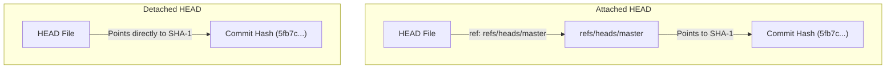

#Git #DevOps #Internals #HEAD #DetachedHEAD #GitInternals #CoreConcept

> [!abstract] Brief Description
> This note explains the role and internal mechanics of the `.git/HEAD` file. You will learn how Git tracks your current position, the difference between pointing to a branch reference (attached) and pointing directly to a commit hash (detached HEAD), and how this file changes during checkouts.

---

> [!note] 📖 The Core Analogy: The Laser Pointer
> Imagine you have a large project timeline map on your office wall:
> - **The Laser Pointer (HEAD File):** The pointer you hold to indicate *"where I am looking right now."*
> - **Attached HEAD (Pointing to a Flag):** You aim the laser at a flag labeled "master." If a coworker moves the "master" flag forward to a new checkpoint, your laser automatically follows because it is locked onto the flag.
> - **Detached HEAD (Pointing to a Grid Coordinate):** You aim the laser directly at a historical grid coordinate on the map. The laser is detached from all flags. If coworkers add new checkpoints and flags, your laser remains frozen on that single historical coordinate.

---

## 🎯 1. What is the HEAD File?

The `HEAD` file is a plain-text file located at `.git/HEAD`. It acts as Git's internal pointer to track your current working directory's position in history.

Whenever you run commands like `git status`, `git diff`, or `git commit`, Git checks the `HEAD` file first to determine what your current active state is.

---

## 🔗 2. Attached HEAD: Reference to a Reference

Under normal conditions, you are working on a specific branch (e.g., `master`). In this state, the `HEAD` file does not contain a commit hash. Instead, it contains a reference to a branch file:

```text
ref: refs/heads/master
```

This makes `HEAD` a **pointer to a pointer**:
1.  `HEAD` points to `refs/heads/master`.
2.  `refs/heads/master` points to the latest commit hash (e.g., `796a2b...`).

### Switching Branches
When you switch branches (e.g., `git switch chicken`), Git simply updates the text inside the `.git/HEAD` file:

```text
ref: refs/heads/chicken
```

---

## ⚠️ 3. Detached HEAD: Direct Hash Reference

If you check out a specific commit hash or a tag directly (e.g., `git checkout 5fb7c8`), you leave the safety of a branch timeline. Git places you in a **detached HEAD state**.

### What Changes in the File?
If you open `.git/HEAD` while in a detached HEAD state, the `ref:` pointer is gone. The file now contains the raw, 40-character commit hash directly:

```text
5fb7c8d9a0b1c2d3e4f5a6b7c8d9e0f1a2b3c4d5
```



In this state:
*   `HEAD` is detached because it no longer points to any branch file inside `refs/heads/`.
*   If you make new commits here, `HEAD` will update to point directly to them, but no branch pointer will move with you, making those commits orphaned if you switch away.

---

> [!summary] Key Takeaways
> - **Core concept:** The `.git/HEAD` file is a text file that records your current active location in the repository.
> - **Key implementation detail:** In an attached state, it holds a path reference to a branch file (e.g., `ref: refs/heads/master`). In a detached state, it holds the raw 40-character commit hash directly.
> - **Best practice:** Check the state of the `.git/HEAD` file if you are troubleshooting repository pointer errors or need to verify if you are in a detached state.
