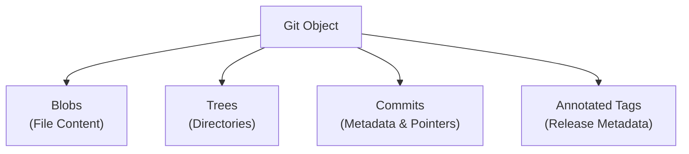

#Git #DevOps #Internals #ObjectsFolder #GitInternals #CoreConcept

> [!abstract] Brief Description
> This note introduces the `.git/objects` directory, which serves as Git's core database. You will learn how Git organizes files using hexadecimal subdirectories, understand Git's snapshot model (as opposed to delta-based version control), and explore the four primary object types.

---

> [!note] 📖 The Core Analogy: The Compressed Blueprint Vault
> Imagine a physical architecture firm storing building designs over time:
> - **Delta-Based Storage (Traditional VCS):** Storing only the list of modifications (e.g., *"Chapter 1: Add 2 windows. Chapter 2: Move the door 3 feet left"*). To see what the building looks like today, you must read the entire book of modifications from start to finish.
> - **Snapshot-Based Storage (Git):** Storing a complete, printed architectural blueprint of the entire building for every revision. Even if you only change a single window, Git prints a whole new blueprint.
> - **Vacuum-Sealed Folders (Objects Directory):** Folding the blueprints, sealing them in compressed plastic folders labeled `ce` or `dd` to save space. You cannot read them through the packaging, but they contain complete records.

---

## 📦 1. Inside the Objects Directory

The `.git/objects` directory contains all the data for your repository. If you look inside this folder in VS Code or via terminal, you will see a collection of two-digit hexadecimal folders:

```text
.git/objects/
├── ce/
│   └── 013621a556852fc7e53b53ece5c28b7e5c28b
├── dd/
│   └── 7e1...
├── info/
└── pack/
```

### Why two-digit folders?
Git uses a 40-character SHA-1 hash to name objects. To prevent performance degradation on file systems that struggle with thousands of files in a single folder, Git splits the hash:
1.  The **first 2 characters** form the subdirectory name (e.g., `ce`).
2.  The **remaining 38 characters** form the filename (e.g., `013621...`).

> [!warning] Compressed Binary Files
> The files inside the `objects` directory are compressed and zlib-deflated binary files. If you attempt to open them in a standard text editor, they will show as binary junk or throw an "unsupported text encoding" warning.

---

## 📸 2. Git's Snapshot Model

A fundamental architectural choice of Git is that **it stores full file snapshots, not differences (deltas).**

*   **Other VCS (like SVN):** Store a base file and a list of modifications (deltas) over time. This makes checking out old versions slow because Git would have to re-apply hundreds of diffs.
*   **Git:** Stores a complete copy of every file version. If a file is unmodified in a new commit, Git does not duplicate it; it simply points back to the existing file snapshot.

---

## 🧩 3. The Four Core Git Object Types

Every file, directory, commit, and tag in your project is stored inside `.git/objects` as one of four basic Git objects:



1.  **Blobs (Binary Large Objects):** Store the raw file contents (code, text, images). A blob has no filename, folder structure, or creation date metadata—just bytes of data.
2.  **Trees (Directories):** Store the folder structure. A tree object is a list of directory contents, mapping filenames and permissions to their corresponding blob hashes or sub-tree hashes.
3.  **Commits:** Store the commit metadata. A commit object contains a pointer to the top-level tree object (the project snapshot), parent commit hashes, author/committer names, timestamps, and commit messages.
4.  **Annotated Tags:** Store release information. They contain a pointer to a commit, tagger details, and a tag message.

---

> [!summary] Key Takeaways
> - **Core concept:** The `.git/objects` directory is an object database storing snapshots of all project data compressed into binary files.
> - **Key implementation detail:** Git groups objects into two-digit directories to optimize filesystem lookup times.
> - **Best practice:** Remember that Git stores complete file snapshots rather than diffs. This makes history traversals and branch switching extremely fast.
