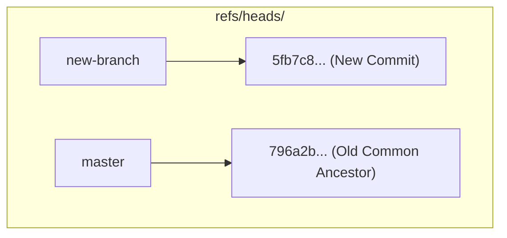

#Git #DevOps #Internals #Refs #Branches #Tags #Remotes #GitInternals #CoreConcept

> [!abstract] Brief Description
> This note analyzes the structure and mechanics of the `refs` (references) directory inside `.git/refs`. It explains how Git represents branches, tags, and remote tracking branches as simple plain-text files containing 40-character SHA-1 commit hashes.

---

> [!note] 📖 The Core Analogy: The Reference Rolodex
> Imagine you keep a card Rolodex on your desk to track the locations of files in a warehouse:
> - **The Rolodex Categories (Heads, Tags, Remotes):** Dividing cards into sections for local items, permanent historical items, and remote warehouse items.
> - **The Card (Branch file):** A single index card labeled "master" or "feature".
> - **The Location Number (Commit Hash):** A 40-character coordinate written in pencil on the card. When new items are added, you erase the old coordinate and write the new tip location.

---

## 📂 1. The Structure of refs/

In Git, branches, tags, and remote tracking references are collectively called **References** (or `refs`). They are stored in the `.git/refs/` directory.

If you list the contents of `.git/refs/`, you will find three primary subdirectories:

```text
.git/refs/
├── heads/     # Local branches (e.g., master, feature)
├── tags/      # Release tags (e.g., v1.0.0, mytag)
└── remotes/   # Remote tracking branches (e.g., origin/master)
```

---

## 🌿 2. Local Branches (`refs/heads/`)

Git represents every local branch in your repository as a single plain-text file inside `.git/refs/heads/`. The name of the file matches the name of the branch.

### How Branches Point to Commits
Inside a branch file (such as `.git/refs/heads/master`), there is no complex data structure—only a single 40-character SHA-1 commit hash:

```text
5fb7c8d9a0b1c2d3e4f5a6b7c8d9e0f1a2b3c4d5
```

When you create a new commit while on a branch:
1.  Git writes the new commit object to its database.
2.  Git updates the corresponding branch file in `.git/refs/heads/`, overwriting the old commit hash with the new commit's SHA-1 hash.

### Divergence Visualized
If you create two branches on the same commit, both files contain the same hash. As you make a commit on `new-branch`, only that file updates, while `master` remains anchored to the older commit.



---

## 🏷️ 3. Tags & Remote Pointers (`tags/` & `remotes/`)

The other subdirectories inside `refs/` behave similarly but serve different purposes:

### Release Tags (`refs/tags/`)
Each file in `.git/refs/tags/` is named after a tag (e.g., `v17.0.0`) and contains the commit hash of the tagged checkpoint. Unlike branch files, tag files are static and do not automatically update when you make new commits.

### Remote Tracking Branches (`refs/remotes/`)
The `remotes/` directory contains folders for each remote configured (such as `origin/`). Inside, files like `refs/remotes/origin/master` track the tip of the master branch on the remote server as of your last communication.

*   When you run `git fetch`, Git updates the commit hashes stored in these files to reflect the remote's latest state, allowing Git to calculate if your local branch is ahead or behind.

---

> [!summary] Key Takeaways
> - **Core concept:** Branches and tags in Git are not heavy directories; they are simple plain-text files containing a 40-character commit hash pointing into the object database.
> - **Key implementation detail:** Local branches are stored in `refs/heads/`, tags in `refs/tags/`, and remote branches in `refs/remotes/`.
> - **Best practice:** Understand that creating a branch is a lightning-fast, zero-overhead operation because Git only needs to write a 40-character text file.
