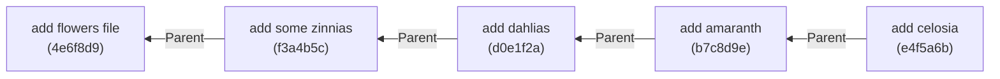

#Git #DevOps #Reflog #GitRebase #InteractiveRebase #HistoryRewriting #GitInternals #CoreConcept

> [!abstract] Brief Description
> This guide demonstrates how to recover original, individual commits after a rebase operation (such as an interactive squash or fixup) has rewritten history. You will learn how to identify the pre-rebase commit tip in the reflog and restore it to reconstruct your original commit chain.

---

> [!note] 📖 The Core Analogy: The Sculpting Scan Recovery
> Imagine working in a clay modeling studio:
> - **The Action (Rebase Squash):** You have four separate small clay sculptures (individual commits). You decide they look cluttered, so you mash them together into a single large clay block (squashed commit) with a new label. The original separate shapes are gone.
> - **The Recovery (Reflog):** Before you mashed the clay, the studio's security camera took a detailed 3D scan of the shelf (the pre-rebase commit hash). By querying the security logs, you extract the 3D file coordinate, reload the scan, and restore the four original separate sculptures onto your shelf, discarding the mashed block.

---

## 🔄 1. The Rebase Rewriting Mechanism

When you run `git rebase` (especially an interactive rebase to `squash` or `fixup` commits), Git rewrites history. It creates brand new commits with new SHA-1 hashes and moves your branch pointer to them, abandoning the original commits.

Once completed, the individual commits and their original messages are completely erased from your branch lineage (`git log`). However, the original commit objects are not immediately deleted from the database—they remain indexed in your local reflog.

---

## 🛠️ 2. Step-by-Step Walkthrough: Undoing a Squash/Fixup

### Scenario:
We have a feature branch named `flowers` containing four commits:
1.  `add flowers file`
2.  `add some zinnias`
3.  `add dahlias`
4.  `add celosia` (Tip of branch)

We run `git rebase -i HEAD~4` and squash/fixup all commits into a single commit with the message `add list of seeds`.

### Step 1: Inspect the Branch Reflog
To find the original commits, inspect the reflog of the specific feature branch:

```bash
git reflog show flowers

# Output:
# a1b2c3d flowers@{0}: rebase -i (finish): returning to refs/heads/flowers
# a1b2c3d flowers@{1}: rebase -i (squash): add list of seeds
# ...
# e4f5a6b flowers@{5}: commit: add celosia     <-- This was our original tip!
# b7c8d9e flowers@{6}: commit: add amaranth
# d0e1f2a flowers@{7}: commit: add dahlias
# f3a4b5c flowers@{8}: commit: add some zinnias
```

*Note: The entry `flowers@{5}` represents the state of the branch right before the rebase started.*

### Step 2: Reset the Branch Pointer
To undo the rebase, reset the branch back to the pre-rebase commit hash (`e4f5a6b`) or the reflog coordinate (`flowers@{5}`):

```bash
# Ensure you are on the flowers branch
git switch flowers

# Perform a hard reset to the pre-rebase tip commit
git reset --hard e4f5a6b
# Or: git reset --hard flowers@{5}
```

### Step 3: Verify Restoration
Run `git log` to confirm that the squashed block is gone and the original four commits are fully restored to the branch timeline:

```bash
git log --oneline

# Output:
# e4f5a6b (HEAD -> flowers) add celosia
# b7c8d9e add amaranth
# d0e1f2a add dahlias
# f3a4b5c add some zinnias
# 4e6f8d9 add flowers file
```

---

## 🔗 3. Why Parentage Restores the Whole Chain

Why does resetting to just *one* commit hash (`e4f5a6b` / `add celosia`) restore all the other three commits?



Because every commit object in Git contains a hardcoded metadata field referencing its parent commit. When you point your branch to `e4f5a6b`, Git traverses the parentage chain backward. By restoring the tip commit, the entire ancestral chain is pulled back into the active history graph.

---

> [!summary] Key Takeaways
> - **Core concept:** Squashing or fixing up commits in a rebase leaves the original commits floating as unreachable objects in the database, protected by the reflog.
> - **Key implementation detail:** You can restore the pre-rebase state of a branch by hard resetting the branch to the reflog index from right before the rebase started.
> - **Best practice:** Use branch-specific reflogs (`git reflog show <branch>`) to isolate the history of that branch's tip and locate original pre-rebase commits easily.
