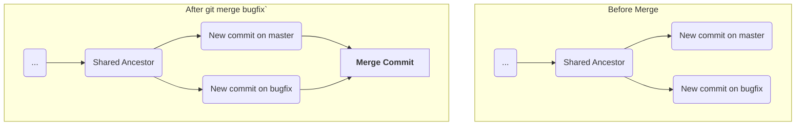

#Git #CoreConcept #Merging #Workflow #Branching
>  When both your current branch and the branch you want to merge in have new, unique commits, Git cannot perform a simple [[Hands-On: Performing a Fast-Forward Merge|fast-forward]]. Instead, it performs a **3-way merge** by creating a special new **merge commit** that has two parents, tying the diverged histories back together.

---

## 🤔 When Fast-Forward Isn't Possible

A fast-forward merge only works when one branch is a direct descendant of the other. But what happens in a more common, collaborative scenario?

> [!danger] The Divergence Problem
> 1. You create a new branch (`bugfix`) from `master` and start working.
> 2. While you are working on your branch, a teammate makes a new commit directly on the `master` branch.
> 3. Now, both branches have unique commits that the other doesn't know about. Their histories have **diverged**.

In this case, Git can't just move the `master` pointer forward, because that would lose the new work your teammate did on `master`.

## ✨ The Solution: The Merge Commit

To resolve this, Git automatically creates a special **merge commit**.

> [!info] Properties of a Merge Commit
> - It is created automatically by Git during a non-fast-forward merge.
> - It has **two parents**: the tip of the current branch and the tip of the branch being merged in.
> - Its purpose is to unite two diverging lines of history.
> - Git will prompt you for a commit message for this new commit, usually by opening your default editor.

### Visualizing the 3-Way Merge


The new merge commit (`J_Merge`) ties the two separate histories back together.

---

## 🛠️ Hands-On: Performing a 3-Way Merge

Let's walk through this process in a clean repository to see it in action.

### Step 1: Create a Divergence
Our goal is to create a situation where both `master` and a feature branch (`ABBA`) have new, unique commits.

1.  **Setup:** Create a new repo and make two initial commits on `master`.
    ```bash
    mkdir PlaylistTake2 && cd PlaylistTake2
    git init
    # ... create songs.txt and make two commits ...
    # (e.g., "add songs file", "add two ABBA songs")
    ```
2.  **Create and develop on the feature branch:**
    ```bash
    git switch -c ABBA
    # ... add "Mamma Mia" and "Dancing Queen" in two separate commits ...
    ```
3.  **Create new, unique work on `master`:** This is the key step.
    ```bash
    git switch master
    # ... create a new file `podcasts.txt` and add some podcasts in two separate commits ...
    # (e.g., "add podcasts file", "add three podcasts")
    ```
Now our history has diverged. `master` has podcast commits that `ABBA` doesn't, and `ABBA` has song commits that `master` doesn't.

### Step 2: Switch to the Receiving Branch
As always, we must be on the branch we want to merge *into*. We want to bring the `ABBA` changes into `master`.

```bash
# We are already on master, but if not:
git switch master
```

### Step 3: Run the Merge Command

```bash
git merge ABBA
```

### Step 4: The Merge Commit Message
Because this is not a fast-forward merge, Git cannot complete it automatically. It needs to create a new merge commit, and that commit needs a message.

-   Your configured text editor (e.g., VS Code) will open with a pre-filled message like `Merge branch 'ABBA'`.
-   For a simple merge like this, you can usually just accept the default message.
-   **Save and close the file** to finalize the merge.

### Step 5: Analyze the Result
Your terminal will confirm the merge was successful.

**Output:**
```
Merge made by the 'recursive' strategy.
 songs.txt | 2 ++
 1 file changed, 2 insertions(+)
```
Now, let's look at the log. This is where you see the new structure.
```bash
git log --oneline --graph
```
**Output (will look similar to this):**
```
*   1a2b3c4 (HEAD -> master) Merge branch 'ABBA'
|\
| * 4d5e6f7 (ABBA) Add Dancing Queen
| * 7g8h9i0 Add Mamma Mia
* | 3j4k5l6 Add three podcasts
* | 9m8n7o6 add podcasts file
|/
* 5p6q7r8 Add two ABBA songs
* 2s3t4u5 add songs file
```
> [!success] The Merge Commit is Visible!
> The `git log` clearly shows the new merge commit at the top, with lines indicating how it ties together the two previously separate histories from the `master` and `ABBA` branches. Your `master` branch now contains all the work from both lines of development.

---

### What About Conflicts?
This demonstration was the "happy path" for a 3-way merge. We made changes in different files (`songs.txt` on the `ABBA` branch, `podcasts.txt` on the `master` branch), so Git could automatically combine the work without any issues.

> [!tip] What's Next: Merge Conflicts
> What happens if both branches had edited the *same lines* in the *same file*? Git wouldn't know which version to keep. This situation is called a **[[Merge Conflicts|merge conflict]]**, and Git will stop and ask you, the developer, to resolve it manually.