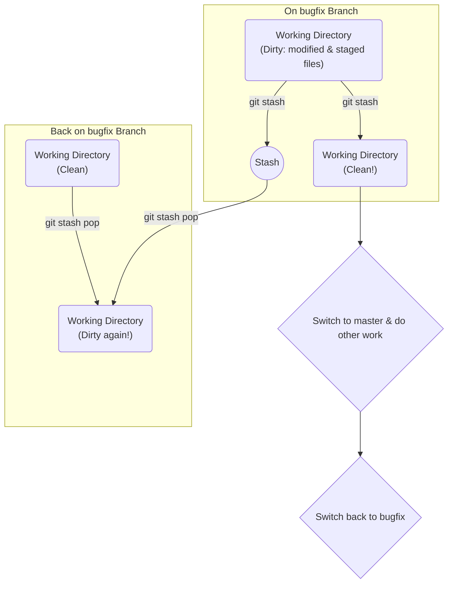

#Git #CoreCommand #Workflow #Troubleshooting

>  `git stash` is a command that takes your uncommitted changes (both staged and unstaged), saves them on a temporary "shelf," and cleans your working directory. This allows you to quickly switch branches without committing incomplete work. `git stash pop` brings those changes back.

---

## 🤔 The Problem: The "I'm Not Done, But I Have to Go" Scenario

You're in the middle of working on a new feature on your branch, `feature/new-ui`. Your code is half-finished and not ready for a proper [[Commit]]. Suddenly, an urgent request comes in: you need to switch to the `hotfix/login-bug` branch to fix a critical issue *right now*.

What do you do with your incomplete work?

> [!danger] The Bad Options
> 1.  **Make a messy, incomplete commit:** You could commit your work with a message like `"WIP - work in progress"`. This clutters your project history with meaningless commits that you'll have to clean up later.
> 2.  **Try to switch branches anyway:** As we've learned, Git will either:
>     - **Block you with an error** if your changes conflict with the destination branch.
>     - **Carry the changes over** to the new branch if there's no conflict, which can be very confusing.

You need a way to "pause" your current work without making a permanent commit.

## ✨ The Solution: The `git stash` Workflow

`git stash` is the perfect solution. Think of it as a temporary storage shelf for your uncommitted work.

> [!success] The Stash-and-Return Workflow
> The process is simple:
> 1. You have uncommitted changes you need to save.
> 2. You run `git stash`. Git saves your changes to a "stash" and reverts your working directory to match your last commit (`HEAD`). Your working tree is now clean.
> 3. You are now free to switch branches, pull updates, or do whatever else you need to do.
> 4. When you're ready to resume your work, you switch back to your original branch and run `git stash pop`. Git takes your saved changes off the shelf and reapplies them to your working directory.

### The Core Commands
-   **`git stash`** (or `git stash save`): Takes all current uncommitted changes (staged and unstaged) and "stashes" them away, cleaning your working directory.
-   **`git stash pop`**: Takes the *most recently stashed* set of changes, reapplies them to your current working directory, and removes them from the stash.

### Workflow Visualization


---

## 🛠️ Hands-On Demo: A Practical Stashing Scenario

Let's walk through the exact problem `stash` is meant to solve.

### Step 1: Create Uncommitted, Conflicting Work
1.  On a new branch called `goodbye`, make some changes. For example, in `index.html`, change `"Hello World"` to `"Goodbye World"`, and in `app.css`, set the `background-color` to `magenta`.
2.  On the `master` branch, make a different change to `index.html`, like adding exclamation points to `"Hello World"`, and commit it. This ensures a conflict will occur.
3.  Switch back to the `goodbye` branch. `git status` shows your uncommitted changes.

### Step 2: The Blocked Switch
Now, try to switch to `master` without committing your work on the `goodbye` branch.

```bash
# On branch 'goodbye' with uncommitted changes...
git switch master
```
**Git blocks you with an error:**
> [!danger] Conflict Detected!
> `error: Your local changes... would be overwritten by checkout: index.html`
> `Please commit your changes or stash them before you switch branches.`

### Step 3: Stashing the Changes
Instead of making a messy commit, let's stash the work.

```bash
# Still on branch 'goodbye'
git stash
```
**Output:**
```
Saved working directory and index state WIP on goodbye: <hash> <commit_message>
```
Look at your files and browser! The "Goodbye World" text and the magenta background are gone. Your working directory is now clean, as if you never made the changes. `git status` will confirm: `nothing to commit, working tree clean`.

### Step 4: Freedom to Move
With your changes safely stashed, you are now free to move.

```bash
git switch master
# Success! You are now on the master branch.
```
You can now do whatever work was required on `master`.

### Step 5: Returning and Popping the Stash
When you're ready to resume your work, return to the original branch and "pop" the stash.

```bash
# Go back to your feature branch
git switch goodbye

# Reapply your stashed changes
git stash pop
```
**Output:**
```
On branch goodbye
Changes not staged for commit:
...
        modified:   app.css
        modified:   index.html

no changes added to commit
Dropped refs/stash@{0} (...)
```
Your "Goodbye World" text and magenta background are back! The stashed changes have been reapplied, and you can pick up exactly where you left off.