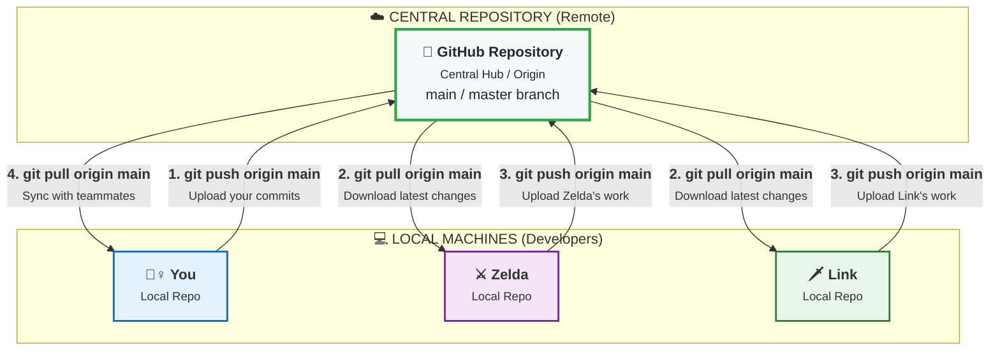

#Git #GitHub #CoreConcept #Workflow #Collaboration #Remote

>  **GitHub** is the cloud platform for hosting Git projects, enabling backup, collaboration, and open-source development. **`git clone <URL>`** is the command you use to download a complete copy of a remote repository, including its entire history, to your local machine.

---

## 🤔 What is GitHub?

While [[Git]] is the tool you run on your computer, **GitHub** is the website where you give your Git projects "a home in the cloud."

At its core, GitHub is a **hosting platform for Git repositories**. Over the years, it has evolved into a massive ecosystem with many features, but its primary purpose remains:

-   **Cloud Backup:** Store your local repositories remotely. If your computer is lost or damaged, your code is safe.
-   **Collaboration:** GitHub provides the central "source of truth" that allows teams of developers to work on the same project from anywhere in the world.
-   **Community & Discovery:** It acts as a social network for developers, a place to share code, contribute to projects, and showcase your work.

### The Collaboration Loop Visualized



---

## ✨ Why Use GitHub?

Beyond just backing up your code, GitHub is an essential part of the modern developer ecosystem.

> [!success] The Benefits of Using GitHub
> - **🤝 Collaboration at Scale:** GitHub is built for teamwork. Projects like React and TensorFlow have thousands of contributors working together through GitHub's toolset.
> - **🌐 The Home of Open Source:** If you want to use or contribute to an open-source project, it almost certainly lives on GitHub. Contributing to these projects is a fantastic way to learn and build your skills.
> - **💼 Your Developer Résumé:** Your GitHub profile acts as a public portfolio of your work. Employers frequently review GitHub profiles to see real examples of a candidate's code, problem-solving skills, and collaboration history.
> - **📰 Stay Up-to-Date:** By "watching" or "starring" projects, you can stay informed about the latest developments, discussions, and releases for the tools and libraries you use every day.

---

## `git clone`: Creating Projects from Remotes

So far, we have only created projects from scratch using `[[`git init` & `git status`: Creating Your First Repository|git init]]`. But what if the project already exists on GitHub? This is where `git clone` comes in.

> [!tip] `init` vs. `clone`: The Two Ways to Start
> - **`git init`**: Creates a brand new, empty repository on your local machine.
> - **`git clone`**: Creates a local copy of an **existing** remote repository.

`git clone` downloads the entire repository, including all files, branches, and the complete commit history, and sets it up as a new Git repository on your computer.

### The Command
```bash
git clone <URL-of-remote-repository>
```

---

## 🛠️ Hands-On Demo: Cloning a Repository

Let's clone the source code for the popular game "2048".

#### 1. Find the Repository URL on GitHub
Navigate to the project's page on GitHub (e.g., `https://github.com/gabrielecirulli/2048`). Click the green **"< > Code"** button, and copy the HTTPS URL.

#### 2. The Safety Check
In your terminal, navigate to the directory where you want to store your projects. Crucially, **make sure you are not already inside a Git repository**.

```bash
# A quick check to be safe
git status
# Expected output: fatal: not a git repository...
```

#### 3. Run the Clone Command
```bash
git clone https://github.com/gabrielecirulli/2048.git
```
Git will download the project, showing you its progress.

#### 4. Explore the Cloned Repository
Once finished, you will have a new folder named `2048`.

```bash
# Navigate into the new folder
cd 2048

# Check its status
git status
# Output: On branch master... Your branch is up to date...

# Check its history
git log --oneline
# You will see the complete history of all 180+ commits!
```
You now have a complete, fully-functional copy of the entire project and its history on your local machine. You can open the `index.html` file in your browser to play the game, or modify the code to experiment with it.

---

## Important Nuances of Cloning

### Permissions: Clone vs. Push
> **Anyone can `clone` a public repository.** If you can see it on GitHub, you have permission to download a copy. However, you do **not** have permission to `push` (upload) changes directly back to the original repository. There is a specific workflow for suggesting changes to a project you don't own (called "Pull Requests"), which we will cover later.

### `clone` is a Git Command, Not a GitHub Command
> While GitHub is the most popular place to host repositories, `git clone` is a native Git command and is not tied to GitHub. It can clone a repository from **any** remote hosting service, such as GitLab, Bitbucket, or a privately hosted server.