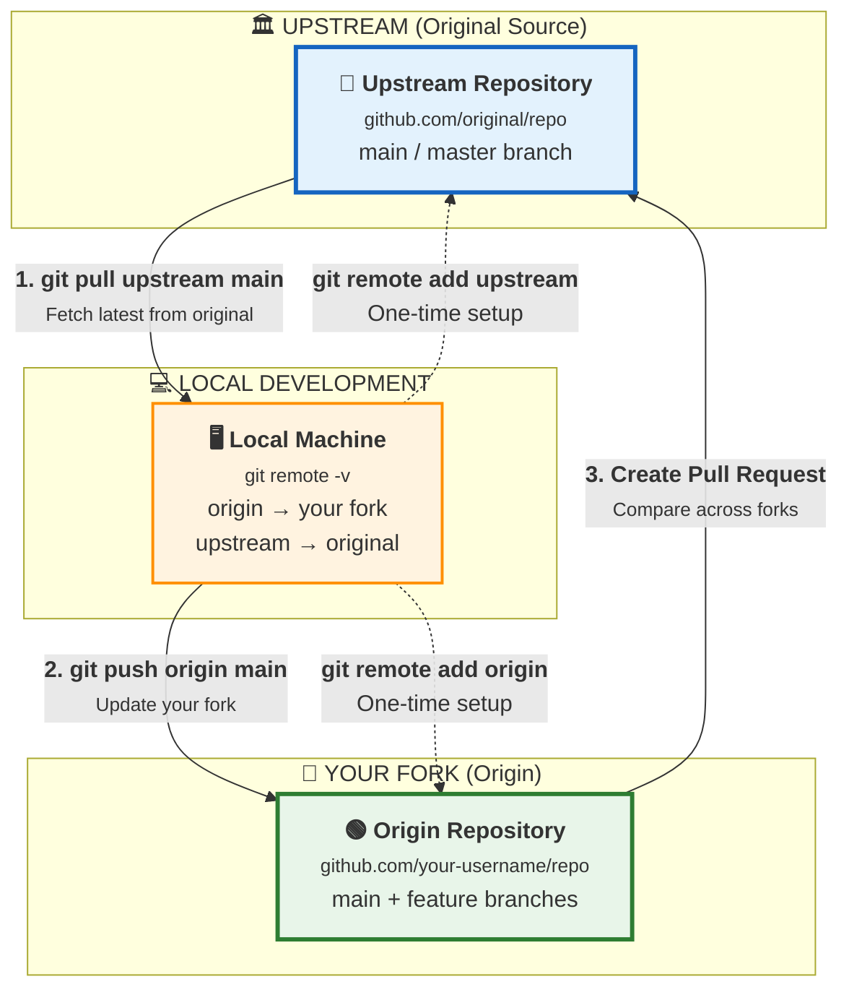

#GitHub #OpenSource #Collaboration #Forking #Workflow

> "Forking is a workflow where, instead of just one centralized repository, every developer has their own GitHub repository in addition to the main centralized repo."

---

## 🍴 What is Forking?
Forking is a feature of GitHub (not Git itself) that allows you to create a **personal copy** of someone else's repository on your GitHub account.

*   **Personal Copy**: You have full permissions to your fork (clone, push, delete branches) even if you don't have access to the original.
*   **The Goal**: Enables contribution to large open-source projects (like React, TensorFlow) where thousands of contributors cannot all be given direct write access.
*   **No Permission Needed**: You don't need to be added as a collaborator to fork a repo.

---

## ❓ When to Use This Workflow?
*   **Open Source**: Contributing to projects you don't own (e.g., fixing a bug in React).
*   **Large Teams**: When you don't want to manage write access for hundreds of developers.
*   **"Try Before You Buy"**: Allowing external contributors to propose changes without giving them the keys to the castle.

---

## 🔄 The "Fork and Clone" Workflow
This workflow involves two remotes and a specific cycle to keep everything in sync.

### The Setup
1.  **Fork**: Click the "Fork" button on the original repository (e.g., `Colt/2048`).
    *   Result: You now have `Stevie/2048` on your account.
2.  **Clone**: Clone **your fork** to your local machine.
    *   `git clone <url-of-your-fork>`
    *   The default remote `origin` points to **your fork** (where you can push).
3.  **Add Upstream**: Add a second remote pointing to the **original repository**.
    *   `git remote add upstream <url-of-original-repo>`
    *   Purpose: To pull down changes made by the maintainers (e.g., keeping up to date).

### 📊 Visualizing the Flow


---

## 🚀 Step-by-Step Guide

### 1. Forking a Repository
*   Navigate to the repository you want to contribute to.
*   Click the **Fork** button (top right).
*   GitHub creates a copy under your username.

### 2. Cloning & Verifying Remotes
```bash
git clone https://github.com/Stevie/project.git
cd project
git remote -v
# origin  https://github.com/Stevie/project.git (fetch/push)
```
*   **Pro Tip**: `origin` is automatically set to the repo you cloned (your fork).

### 3. Adding the Upstream Remote
To ensure you can get updates from the original project (e.g., if the owner adds "Ice Cream flavors" to the README), you need to connect to it.
```bash
git remote add upstream https://github.com/Colt/project.git
git remote -v
# origin    https://github.com/Stevie/project.git (your fork)
# upstream  https://github.com/Colt/project.git (original repo)
```

### 4. The Contribution Cycle
1.  **Pull from Upstream**: Get the latest changes from the original repo.
    ```bash
    git pull upstream main
    ```
2.  **Work**: Make revisions, add features, or fix bugs locally.
    *   *Best Practice*: Create a feature branch (`git switch -c my-feature`) instead of working on main!
    ```bash
    git add .
    git commit -m "Add my favorite ice cream flavors"
    ```
3.  **Push to Origin**: Push your changes to **your fork** (you can't push to upstream!).
    ```bash
    git push origin main
    ```
4.  **Open Pull Request**:
    *   Go to GitHub.
    *   You'll see a prompt: "This branch is 1 commit ahead of Colt:main".
    *   Click **Compare & pull request**.
    *   Submit the PR to the original repository for review.

---

## 🧩 Scenario: The "Ice Cream" Example
*   **Colt (Owner)** updates the `README.md` with his favorite ice creams on the original repo.
*   **Stevie (Contributor)**:
    1.  **Pulls** from `upstream` to get Colt's list.
    2.  **Adds** her own favorite flavors (Peppermint, Mint Chip).
    3.  **Pushes** to her `origin` (Stevie's fork).
    4.  **Opens a PR** to suggest adding her list to the main project.
*   **Colt** reviews the PR, merges it, and now Stevie's changes are part of the official project.

---

## ⚠️ Common Pitfalls
1.  **Clone the Original**: If you clone `Colt/2048` directly, you won't be able to push changes (Permission Denied 🚫). Always clone **your fork**.
2.  **Pushing to Upstream**: You cannot `git push upstream main`. You only have read access.
3.  **Forgetting to Sync**: If you don't `git pull upstream` regularly, your fork will diverge, leading to easier merge conflicts.

---

## 🏆 Summary
| Term | Definition | Permission |
| :--- | :--- | :--- |
| **Fork** | Your personal GitHub copy of a repo. | **Read/Write** (It's yours) |
| **Origin** | Remote pointing to **your fork**. | **Read/Write** (Push here) |
| **Upstream** | Remote pointing to the **original repo**. | **Read Only** (Pull from here) |
