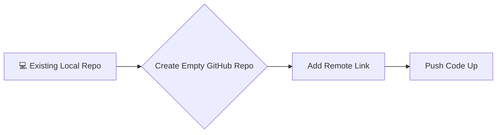
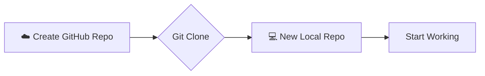

#Git #GitHub #Workflow #Remote #Collaboration

>  There are two ways to connect a local project to GitHub. **Option 1**: Create an empty repo on GitHub and connect your existing local code. **Option 2**: Create a repo on GitHub first, clone it down, and start working.

---

## 🛤️ The Two Approaches

Depending on where you are starting your project, you will use one of these two workflows.

### Option 1: Pushing an Existing Repository
**Use this when:** You have already started working on your computer (you have a local `.git` folder with commits) and now want to put it on GitHub.

### Option 2: Cloning a New Repository
**Use this when:** You haven't started working yet. You want to set up the project on GitHub first and then bring it down to your machine.

*(Note: When you clone, the remote connection is set up automatically).*

---

## 🛠️ Hands-On: Setting up Option 1

In this video, we focused on **Option 1**: taking our existing "MyFirstNovel" repository and preparing a home for it on GitHub.

### Step 1: Create the Empty Shell on GitHub
Before we can push our code, we need a place for it to go.

1.  Log in to **GitHub.com**.
2.  Click the **+** icon in the top right and select **New repository** (or click the green "New" button on your dashboard).

### Step 2: Configure the Repository
You will see a form to set up your new remote repo.

*   **Repository Name:** Must be unique to your account.
    *   *Convention:* Use dashes (`my-first-novel`) instead of spaces.
*   **Description:** Optional, but good for SEO and explaining what the project is.
*   **Public vs. Private:**
    *   **Public:** Anyone on the internet can see this repository. (Great for open source, portfolios).
    *   **Private:** Only you (and people you invite) can see this repository. (Best for proprietary code, unfinished work, or embarrassing novels).

### ⚠️ Critical Step: Keep it Empty!
If you are importing an **existing** local repository, **DO NOT** check any of the following boxes:
*   [ ] Add a README file
*   [ ] Add .gitignore
*   [ ] Choose a license

> [!danger] Why keep it empty?
> If you add a README or .gitignore here, GitHub creates a commit on the remote repository immediately. Your local repository *also* has commits. Merging these two unrelated histories can be messy for a beginner.
>
> **For Option 1, always create a completely empty repository.**

### Step 3: Create
Click **Create repository**.

### The Result
You will be taken to a setup page that looks empty. It will display a list of commands. This is exactly what we want. It means the "house" is built, and it's waiting for us to move our furniture (code) in.

---

> [!summary] Next Up: The Connection
> We now have a local repository with code, and an empty remote repository on GitHub. The next step is to introduce them to each other using the command `git remote add`.