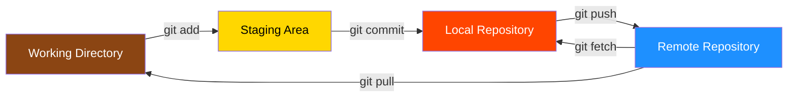

#Git #GitHub #Remote #Workflow #Collaboration

> When collaborating, other people (or you on another machine) will push changes to GitHub that you don't have. We need to get those changes down to our machine. The two main tools for this are `git fetch` and `git pull`.

---

## 🖼️ The Scenario: Diverged Histories

Imagine this common situation:
1.  **You** have done some work locally on `master` (e.g., a "Yellow" commit).
2.  **A Collaborator (e.g., "Bob Head")** has pushed 3 new "Green" commits to the `master` branch on GitHub.
3.  **Result**: Your histories have **diverged**. You have a commit they don't have, and they have 3 commits you don't have.

**How do you get Bob's "Green" commits?**
You need to fetch or pull them.

---

## 📍 The 4 Locations of Git

To understand `fetch` vs `pull`, you must understand where data lives:
1.  **Remote Repository**: GitHub (The source of new changes).
2.  **Local Repository (`.git`)**: Your database of commits/history.
3.  **Staging Area**: Where you prepare commits (`git add`).
4.  **Working Directory**: Your actual files that you edit.



*   **`git push`**: Local Repo ➡️ Remote Repo.
*   **`git fetch`**: Remote Repo ➡️ Local Repo (Updates `origin/master`, **not** your files).
*   **`git pull`**: Remote Repo ➡️ Local Repo ➡️ Working Directory (Updates **everything**).

---

## 📡 `git fetch`: Downloading without Integrating

Think of `fetch` as: **"Go get the latest information from GitHub, but don't screw up my working files."**

### What it does
*   Talks to the remote ("origin").
*   Asks: "Do you have any changes?"
*   Downloads new commits to your **Local Repository**.
*   Updates **Remote Tracking Branches** (e.g., `origin/master`, `origin/food`, `origin/movies`).
*   **Safe**: It does **not** touch your Working Directory. You can fetch at any time.

### Syntax
```bash
git fetch <remote> <optional-branch>
```
*   `git fetch origin`: Fetches all changes from the remote named `origin`.
*   `git fetch`: Defaults to `origin`.
*   `git fetch origin food`: Only fetches the `food` branch.

### 🧪 Demo 1: Seeing New Files (Tinkerbell)
*   **Context**: "Bob Head" pushes `tinkerbell.txt` to the `movies` branch on GitHub.
*   **Before Fetch**: `git status` says "up to date". You don't know about Tinkerbell.
*   **Action**: `git fetch origin`.
*   **After Fetch**:
    *   `git status`: "Your branch is behind 'origin/movies' by 1 commit."
    *   **Files**: `tinkerbell.txt` is **not** in your folder yet.
    *   **Inspect**: `git checkout origin/movies`. You enter **Detached HEAD** showing the new state with Tinkerbell, Ghostbusters, and Bambi.

### 🧪 Demo 2: Discovering New Branches (`morefood`)
*   **Context**: A new branch `morefood` is created on GitHub.
*   **Before Fetch**: `git branch -r` does not show `origin/morefood`.
*   **Action**: `git fetch`.
*   **Result**: Git says "New branch: origin/morefood". Now `git branch -r` shows it, and you can switch to it.

### 🧪 Demo 3: The "First Switch" (`food`)
*   **Context**: You have never touched the `food` branch locally.
*   **Action**: `git fetch` (updates `origin/food` with `apple.txt`). -> `git switch food`.
*   **Result**: Since you just fetched, Git sets up the new local branch `food` pointing to the latest `origin/food`. You immediately see `apple.txt` (and `banana`, `popsicle`).

---

## ⤵️ `git pull`: Retrieve & Merge

Think of `pull` as: **"Go get the latest changes and put them in my files right now."**

### The Formula
> **`git pull` = `git fetch` + `git merge`**

1.  **Fetch**: Updates the remote tracking branch (`origin/master`).
2.  **Merge**: Merges that remote branch into your **current** local branch (`master`).

### Syntax
```bash
git pull <remote> <branch-to-pull-from>
```
*   `git pull origin master`: Pulls from `origin/master` into your **current** branch.

### ⚡ Shorthand (Most Common)
If your branch is tracking an upstream branch (e.g., `food` tracks `origin/food`), you can just run:
```bash
git pull
```
Git knows you are on `food` and want changes from `origin/food`.

### 🧪 Demo 1: Pulling "Tinkerbell"
*   **Context**: You are on the `movies` branch. You fetched earlier, so you know you are "behind by 1 commit" (Tinkerbell).
*   **Action**: `git pull origin movies`.
*   **Result**: fast-forward merge. `tinkerbell.txt` appears in your working directory.

### 🧪 Demo 2: Pulling "Cyclops" (Fantasy)
*   **Context**: Bob pushes `cyclops.txt` to the `fantasy` branch.
*   **Action**: You switch to `fantasy` (`git switch fantasy`). You don't see `cyclops.txt`.
*   **Command**: `git pull`.
*   **Result**: Git creates `cyclops.txt` in your folder. Your `git log` now shows the "Create cyclops" commit.

### 🧪 Demo 3: Pulling "Tea" (Food)
*   **Context**: Bob pushes `tea` to the `food` branch.
*   **Action**: You are on `food`. `git pull`.
*   **Result**: `tea` file appears.

---

## ⚔️ Handling Conflicts with `git pull`

Since `pull` performs a **merge**, conflicts can happen if you and the remote changed the same lines.

### The "Coffee" Scenario
1.  **Remote**: "Bob Head" pushes a `coffee.txt` file to the `food` branch.
2.  **Local**: You **independently** create `coffee.txt` with different ASCII art and commit it.
3.  **The Pull**:
    ```bash
    git pull origin food
    ```
4.  **The Conflict**:
    ```text
    CONFLICT (add/add): Merge conflict in coffee.txt
    Automatic merge failed; fix conflicts and then commit the result.
    ```
5.  **Resolution**:
    *   Open `coffee.txt`. You will see the "HEAD" (your changes) and the "Incoming Change" (Bob's art).
    *   **Decide**: Keep yours? Keep Bob's? Keep Both? (In the demo, we kept both).
    *   **Save** the file.
    *   **Stage**: `git add coffee.txt`.
    *   **Commit**: `git commit -m "Fix merge conflicts"`.
6.  **Aftermath**: Your branch is now **ahead** of origin by 2 commits (Your original "add coffee" + The "Merge Commit").
7.  **Final Step**: `git push origin food`. Now GitHub has the merged result.

---

## ⚡ The Shorter Syntax

Often when using `git pull`, we can get away with an even shorter syntax where we don't need to specify the remote or the branch.

### Why?
Because it's really common to want to pull the **same branch** from the **origin** remote.
*   If I am on `food`, I almost always want the latest from `origin/food`.
*   I rarely want to pull some other branch into `food`.

### Defauts
If you run `git pull` without arguments:
1.  **Remote Defaults to `origin`**: Unless you have configured another remote, Git assumes `origin`.
2.  **Branch Defaults to Configured Tracking Connection**: Git looks at your current branch's configuration.

### Tracking Connections
Tracking connections are set up for us automatically simply by switching to a remote branch.
*   When we ran `git switch food`, Git created a local `food` branch AND set it to track `origin/food`.
*   You don't need to manually configure this.

### Example
If you are on the `main` branch:
```bash
git pull
```
Is exactly the same as:
```bash
git pull origin main
```

If you are on the `puppies` branch:
```bash
git pull
```
Is exactly the same as:
```bash
git pull origin puppies
```

---

## 🔄 Rebase on Pull (`git pull --rebase`)

Instead of creating a merge commit when your local history and the remote history have diverged, you can use the `--rebase` flag. This will fetch the remote changes and then **rebase** your local commits on top of them, creating a cleaner, linear history.

### Syntax
```bash
git pull --rebase <remote> <branch-to-pull-from>
```

### Example
```bash
git pull --rebase origin addtests
```

### How It Works

```mermaid
graph TD
    %% Nodes
    subgraph Before git pull --rebase
      A1((A)) --> B1((B))
      B1 --> C1(("Local"))
      B1 --> D1(("Remote"))
    end

    subgraph After git pull --rebase origin addtests
      A2((A)) --> B2((B))
      B2 --> D2(("Remote"))
      D2 --> C2(("Local"))
    end
    
    style C1 fill:#FF4500,color:white
    style D1 fill:#1E90FF,color:white
    style C2 fill:#FF4500,color:white
    style D2 fill:#1E90FF,color:white
```

1. **Fetch**: Git fetches the latest `addtests` branch from `origin`.
2. **Rewind**: Git temporarily sets aside your local commits.
3. **Fast-Forward**: Git moves your branch pointer to match the remote commits.
4. **Replay**: Git applies your local commits one by one on top of the new remote commits.

---

## 📝 Summary Table

| Feature | `git fetch` | `git pull` |
| :--- | :--- | :--- |
| **Primary Goal** | Update knowledge of the remote. | Update local files with remote changes. |
| **Updates Work Dir?** | ❌ No. | ✅ Yes. |
| **Updates `.git` Repo?** | ✅ Yes. | ✅ Yes. |
| **Risk?** | Safe. No conflicts possible. | Conflicts possible. |
| **Analogy** | "Download the email." | "Download and read the email." |
