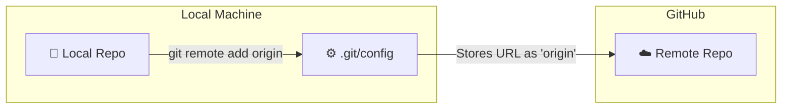

#Git #GitHub #Remote #CoreCommand #Configuration

>  A **remote** is simply a saved URL with a nickname. It allows Git to know *where* on the internet to push your code. The command `git remote add origin <url>` creates this connection.

---

## 🤔 What is a Remote?

Your local repository and your GitHub repository are currently two completely separate entities. To transfer code between them, you need to establish a link.

In Git, a **Remote** is just a fancy name for a destination URL. instead of typing `https://github.com/myname/myproject.git` every time you want to upload code, you define a nickname (like `origin`) that points to that URL.

### Cloned Repos vs. New Repos
*   **If you `git clone` a repository:** Git *automatically* sets up a remote named `origin` pointing to the URL you cloned from.
*   **If you `git init` a repository:** You have no remotes. You must add one manually.

---

## 🛠️ The Commands

### 1. Checking Existing Remotes
To see if your repository already has any connections, use:

```bash
git remote -v
```
*   The `-v` flag stands for **verbose**. It shows you the name *and* the URL.

**Output (if connected):**
```
origin  https://github.com/user/repo.git (fetch)
origin  https://github.com/user/repo.git (push)
```
**Output (if not connected):**
*(Nothing is displayed)*

### 2. Adding a Remote
This is the command to create the link.

```bash
git remote add <name> <url>
```

**The Standard Command:**
```bash
git remote add origin https://github.com/YourUsername/YourRepo.git
```
*   **`origin`**: The nickname for the remote.
*   **`https://...`**: The URL provided by GitHub.

---

## 🏷️ What is `origin`?

Beginners often think `origin` is a magic Git keyword. **It is not.**

> [!info] The `origin` Convention
> `origin` is simply the standard, conventional name for your primary remote repository.
>
> It functions exactly like the name `master` or `main` for branches. It is the default, but you could technically name your remote `potato`, `backup`, or `my-github-link`. However, nearly every tool and tutorial assumes you will use **`origin`**, so stick with it unless you have a specific reason not to.

---

## 🚑 Managing Remotes (Renaming & Removing)

You generally won't need these often, but they are good to know if you make a typo or change repository URLs.

### Renaming a Remote
If you named your remote `orign` by mistake, you can fix it:
```bash
git remote rename <old-name> <new-name>
# Example:
git remote rename orign origin
```

### Removing a Remote
If a remote URL is no longer valid, or you want to disconnect from a repo:
```bash
git remote remove <name>
# Example:
git remote remove origin
```
*Note: This does not delete the remote repository from GitHub; it just deletes the link from your local machine.*

---

## Workflow Visualization

