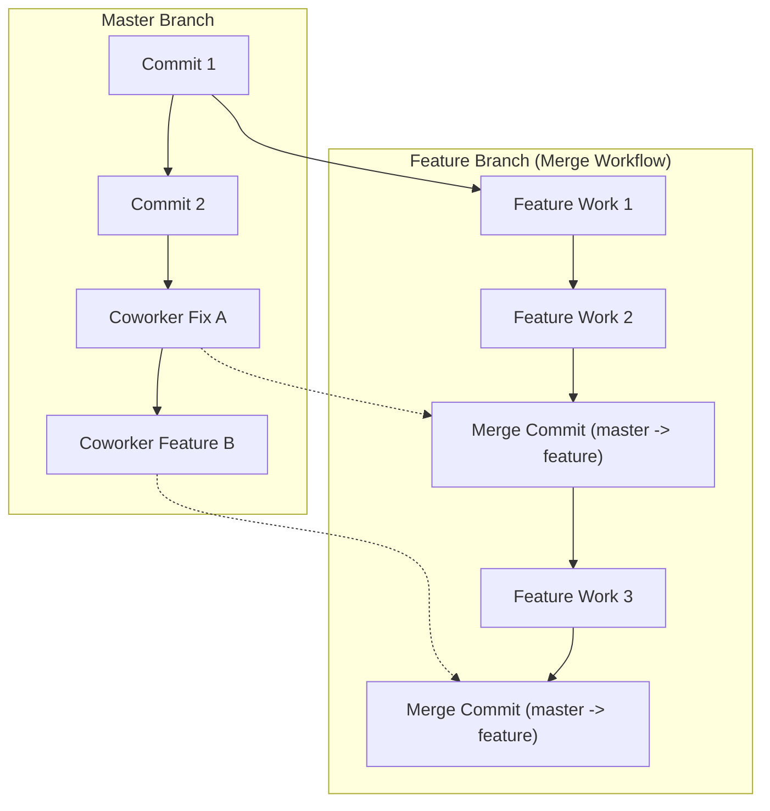
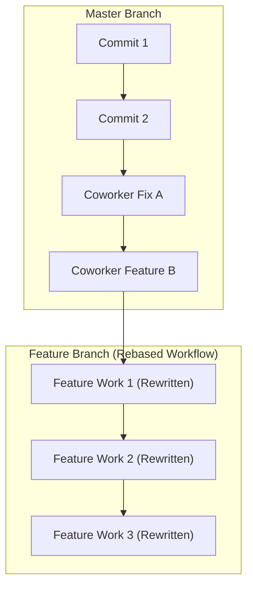

#Git #DevOps #Rebasing #Merging #Workflow #CoreConcept

> [!abstract] Brief Description
> This note analyzes the differences between `git merge` and `git rebase` for branch integration. It highlights the "muddy history" problem associated with merging in active team environments and demonstrates how rebasing solves it by maintaining a linear history.

---

> [!note] 📖 The Core Analogy: The Book Editing Workflow
> Imagine two authors writing chapters for a textbook.
> - **The Main Draft (Master Branch):** The main book file where final chapters are added.
> - **Your Chapter Draft (Feature Branch):** An isolated chapter you are writing on the side.
> - **Merging:** Copying the entire updated main draft into your working chapter folder every day. Your folder becomes cluttered with duplicate sections and revision logs like "Synced with main draft on Monday."
> - **Rebasing:** Taking your draft pages and changing their starting point to the very end of the updated main draft, making it look as if you began writing your chapter only after the rest of the book was finalized.

---

## 🏗️ 1. The Problem: Muddying History with Merges

When working on a large codebase with multiple developers (e.g., 10 or more), the main branch is highly active. 

1.  **Divergence:** You create a `feature` branch from `master` and write some commits.
2.  **Upstream Changes:** Meanwhile, coworkers merge their tasks into `master`.
3.  **Synchronization:** To ensure your branch has the latest bug fixes or dependencies, you merge `master` into `feature`.
4.  **Merge Commits:** Because the histories have diverged, Git cannot perform a fast-forward merge and is forced to create a **merge commit**.

If this cycle repeats several times over the course of a long-running feature, your branch history becomes riddled with uninformative merge commits (e.g., `"Merge branch 'master' into feature"`), muddiness, and clutter.

### The Merge Workflow Visualized


---

## 🔑 2. The Solution: Rebasing for a Linear History

`git rebase` solves the muddy history problem by taking the commits from your `feature` branch and re-applying them on top of the latest commit on the target branch (e.g., `master`).

```bash
# How to rebase your current feature branch onto master
git rebase master
```

### The Rebase Workflow Visualized
Instead of weaving the branches together with merge commits, Git identifies the common ancestor, saves your feature commits, resets your branch to the tip of `master`, and applies your commits one-by-one.



> [!tip] Cleaner Histories
> Rebasing results in a clean, linear structure. Someone reviewing the history can quickly see the logical progression of your work without wading through dozens of intermediate merge commits.

---

## 🧬 3. Under the Hood: History Rewriting

It is critical to understand that rebasing **rewrites history**. 

*   **New Commits:** Git does not just move your existing commits. It creates *new* commits (with new SHA-1 hashes) containing the same content changes.
*   **Author Details:** The author date and details are preserved, but the commit hashes are completely rewritten.
*   **Parentage:** The parent of your first feature commit changes from the old common ancestor to the latest commit on the target branch.

> [!danger] Rewriting Public History is Dangerous
> Because rebasing creates new commits, running `git rebase` on a branch that other developers are actively tracking will cause their local history to diverge from the remote. This results in duplicate commits and severe conflicts.

---

> [!summary] Key Takeaways
> - **Core concept:** Merging preserves the exact historical timeline and creates merge commits, whereas rebasing rewrites the commits onto a new starting point (base) to maintain a linear history.
> - **Key implementation detail:** Merging in active team settings leads to "muddy" histories full of non-informative merge commits. Rebasing replaces these with a clean, linear chain of commits.
> - **Best practice:** Use `git rebase` to keep your local feature branch updated with the main branch, but use `git merge` when merging your completed work back into the public main branch.
