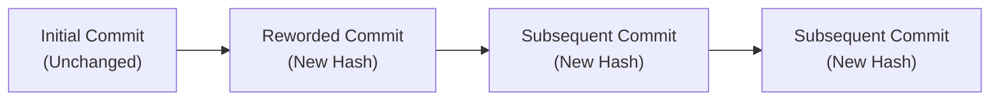

#Git #DevOps #Rebasing #Interactive #Reword #CoreConcept

> [!abstract] Brief Description
> This note introduces the **Interactive Rebase** (`git rebase -i`) utility as a history cleanup tool. It explains the structure of the interactive command sheet, the chronological ordering of commits during playback, and how to use the `reword` command to safely edit local commit messages.

---

> [!note] 📖 The Core Analogy: The Film Director's Editor
> Imagine you are a film director editing N scenes of a movie before the grand premiere.
> - **HEAD~N (Rewinding the Reel):** Moving the film reel N scenes back to start your review.
> - **Chrono-Replay (Reversed Commit Order):** Arranging the scenes from first-shot to last-shot so they play in chronological order.
> - **Reword (Changing a Scene's Subtitle):** Correcting the spelling in a title card without altering the actual video footage.
> - **Re-export (Rewritten Hashes):** Because you changed a frame early in the film, the entire segment from that point forward must be re-rendered, creating new final timestamps (hashes).

---

## ❓ 1. What is Interactive Rebase?

While standard `git rebase` is used to integrate changes across branches, **Interactive Rebase** (`git rebase -i`) is used as a local cleanup utility. It allows you to rewrite your local commit history before sharing your code with coworkers.

```bash
# Rebase the last N commits interactively in place
git rebase -i HEAD~<N>
```

Using interactive rebase, you can:
*   **Edit** commit contents.
*   **Change** commit messages (reword).
*   **Combine** commits together (squash/fixup).
*   **Delete** commits entirely (drop).
*   **Reorder** commits.

---

## 🔄 2. The Interactive Rebase Interface

When you run `git rebase -i HEAD~9`, Git suspends your terminal and opens your default text editor with a script outlining the N selected commits:

```text
pick 1a2b3c4 I added project files
pick 2b3c4d5 add bootstrap
pick 3c4d5e6 whoops forgot to add bootstrap js script
...
# Rebase 1a2b3c4..9z8y7x6 onto 1a2b3c4
#
# Commands:
# p, pick <commit> = use commit
# r, reword <commit> = use commit, but edit the commit message
# s, squash <commit> = use commit, but meld into previous commit
# f, fixup <commit> = like "squash", but discard this commit's log message
# d, drop <commit> = remove commit
```

> [!important] Chronological Ordering
> Unlike `git log`, which shows the newest commits at the top, the interactive rebase file lists commits in **reverse order** (oldest at the top, newest at the bottom). This is the order in which Git will replay/apply the commits.

---

## 🔑 3. Rewording Commit Messages

If you want to edit a commit message (e.g., to correct grammar or use the imperative mood) without changing the code itself, use the `reword` command.

### Step-by-Step Workflow:
1.  Open the interactive rebase list: `git rebase -i HEAD~9`
2.  Locate the target commit and change `pick` to `reword` (or `r`):
    ```text
    reword 1a2b3c4 I added project files
    pick 2b3c4d5 add bootstrap
    ```
3.  Save and close the file.
4.  Git will start the rebase, pause at the marked commit, and open a new editor window containing the original commit message.
5.  Edit the message (e.g., change `"I added project files"` to `"add project files"`), save, and exit.
6.  Git finishes the playback and outputs: `Successfully rebased and updated`.

### Hash Cascading Effect
When you reword a commit, its SHA-1 hash changes. Because every subsequent commit's hash is calculated using its parent's hash, **every commit that occurred after the reworded commit will also get a new hash.**



---

> [!summary] Key Takeaways
> - **Core concept:** Interactive rebase lets you execute a sequence of cleanup commands on your local commits, editing history in place without moving branches.
> - **Key implementation detail:** Commits are listed in oldest-to-newest order in the rebase editor because Git applies them from top-to-bottom.
> - **Best practice:** Use the `reword` command to format commit messages correctly according to team guidelines before pushing your branch to GitHub.
