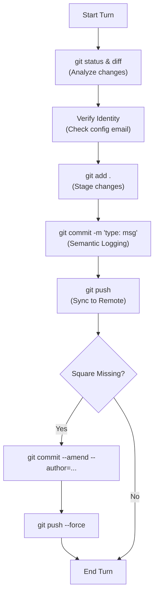

 #Git #Agents #Workflow
---

This document outlines the systematic workflow used by an AI Agent to manage, analyze, and synchronize multiple repositories while maintaining a clean, professional history.

---

## 🔍 Step 1: The "Situation Report" (Analysis)

Before touching any code, the agent performs a deep scan of the current state.

> [!tip] The "Double Check"
> Instead of blindly committing, the agent uses `git diff --stat` to get a bird's-eye view of the file changes, ensuring no unexpected files are about to be included.

#### Commands:
```bash
# Get the status and a high-level summary of changed files
git status; git diff --stat

# Perform a deep analysis of actual code logic changes
git diff
```

---

## 🛠️ Step 2: The "Identity Guard" (Config)

To ensure "Green Squares" (contributions) appear on GitHub, the agent verifies that the local identity matches the remote profile, especially when privacy settings are enabled.

> [!warning] The Private Email Trap
> If you have "Keep my email addresses private" enabled on GitHub, using your personal email locally will result in anonymous commits. You **must** use your official `@users.noreply.github.com` email.

#### Commands:
```bash
# Set global identity (The "Set it and forget it" fix)
git config --global user.name "Your Name"
git config --global user.email "12345678+username@users.noreply.github.com"

# Check who you are right now
git config user.email
```

---

## 🏗️ Step 3: The "Semantic Commit" (Execution)

The agent uses **Conventional Commits** to make the history readable for both humans and automation tools.

#### The Format:
`type(scope): short description`
`Detailed multi-line explanation of the "why" and "how".`

#### Commands:
```bash
# Stage everything (The "Magnet" approach)
git add .

# Create a meaningful save point
git commit -m "feat(api): add zone support" -m "Detailed analysis of changes..."
```

---

## 🚀 Step 4: The "Sync & Repair" (Maintenance)

If a mistake was made (like a wrong email), the agent uses "Time Travel" to fix it before anyone notices.

> [!danger] Force Push Caution
> Only use `--force` on your own branches. It overwrites the remote history with your local version.

#### Commands:
```bash
# Repair the author of the last commit (Retroactive Square Fix)
git commit --amend --author="Name <email@example.com>" --no-edit

# Sync with the cloud
git push

# Force-sync after a repair
git push --force
```

---

## 🔄 The Agent Workflow Loop



---

> [!summary] Key Takeaway
> An AI agent doesn't just "save code"; it manages **metadata**. By combining `git diff` for analysis, `config` for identity, and `semantic commits` for documentation, the agent ensures the project history is as high-quality as the code itself.

---