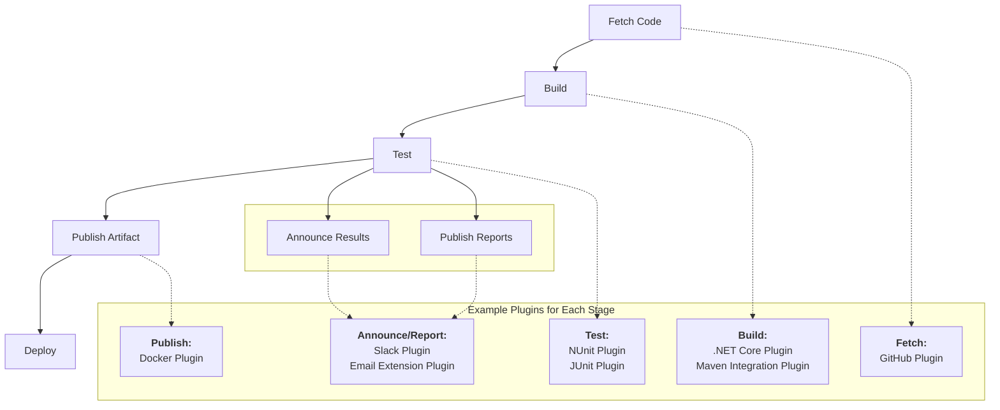

#DevOps #CI-CD #Jenkins #CoreConcept #Plugins #PipelineAsCode

>  Plugins are the core of Jenkins' power and flexibility. Jenkins, by default, is a simple execution engine. **Plugins** are add-ons that provide the actual functionality to interact with other tools, such as Git, Docker, Maven, or Slack. They are what enable Jenkins to perform specific tasks like fetching code, building artifacts, running tests, and publishing results.

---

## 🔌 What are Jenkins Plugins?

Jenkins on its own is a barebones automation server. It knows how to run tasks, but it doesn't inherently know *how* to interact with specific technologies. Plugins bridge this gap.

-   **Functionality Extenders:** Plugins make Jenkins a powerful and flexible platform by adding specific features.
-   **Vast Ecosystem:** There is a wide variety of plugins available, created by both the Jenkins community and third-party vendors, to support almost any tool or use case.
-   **Customizable:** You choose and install plugins based on your specific project's technology stack and needs.

### How Plugins Enable a CI/CD Pipeline
A typical CI/CD pipeline involves several distinct steps. Jenkins itself doesn't provide these functionalities by default; it relies on plugins to execute them.

> [!info] The key takeaway is that for almost every action in your pipeline (fetching, building, testing, etc.), there is a corresponding plugin that provides the necessary integration.

---

## ⚙️ A Roadmap for Learning Plugin Management and Pipeline Creation

The instructor outlines a three-stage approach to learning how to build pipelines in Jenkins, progressing from a traditional, manual style to a modern, fully automated one. This course will demonstrate these methods using a specific technology stack (`GitHub`, `.NET Core`, `NUnit`, `Docker`, `Slack`), but the principles are transferable to any other stack (e.g., `Java`, `Maven`, `JUnit`).

### Stage 1: The Traditional Way (Manual & UI-Driven)
This is the standard, classic approach to building a pipeline in Jenkins.
-   **Job Type:** [[The Jenkins Job#🆚 Freestyle vs. Pipeline A Detailed Comparison|Freestyle Job]].
-   **Execution Logic:** Using `Execute shell` or `Execute Windows batch command` build steps.
-   **Plugin Management:** **Manual Plugin Setup.** You, the administrator, must log in to the Jenkins UI and manually install and configure every plugin the pipeline needs.

> **Advantage:** Easy for beginners to understand and set up for simple tasks.
> **Disadvantage:** Not scalable, not version-controlled, and prone to manual error. This is the "ClickOps" approach.

### Stage 2: The Portable Way (Scripted & Semi-Automated)
This approach improves reusability by scripting the pipeline logic, making it more portable between Jenkins servers.
-   **Job Type:** Freestyle Job.
-   **Execution Logic:** Using **Scripted Steps** (e.g., more advanced shell scripting that can be copied between jobs).
-   **Plugin Management:** **Offline Plugin Setup.** This implies a more managed approach, perhaps installing plugins from a pre-downloaded list rather than directly from the internet, improving consistency.

> **Advantage:** The pipeline logic is now in a script, which is more portable than a complex set of UI configurations.
> **Disadvantage:** Still relies on a UI-based job type and doesn't fully embrace the "as code" philosophy.

### Stage 3: The Modern Way (Self-Contained & Fully Automated)
This is the current best-practice, "Pipeline as Code" approach.
-   **Job Type:** [[The Jenkins Job#🆚 Freestyle vs. Pipeline A Detailed Comparison|Pipeline Job]].
-   **Execution Logic:** Using **Declarative Steps** within a [[Jenkinsfile]]. The entire pipeline is defined as code.
-   **Plugin Management:** **Automated Plugin Handling.** Modern Jenkins setups can automate the installation and management of plugins, for example, by defining them in a `plugins.txt` file that is processed when the Jenkins instance is built (often in a Docker container).

> **Advantage:** The entire pipeline—its logic, stages, and even its plugin dependencies—is version-controlled, reusable, and fully automated. This is the goal for modern CI/CD.

---

## ✅ Advantages and Disadvantages of Plugin Approaches

This course will explore the pros and cons of each method:

-   **Manual Approach:**
    -   **Advantage:** Simple to get started.
    -   **Disadvantage:** Hard to reproduce, not scalable, no audit trail for changes.
-   **Automated Approach:**
    -   **Advantage:** Reproducible, scalable, version-controlled, aligns with modern DevOps practices.
    -   **Disadvantage:** Steeper initial learning curve (requires understanding of scripting/`Jenkinsfile` syntax).

By the end of this learning path, you will understand how to choose the right approach for your use case and how to build a fully qualified, functional pipeline using a variety of plugins.