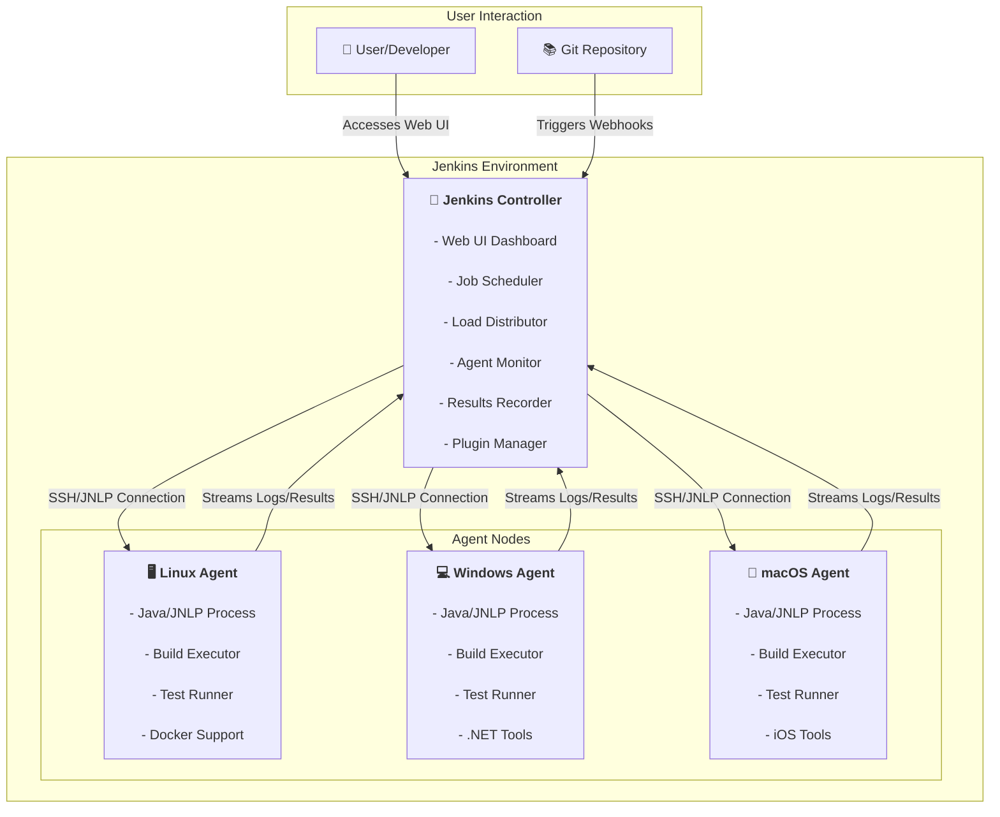

#DevOps #CI-CD #Jenkins #Architecture #CoreConcept

>  [[Jenkins]] uses a **master-slave** (also known as master-agent or controller-worker) architecture to distribute and execute jobs. The **master** node manages and schedules tasks but does not execute them. The **slave** nodes are the workhorses that perform the actual executions (building, testing, etc.) as directed by the master.

---

## 🏛️ The Architectural Overview

Jenkins is designed for distributed builds, allowing it to scale and handle multiple jobs across different environments simultaneously. This is achieved through its master-slave architecture, which consists of two types of nodes.

---

## 🤖 The Jenkins Master (Controller) Node

The master node is the central brain of the Jenkins system. It is responsible for all management and coordination tasks.

### Core Functions of the Master
-   **Scheduler & Controller:** The master's primary role is to schedule executable tasks (called **Jobs**) and dispatch them to available slave nodes for execution.
-   **User Interface:** The Jenkins web UI is served exclusively from the master node. All user commands and interactions happen through the master.
-   **Load Distribution:** The master manages the workload across all connected slave nodes, assigning jobs to them based on their capacity and configuration.
-   **Monitoring and Reporting:** The master continuously monitors the health and status of the slave nodes and the jobs running on them. When a job completes, the slave sends the results (logs, artifacts, success/failure status) back to the master, which then records them and displays them to the user.

> [!danger] User Interaction
> Users **cannot** directly interact with or execute anything on a slave node. All communication and output must go through the master.

---

## 🖥️ The Jenkins Slave (Agent/Worker) Node

The slave nodes (also commonly called **agents** or **worker nodes**) are the execution environments where the actual work happens.

### Core Function of the Slave
-   **Execution Only:** The one and only purpose of a slave node is **execution**. It receives a job from the master, executes the defined steps (like compiling code or running tests), and reports the results back.

### How Slave Nodes are Connected
-   **No Jenkins Installation:** You do **not** install the full Jenkins application on a slave node.
-   **The Jenkins Agent:** To connect a slave to the master, you execute a command (provided by the master's UI) on the slave machine.
    -   This command downloads a `jar` file, which is the **Jenkins Agent**.
    -   A token is used to securely associate the agent with the master.
-   **Java is Required:** The only strict prerequisite for a machine to become a Jenkins slave is that it must have a compatible version of **Java** installed to run the `agent.jar` file.

### Multi-Platform Support
-   A key advantage of the master-slave architecture is its support for heterogeneous environments.
-   You can connect slave nodes of any operating system to a single master. For example, a Linux master can manage and distribute jobs to:
    -   Other Linux slaves.
    -   Windows slaves.
    -   macOS slaves.
-   This allows you to build and test your software on all the platforms you need to support, all from a single Jenkins instance.

---

> [!summary] Key Takeaways
> -   Jenkins follows a **master-slave** distributed architecture.
> -   The **master** is the controller: it schedules, monitors, and reports. It runs the Jenkins UI.
> -   **Slaves** are the executors: their only job is to run the tasks assigned by the master.
> -   **No Jenkins installation is required on slaves**, only a compatible version of Java.
> -   This architecture enables **scalability** (you can add more slaves to handle more jobs) and **multi-platform support** (you can have slaves with different operating systems).