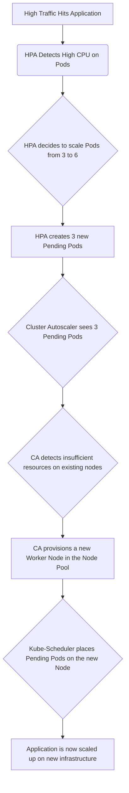

#Cloud #Azure #Kubernetes #AKS #Scaling #Autoscaling #ClusterAutoscaler #HPA

>  Kubernetes provides two primary, complementary mechanisms for automatic scaling:
> 1.  **Horizontal Pod Autoscaler (HPA):** Scales the **number of Pods** for an application up or down based on observed metrics like CPU or memory utilization. This is for scaling your *application*.
> 2.  **Cluster Autoscaler (CA):** Scales the **number of worker nodes** in your cluster up or down based on the overall resource needs of your pods. This is for scaling your *infrastructure*.

---

These two components work together to provide a fully elastic and resource-efficient environment for your applications.

## 🏛️ The Two Levels of Autoscaling

### 1. Horizontal Pod Autoscaler (HPA)
-   **What it does:** Automatically scales the number of [[The Kubernetes Pod|Pods]] in a [[The Kubernetes Deployment|Deployment]] or [[The Kubernetes ReplicaSet|ReplicaSet]].
-   **How it works:** It monitors the resource utilization (e.g., average CPU usage) of the Pods in a deployment. If the usage exceeds a target you've defined, the HPA increases the number of replicas. If the usage drops, it decreases the number of replicas.
-   **Scope:** Application-specific. It scales your application's instances based on its traffic and needs.
-   **In short:** It answers the question, "Do I need more or fewer copies of my application running?"

### 2. Cluster Autoscaler (CA)
-   **What it is:** A tool that automatically adjusts the size of a Kubernetes cluster by adding or removing worker nodes.
-   **How it works:** The Cluster Autoscaler watches for two primary conditions:
    1.  **Scale-Out (Adding Nodes):** It looks for Pods that are in a `Pending` state because there are **insufficient resources** in the cluster (e.g., not enough available CPU or memory on any existing node to schedule them). If it finds such pods, it will add a new worker node to the cluster.
    2.  **Scale-In (Removing Nodes):** It periodically checks for nodes that have been **underutilized** for an extended period. If it finds a node where all the running pods can be safely rescheduled onto other existing nodes, it will drain the underutilized node and remove it from the cluster to save costs.
-   **Scope:** Cluster-wide. It scales your underlying infrastructure based on the aggregate needs of all your applications.
-   **In short:** It answers the question, "Do I have enough (or too many) machines to run all my applications?"

### How They Work Together

---

## 🏗️ A Deeper Look at the Cluster Autoscaler

The Cluster Autoscaler is a crucial component for managing costs and ensuring your cluster can handle fluctuating demand. In the context of [[Azure Kubernetes Service (AKS)|AKS]], it works by modifying the Azure VM Scale Sets that back your node pools.

### When does it scale out (add a node)?
-   The primary trigger is the presence of **unschedulable Pods**. A Pod becomes unschedulable when the Kubernetes scheduler cannot find any node in the cluster that has enough free resources (CPU, memory) to satisfy the Pod's [[Kubernetes Resource Management Requests and Limits|`requests`]]. The Cluster Autoscaler detects this situation and adds a new node to the node pool to provide the necessary capacity.

### When does it scale in (remove a node)?
-   The Cluster Autoscaler will consider removing a node if it has been **underutilized** for a certain period (e.g., 10 minutes).
-   Before removing the node, it simulates whether all the pods currently running on that node can be safely moved (rescheduled) to other nodes in the cluster that have sufficient capacity.
-   If the rescheduling is possible, it will drain the node (gracefully moving the pods off it) and then terminate the underlying VM, thereby saving costs.

---

> [!summary]
> In the upcoming hands-on lectures, we will:
> 1.  First, focus on the **Cluster Autoscaler**. We will enable it on our AKS cluster's node pool and then deploy an application with high resource requests to force a scale-out event, observing as a new worker node is automatically added.
> 2.  Second, we will focus on the **Horizontal Pod Autoscaler**. We will deploy a sample application, create an HPA resource for it, and then apply a load to the application to watch as the number of pods scales up and down automatically based on CPU usage.