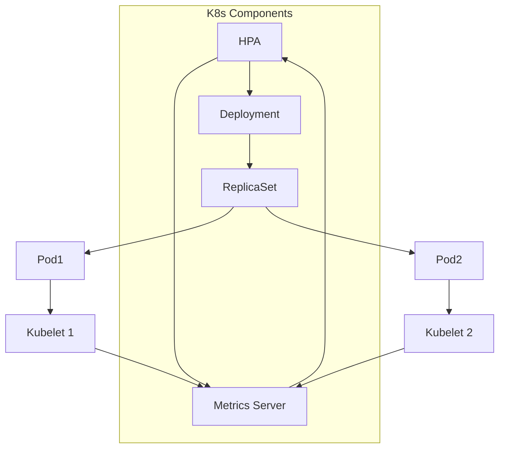

#Cloud #Azure #Kubernetes #AKS #Scaling #Autoscaling #HPA #MetricsServer

>  The **Horizontal Pod Autoscaler (HPA)** is a native Kubernetes controller that automatically scales the number of [[The Kubernetes Pod|Pods]] in a [[The Kubernetes Deployment|Deployment]], [[The Kubernetes ReplicaSet|ReplicaSet]], or StatefulSet. It makes scaling decisions based on observed metrics, most commonly **CPU utilization**, to match the application's current workload.

---

In simple terms, "horizontal scaling" means increasing or decreasing the number of running instances (replicas) of your application. The HPA automates this process.

-   **Scale Out:** When application demand increases, the HPA adds more Pods to handle the load.
-   **Scale In:** When demand decreases and resources are not needed, the HPA removes Pods, freeing up resources on the worker nodes for other applications.

## 🏛️ How the HPA Works

The HPA operates as a **control loop** that runs periodically (by default, every 15 seconds). It is a core Kubernetes API resource and does **not** require installing any additional, third-party controllers.

### The Control Loop Architecture


**The Workflow:**
1.  You create an HPA object and associate it with a target workload (e.g., a Deployment). You specify a target metric, like `targetCPUUtilizationPercentage: 50`.
2.  The **Metrics Server**, a crucial cluster add-on, collects resource usage metrics (CPU and memory) from the `kubelet` on each worker node.
3.  The HPA controller periodically queries the Metrics Server to get the current average CPU utilization across all Pods managed by the target Deployment.
4.  The HPA controller then calculates the number of replicas needed to bring the average CPU utilization as close as possible to the target you defined.
    -   `desiredReplicas = ceil[currentReplicas * (currentMetricValue / desiredMetricValue)]`
5.  The HPA then updates the `replicas` field on the target Deployment.
6.  The Deployment's controller sees this change and scales the underlying ReplicaSet up or down, which in turn creates or terminates Pods.
7.  This loop repeats continuously, allowing the application to dynamically adapt to changing load.

> [!warning] **Prerequisite: The Metrics Server**
> The HPA **requires** the **Kubernetes Metrics Server** to be running in the cluster. Without it, the HPA has no source of CPU and memory metrics and will not be able to function. Most managed Kubernetes services like [[Azure Kubernetes Service (AKS)|AKS]] install the Metrics Server by default.

---

## ⚙️ Configuring an HPA

To configure an HPA, you need to provide four key pieces of information:
1.  **The target workload:** The Deployment, ReplicaSet, etc., that you want to scale.
2.  **The scaling metric:** The metric to base scaling decisions on (most commonly `cpu`).
3.  **The target value:** The desired value for the metric (e.g., `50` for 50% CPU utilization).
4.  **Min and Max replicas:** The minimum and maximum number of pods the HPA is allowed to scale to.

### Creating an HPA
You can create an HPA either imperatively with a `kubectl` command or declaratively with a YAML manifest.

-   **Imperative Command (`kubectl autoscale`):**
    ```bash
    kubectl autoscale deployment <deployment-name> --cpu-percent=50 --min=1 --max=10
    ```
    -   `autoscale deployment <deployment-name>`: Targets the specified deployment.
    -   `--cpu-percent=50`: Sets the target CPU utilization to 50%.
    -   `--min=1`: Sets the minimum number of replicas to 1.
    -   `--max=10`: Sets the maximum number of replicas to 10.

-   **Declarative Manifest (`hpa.yaml`):**
    In modern Kubernetes versions, you can and should define the HPA declaratively.
    ```yaml
    apiVersion: autoscaling/v2
    kind: HorizontalPodAutoscaler
    metadata:
      name: my-app-hpa
    spec:
      scaleTargetRef:
        apiVersion: apps/v1
        kind: Deployment
        name: my-app-deployment
      minReplicas: 1
      maxReplicas: 10
      metrics:
      - type: Resource
        resource:
          name: cpu
          target:
            type: Utilization
            averageUtilization: 50
    ```

---

> [!summary]
> In the next lecture, we will:
> 1.  Deploy a sample application.
> 2.  Create a Horizontal Pod Autoscaler for it using the `kubectl autoscale` command.
> 3.  Generate a high CPU load on the application.
> 4.  Observe as the HPA automatically scales the number of pods up to meet the demand.
> 5.  Stop the load and watch as the HPA scales the number of pods back down to the minimum, demonstrating the full autoscaling lifecycle.