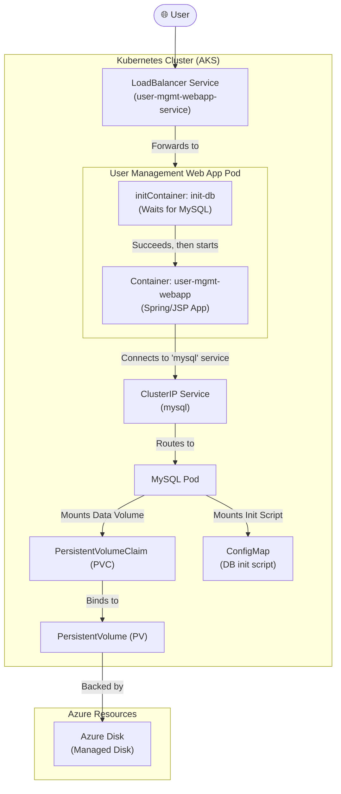

#DevOps #Containerization #Kubernetes #CoreConcept #YAML #Deployments #Services #StatefulSets #HandsOn #Tutorial

>  This is the capstone hands-on guide that brings together all the fundamental Kubernetes concepts we've learned so far. We will deploy a complete, multi-tier application consisting of a **stateful MySQL database** (using a `StorageClass`, `PVC`, and `ConfigMap`) and a **stateless User Management Web Application** (using a `Deployment` with `initContainers`). We will then expose the web app to the internet with a `LoadBalancer` Service and test the end-to-end functionality.

---

## 🏛️ The Final Application Architecture

This exercise will deploy all the manifests we have written in the `05-azure-disks-for-aks-storage/05-03-usermanagement-webapp-with-mysqldb/` section to build the following architecture:



---

## ✍️ Step 1: Writing the Frontend LoadBalancer Service Manifest

This is the final YAML manifest we need to create. It will expose our User Management Web App to the public internet.

### The `user-management-webapp-service.yaml` Manifest
```yaml
apiVersion: v1
kind: Service
metadata:
  name: user-mgmt-webapp-service
  labels:
    app: user-mgmt-webapp
spec:
  # This type requests a public IP from the cloud provider (Azure)
  type: LoadBalancer
  
  # This selector tells the Service to find the Pods with the label 'app: user-mgmt-webapp'
  selector:
    app: user-mgmt-webapp
    
  ports:
  - port: 80 # The external Load Balancer will listen on port 80
    targetPort: 8080 # Forward traffic to port 8080 on the web app container
```
-   **`selector: app: user-mgmt-webapp`**: This is the crucial link. It matches the label we defined in the Pod template of our `user-management-webapp-deployment.yaml`, ensuring this service sends traffic to the correct pods.

---

## 🛠️ Hands-On: Deploying the End-to-End Application

This guide assumes we are using the manifests from the `05-03` directory, which includes our custom `StorageClass` with `reclaimPolicy: Retain`.

### Step 1: Deploy All Manifests
We can apply all the manifests in the `kube-manifests/` directory in a single, powerful command. Kubernetes is smart enough to create them in the correct order.
```bash
# Navigate to the 05-03 directory
cd 05-03-usermanagement-webapp-with-mysqldb/

# Apply all manifests in the sub-directory
kubectl apply -f kube-manifests/
```
**Output:** This will create (or configure) all the necessary resources: `StorageClass`, `PVC`, `ConfigMap`, `mysql` Deployment, `mysql` Service, `user-mgmt-webapp` Deployment, and `user-mgmt-webapp-service`.

### Step 2: Observe the `initContainer` in Action
Immediately after applying the manifests, check the status of your pods.
```bash
kubectl get pods
```
**Output:**
You will see the `mysql` pod starting up (`ContainerCreating`). Crucially, you will see the `user-mgmt-webapp` pod in the **`Init:0/1`** state.
```
NAME                                READY   STATUS     RESTARTS   AGE
mysql-xxxx-yyyy                     0/1     ContainerCreating   0          5s
user-mgmt-webapp-zzzz-wwww          0/1     Init:0/1            0          5s
```
-   **`Init:0/1`**: This status means the Pod has **1** `initContainer` defined, and **0** of them have completed successfully yet. The main application container will **not** start until this becomes `Init:1/1`.

If you describe the web app pod (`kubectl describe pod user-mgmt-webapp-...`), you can see the `init-db` container is running its `while` loop, waiting for the MySQL service to become available. Once the `mysql` pod is fully up and running, the `initContainer` will succeed, and the `user-mgmt-webapp` pod will transition to `Running`.

### Step 3: Verify All Components
-   **Pods:** `kubectl get pods` should now show both pods in the `Running` state.
-   **Logs:** Check the logs of the web app pod to confirm it started successfully without any database connection errors.
    ```bash
    kubectl logs -f <user-mgmt-webapp-pod-name>
    ```
    You should see the Spring Boot application startup messages.
-   **Storage:** Verify that the `PVC` is `Bound`, a `PV` has been created, and a new `Azure Disk` exists in the Azure Portal.

### Step 4: Access and Test the Web Application
1.  **Get the Public IP:** Get the external IP address of the frontend service.
    ```bash
    kubectl get svc
    ```
    Copy the `EXTERNAL-IP` for the `user-mgmt-webapp-service`.
2.  **Log in:**
    -   Navigate to the IP address in your browser. You will be prompted for a username and password.
    -   The default credentials (seeded by a `data.sql` file in the web app's source code) are:
        -   Username: `admin101`
        -   Password: `password101`
3.  **Test the Application:**
    -   After logging in, you'll see the application's home page.
    -   Click **List Users**. You will see the default `admin101` user.
    -   Click **Add User** and create a new user (e.g., `admin102`).
    -   Log out and log back in with the new `admin102` credentials to confirm it works.

### Step 5: Verify Data Persistence in the Database
Let's connect directly to the MySQL database to confirm that the new user data was persisted.
1.  **Run a temporary MySQL client pod:**
    ```bash
    kubectl run -it --rm --image=mysql:5.6 mysql-client -- mysql -h mysql -pdbpassword11
    ```
2.  **Query the Database:**
    ```sql
    mysql> USE webappdb;
    mysql> SHOW TABLES; -- You should see the 'user' table
    mysql> SELECT * FROM user;
    ```
    The output of the `SELECT` query will show both `admin101` and the new `admin102` user you created, confirming that the data was written to the MySQL database running on the persistent Azure Disk.

### Step 6: Clean Up and Test the `Retain` Policy
1.  **Delete All Kubernetes Resources:**
    ```bash
    kubectl delete -f kube-manifests/
    ```
2.  **Verify `Retain` Policy:**
    -   `kubectl get pv`: The `PersistentVolume` will still exist in a `Released` state.
    -   **Azure Portal:** The `Azure Disk` **will still exist**.
3.  **Final Manual Cleanup:** To avoid costs, you must manually delete the `PV` and the `Disk`.
    ```bash
    kubectl delete pv <pv-name>
    # Then delete the Disk in the Azure Portal
    ```

---

> [!summary] Conclusion
> This end-to-end demonstration successfully brings together nearly all the fundamental concepts of Kubernetes. You have declaratively defined and deployed a multi-tier, stateful application, leveraging:
> -   **Deployments** to manage both stateless and stateful workloads.
> -   **Services (`ClusterIP` and `LoadBalancer`)** for internal and external networking.
> -   **ConfigMaps** for application configuration and initialization.
> -   **Persistent Storage (`StorageClass`, `PVC`, `PV`)** to provide durable data storage with Azure Disks.
> -   **Init Containers** to gracefully manage startup dependencies.
> 
> This forms a solid foundation for building and managing complex, real-world applications on Kubernetes.