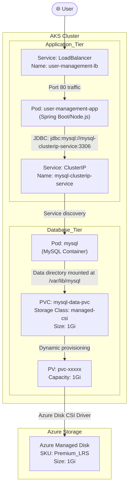

#Cloud #Azure #Kubernetes #AKS #Storage #PersistentStorage #AzureDisk #StatefulSets #HandsOn #Tutorial

>  [[The Kubernetes Pod|Pods]] are ephemeral, meaning their internal filesystems are destroyed when they are terminated. To run stateful applications like databases, we need **persistent storage**. **Azure Disks** provide high-performance, durable block storage that can be attached to Pods in an [[Azure Kubernetes Service (AKS)|AKS cluster]]. This is orchestrated through a set of Kubernetes storage objects: **StorageClass**, **PersistentVolumeClaim (PVC)**, and **PersistentVolume (PV)**.

---

## 💾 What are Azure Disks?

Azure Disk Storage is a managed block storage service on Microsoft Azure, designed for mission-critical workloads. It offers:
-   **High Performance and Durability:** Provides reliable, enterprise-grade storage with a 0% annual failure rate.
-   **Cost-Effectiveness:** Features like bursting capabilities allow it to handle unexpected traffic spikes and batch jobs cost-effectively.
-   **Seamless Scalability:** Performance can be dynamically scaled without disruption (on Ultra Disks).
-   **Built-in Security:** Data is automatically encrypted at rest using either Microsoft-managed keys or your own keys.

In the context of AKS, an Azure Disk can be dynamically provisioned and mounted into a container as a volume, providing a persistent filesystem that outlives the Pod.

---

## 🏛️ The Goal: Deploying a Stateful MySQL Database and a Web App

This section outlines a comprehensive, multi-part tutorial to deploy a complete, stateful application on AKS. The architecture consists of two main components:
1.  A **MySQL database** running as a stateful workload, with its data persisted on an Azure Disk.
2.  A **User Management web application** (a JSP/Spring app) that connects to the MySQL database to create and manage users.

### The Visual Architecture

---

## 🧠 Kubernetes Concepts to be Mastered

Deploying this stateful application will require us to create and understand a wide range of fundamental and advanced Kubernetes concepts.

### Part 1: Provisioning the MySQL Database (The Stateful Part)
This part focuses on setting up the database and its persistent storage. We will master:
-   **`StorageClass`:** A template for creating storage. It tells Kubernetes *what kind* of storage to provision (e.g., standard HDD, premium SSD). AKS comes with pre-defined StorageClasses for Azure Disk and Azure Files.
-   **`PersistentVolumeClaim` (PVC):** A *request* for storage made by a user or application. A developer says, "I need 1 GiB of fast storage," by creating a PVC.
-   **`PersistentVolume` (PV):** Represents an actual piece of storage in the cluster (the Azure Disk itself). In a dynamic provisioning setup, when you create a PVC, the `StorageClass` automatically creates a matching PV and the underlying Azure Disk for you.
-   **`Deployment`:** To manage the MySQL Pod. For more robust database deployments, a `StatefulSet` would typically be used, but this demo will start with a Deployment.
-   **`ConfigMap` and `Secrets`:** To manage non-sensitive configuration (like database name) and sensitive configuration (like the root password) separately from the application image.
-   **`volumes` and `volumeMounts`:** The keys in the Pod specification that actually attach the persistent storage (defined by the PVC) to a specific path inside the container (e.g., `/var/lib/mysql`).
-   **`ClusterIP` Service:** To provide a stable, internal network endpoint for the MySQL database so the web application can connect to it.

### Part 2: Deploying the User Management Web Application (The Stateless Part)
This part focuses on deploying the application that will use the database. We will master:
-   **`Deployment`:** To manage the web application Pods.
-   **`LoadBalancer` Service:** To expose the web application to the public internet.
-   **Environment Variables:** To pass the address of the MySQL `ClusterIP` service to the web application, so it knows where to connect.
-   **`initContainers`:** A special type of container in a Pod that runs to completion *before* the main application container starts. We will use an init container to wait until the MySQL database is fully up and ready before allowing the web application to start, preventing connection errors on startup.

By the end of this section, we will have a fully functional web application where users can create data that gets durably stored on an Azure Disk, surviving any Pod restarts or failures.