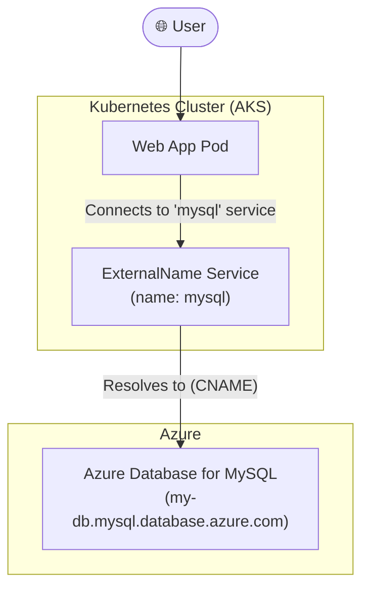

#Cloud #Azure #Kubernetes #AKS #Storage #Database #ManagedServices #AzureMySQL #Architecture

>  While it's possible to run a database like MySQL on Kubernetes using [[Persistent Storage in AKS with Azure Disks|persistent disks]], this approach requires significant manual effort to manage high availability, backups, upgrades, and monitoring. The modern, recommended approach is to offload this operational burden by using a **fully managed cloud database service**, like **Azure Database for MySQL**. We can then connect our applications running in [[Azure Kubernetes Service (AKS)|AKS]] to this external database using a Kubernetes `ExternalName` Service.

---

## 😫 The Challenges of Self-Hosting a Database on Kubernetes

In our previous section, we successfully deployed a MySQL database on our AKS cluster using an [[Persistent Storage in AKS with Azure Disks|Azure Disk]] for persistent storage. While this works, it comes with significant operational complexity and limitations, especially at scale.

### 1. High Availability (HA) is Complex
-   **The Azure Disk Limitation:** Azure Disks operate in `ReadWriteOnce` (RWO) mode, meaning a single disk can only be attached to **one Pod at a time**.
-   **Manual Replication Setups:** To achieve high availability (like a master-master or master-slave replication setup), you would need to:
    -   Provision multiple Azure Disks.
    -   Deploy multiple MySQL Pods, each with its own disk.
    -   Write complex `ConfigMaps` and startup scripts to manually configure the replication between them. This is a fragile and difficult process to manage within Kubernetes.

### 2. Lack of Advanced Database Features
-   **No Automatic Backups or Point-in-Time Recovery (PITR):** While you can back up the underlying disk, you lose critical database-specific features. Implementing point-in-time recovery for your database would require you to build a complex, custom solution.
-   **No Automatic Upgrades:** You are responsible for planning and executing a workflow to upgrade your MySQL version, just like any other application workload.
-   **Manual Monitoring and Logging:** You would need to set up and manage your own custom scripts and tooling for logging and monitoring the health and performance of your database.

### 3. The Core Problem: Misaligned Focus
-   Managing a database is a full-time job. By self-hosting, you are taking on the operational burden of being a database administrator (DBA).
-   If your core focus is on building and improving your applications, managing the underlying database infrastructure can become a major distraction and source of risk.

---

## ✨ The Solution: Azure Database for MySQL (A Fully Managed Service)

The recommended approach is to leverage the power of the cloud by using a fully managed database service. Azure Database for MySQL offloads all the complex operational tasks to Azure, allowing you to focus on your application.

### Key Features and Benefits
✔️ **Built-in High Availability:** Provided out of the box with no additional cost or complex setup.
✔️ **Predictable Performance & Pay-as-you-go Pricing:** You get predictable performance and can scale your resources (CPU, memory, storage) up or down in seconds.
✔️ **Automatic Backups and Point-in-Time Restore:** Azure automatically handles backups and allows you to restore your database to any point in time within a retention period of up to 35 days. This is a massive feature for reliability.
✔️ **Enterprise-Grade Security and Compliance:** Protects sensitive data at rest and in motion with built-in security features.
✔️ **Automatic Upgrades:** Azure manages patching and version upgrades for you.
✔️ **Integrated Monitoring and Alerting:** Comes with a rich set of tools for monitoring performance and setting up alerts.

By using a managed service, we can leverage the full power of the cloud and let the experts at Microsoft handle the database management.

---

## 🏗️ Connecting AKS to Azure Database for MySQL

How do we connect our application workloads running in an AKS cluster to this externally hosted database? The answer is the Kubernetes **`ExternalName` Service**.

### The `ExternalName` Service Concept
-   An `ExternalName` service is a special type of [[Kubernetes Services A Deep Dive|Kubernetes Service]] that doesn't do any proxying or load balancing.
-   Instead, it acts as an internal DNS alias within the cluster. It maps an internal service name (e.g., `mysql`) to an external DNS name (e.g., the long, complex hostname of your Azure Database for MySQL instance).

### The Visual Architecture

**The Workflow:**
1.  We provision an instance of Azure Database for MySQL.
2.  We create a Kubernetes `ExternalName` Service in our AKS cluster named `mysql` that points to the DNS hostname of our Azure database.
3.  We configure our web application's deployment to connect to the database using the simple, internal DNS name `mysql`.
4.  When the web app tries to connect, Kubernetes' internal DNS resolves `mysql` to the external Azure database hostname, and the connection is established.

This approach provides a clean layer of abstraction. If you ever need to migrate your database, you only need to update the `ExternalName` service in one place; none of your application deployments need to change.

---

> [!summary]
> In the upcoming hands-on section, we will:
> 1.  Provision an Azure Database for MySQL instance.
> 2.  Create an `ExternalName` Service manifest.
> 3.  Update our User Management Web Application's Deployment to use this service.
> 4.  Deploy and test the end-to-end connectivity.