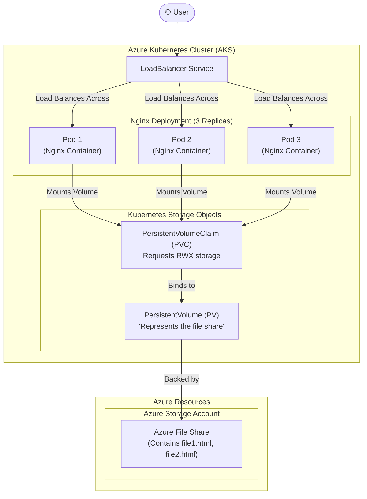

#Cloud #Azure #Kubernetes #AKS #Storage #PersistentStorage #AzureFiles #StorageClass #PVC #HandsOn #Tutorial

>  **Azure Files** is a fully managed cloud file share service that can be accessed via the standard **Server Message Block (SMB)** protocol. In [[Azure Kubernetes Service (AKS)|AKS]], Azure Files are used for persistent storage, most notably for use cases that require a volume to be mounted by **multiple Pods simultaneously** (ReadWriteMany - RWX). This is a key advantage over [[Persistent Storage in AKS with Azure Disks|Azure Disks]], which are limited to a single pod mount (ReadWriteOnce - RWO).

---

## 💾 What is Azure Files?

Azure Files provides simple, secure, and fully managed cloud file shares. It's a PaaS (Platform-as-a-Service) offering that can replace or supplement on-premise file servers.

-   **Fully Managed:** No need to manage file server VMs or operating systems.
-   **Secure:** Data is encrypted at rest and in transit (using SMB 3.0 and HTTPS).
-   **High Performance:** Premium tier offers high-performance SSD-backed file shares.
-   **Accessible:** Can be mounted by cloud or on-premise deployments and managed via PowerShell, Azure CLI, Azure Portal, or Azure Storage Explorer.

### Common Use Cases
-   **Static Content Storage:** A common use case is to store static assets (HTML, CSS, images) for a web server, which can be shared across multiple web server pods.
-   **Shared Configuration:** Provide access to configuration files for multiple application instances (e.g., multiple JVMs).
-   **Lift and Shift:** Easily migrate applications that rely on on-premise file shares to the cloud.

---

## 🏛️ The Goal: Deploying a Static Web Server with Shared Content

This section outlines a comprehensive, multi-part tutorial to deploy a stateless Nginx web server that serves static content from a persistent and shared Azure File share.

### The Visual Architecture

**The Key Concept:** All three Nginx pods will mount the **same** Azure File share. This means if you upload a file (`file1.html`) to the file share, it will be instantly accessible through any of the Nginx pods. This is the power of `ReadWriteMany` (RWX) volumes.

---

## 🧠 Kubernetes Concepts to be Implemented

To achieve this, we will use the standard Kubernetes storage objects, but this time configured for Azure Files.
-   **`StorageClass`:** Defines the template for creating the Azure File share. The `provisioner` will be `kubernetes.io/azure-file`.
-   **`PersistentVolumeClaim` (PVC):** A request for storage that specifies an `accessMode` of `ReadWriteMany` and uses the Azure File `StorageClass`.
-   **`Deployment`:** To manage the Nginx Pods.
-   **`volumes` and `volumeMounts`:** To connect the PVC to the Nginx containers at the path where Nginx serves content (e.g., `/usr/share/nginx/html`).
-   **`LoadBalancer` Service:** To expose the Nginx deployment to the public internet.

---

### Custom vs. Default `StorageClass` for Azure Files

The instructor outlines a plan to demonstrate two approaches:
1.  **V1 (Custom StorageClass):** We will write our own `StorageClass` manifest from scratch.
    -   **Why?** To learn the concepts and to gain more granular control. A custom `StorageClass` allows you to specify:
        -   **`skuName`:** The redundancy level of the storage, such as `Standard_LRS` (Locally-redundant), `Standard_GRS` (Geo-redundant), `Standard_ZRS` (Zone-redundant), or `Premium_LRS`.
        -   Custom `mountOptions` like file and directory permissions.
        -   Other behaviors like `reclaimPolicy` and `volumeBindingMode`.
2.  **V2 (Default StorageClass):** We will use the `StorageClass` objects that are pre-provisioned by AKS.
    -   **Why?** For simplicity and convenience.
    -   **Limitation:** The default AKS classes for Azure Files (`azurefile` and `azurefile-premium`) typically only support `Standard_LRS` and `Premium_LRS`, respectively. If you need geo-redundancy or other advanced features, you **must** create a custom `StorageClass`.

This dual approach provides a complete understanding of the available options and their trade-offs.