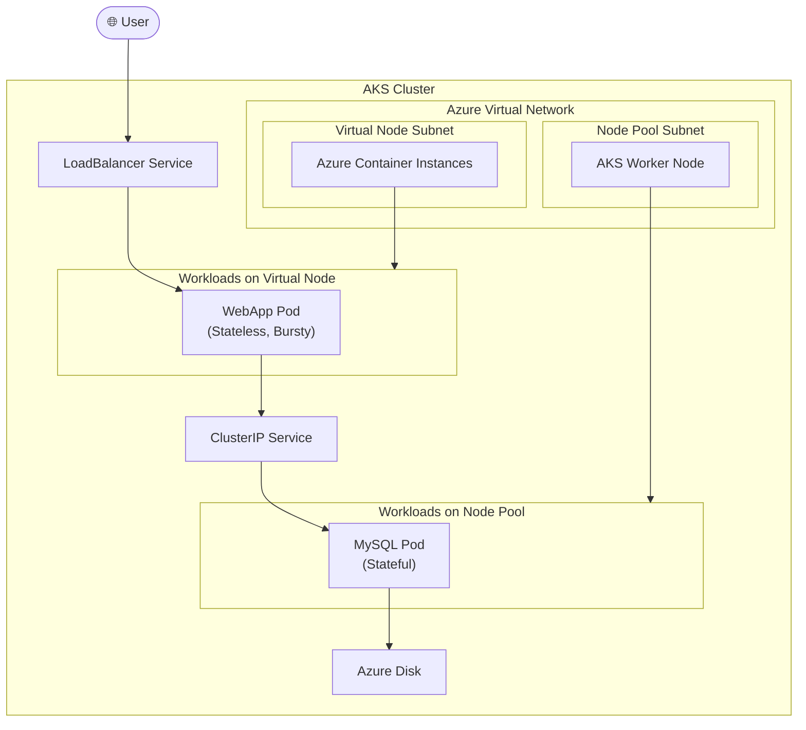

#Cloud #Azure #Kubernetes #AKS #Scaling #Serverless #VirtualNodes #ACI #Architecture

>  **Virtual Nodes** are a feature in [[Azure Kubernetes Service (AKS)|AKS]] that provides a "serverless" way to run containers. A virtual node is not a VM; it's an abstraction that allows you to schedule [[The Kubernetes Pod|Pods]] directly onto **Azure Container Instances (ACI)**, a serverless container runtime. This is ideal for quickly bursting unpredictable workloads without having to manage and pay for additional Virtual Machines in your node pools.

---

## 😫 The Problem: Handling Unpredictable, Bursty Workloads

Imagine you have an application with huge, unpredictable scalability requirements. A sudden spike in traffic might require you to quickly add hundreds of pods.
-   **The Node Pool Limitation:** Using standard node pools and the cluster autoscaler can handle this, but it takes time. The autoscaler needs to provision new Virtual Machines, boot them up, join them to the cluster, and then schedule the pods. This process isn't instantaneous.
-   **Cost Inefficiency:** You might have to overprovision your node pools (keeping extra VMs running just in case) to handle potential spikes, which is expensive.

## ✨ The Solution: Virtual Nodes for Serverless Bursting

Virtual Nodes provide a solution by integrating AKS with **Azure Container Instances (ACI)**. ACI is a serverless container-as-a-service offering. You can run a container on ACI in seconds without managing any underlying VMs.

When you enable the Virtual Nodes feature on your AKS cluster, Kubernetes sees the ACI capacity as a "virtual" node. You can then schedule pods onto this virtual node just like you would with a regular worker node.

> [!info] **Mixed-Mode Deployments**
> The most powerful pattern is a **mixed-mode deployment**. You run your steady-state, predictable, or stateful workloads (like databases) on your regular VM-based **Node Pools**. You then schedule your bursty, unpredictable, or stateless workloads (like a web application frontend) onto the **Virtual Nodes**.

### Key Limitations of Virtual Nodes (as of this lecture)
-   **No Persistent Storage:** Virtual Nodes do **not** support Kubernetes storage concepts like `StorageClass`, `PersistentVolumeClaim`, or `PersistentVolume`. This means you cannot run stateful applications that require persistent disks directly on virtual nodes.
-   **Stateless Workloads Only:** Because of the storage limitation, virtual nodes are suitable only for stateless applications.

---

## 🏗️ The Architecture We Will Build: A Mixed-Mode Deployment

This demo will re-deploy our full-stack User Management application, but this time in a mixed mode.

### The Visual Architecture


**The Workflow:**
1.  Our **stateful** `MySQL` Pod, which requires a persistent [[Persistent Storage in AKS with Azure Disks|Azure Disk]], will be scheduled to run on the regular, VM-based **Node Pool**.
2.  Our **stateless** `User Management Web App` Pod, which has bursty scaling needs, will be scheduled to run on the **Virtual Node** (which is backed by ACI).
3.  The web app pod on the virtual node will connect to the `MySQL` `ClusterIP` Service.
4.  Kubernetes networking will seamlessly route the traffic from the virtual node's subnet to the node pool's subnet, allowing the web app to communicate with the database.
5.  The entire application will be exposed to the internet via a standard `LoadBalancer` Service.

### How to Schedule a Pod on a Virtual Node
To control where a pod is scheduled, we will use a **`nodeSelector`** in our Deployment manifest. When the Virtual Nodes feature is enabled, a virtual `node` object is created in Kubernetes with specific labels. We can target this node.

**Example `Deployment` manifest for the web app:**
```yaml
# In the user-management-webapp-deployment.yaml
# ...
spec:
  template:
    # ...
    spec:
      # This nodeSelector tells the scheduler to place this pod ONLY on a node with these labels.
      # The virtual node has these labels by default.
      nodeSelector:
        kubernetes.io/role: agent
        beta.kubernetes.ioio/os: linux
        type: virtual-kubelet
      # ... containers definition ...
```

---

> [!summary]
> In the upcoming hands-on lectures, we will:
> 1.  Enable the Virtual Nodes feature on our AKS cluster.
> 2.  Review and update our User Management Web App's `Deployment` manifest to include the `nodeSelector` for the virtual node.
> 3.  Deploy the entire stack (MySQL on the node pool, Web App on the virtual node).
> 4.  Verify that the pods are scheduled to the correct locations.
> 5.  Test the end-to-end functionality of the application to demonstrate the seamless communication between the mixed-mode components.