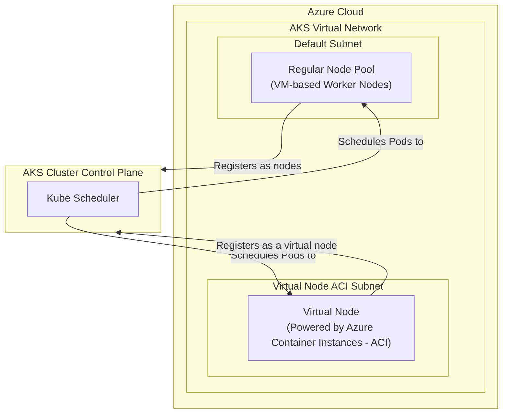

#Cloud #Azure #Kubernetes #AKS #Serverless #VirtualNodes #ACI #Scaling #Architecture

>  **Virtual Nodes** are a feature in [[Azure Kubernetes Service (AKS)|AKS]] that allow you to run Kubernetes Pods on a **serverless container infrastructure** provided by **Azure Container Instances (ACI)**. This enables you to burst workloads and scale your applications with incredible speed, as you no longer need to wait for new virtual machines to be provisioned. You pay per-second for the resources your pods consume, without managing any underlying VMs.

---

## 🏛️ The Core Concept: Bridging VM-based and Serverless Compute

Normally, your pods run on worker nodes, which are Azure Virtual Machines that you manage in a [[Azure Kubernetes Service (AKS)#Customer-Managed Worker Nodes (Node Pools)|node pool]]. Virtual Nodes provide an alternative, serverless execution environment.

### Key Advantages of Virtual Nodes
-   **Rapid Scaling:** This is the primary benefit. You can scale your applications almost instantly without limitations.
-   **Quick Pod Provisioning:**
    -   **Traditional Scaling (with Cluster Autoscaler):** When you need to scale beyond your current node pool's capacity, the Cluster Autoscaler must first provision a new VM, which can take several minutes. Only then can Kubernetes schedule your new pods onto that VM.
    -   **Virtual Node Scaling:** With Virtual Nodes, you just schedule the pod. ACI provisions the necessary compute in the background, and your pod is typically up and running in **under 60 seconds**.

### The Visual Architecture
When you enable the Virtual Nodes feature in an AKS cluster (usually during creation), Azure sets up a dedicated subnet for them.


-   The Virtual Node appears to the Kubernetes control plane just like any other worker node.
-   The magic is how Kubernetes decides where to schedule a pod.

---

## ⚙️ How to Schedule Pods on Virtual Nodes: `nodeSelector`

How does the Kubernetes scheduler know whether to place a pod on a regular VM-based node or on the serverless Virtual Node? The answer is **`nodeSelector`**.

To schedule a pod on the Virtual Node, you must add a specific `nodeSelector` to your pod's specification in your `Deployment` manifest.

```yaml
# In your deployment.yaml, under the pod template spec
spec:
  # ... other pod spec details ...
  nodeSelector:
    kubernetes.io/role: agent
    beta.kubernetes.io/os: linux
    type: virtual-kubelet
  tolerations:
  - key: virtual-kubelet.io/provider
    operator: Exists
  - key: azure.com/aci
    operator: Exists
```
-   When the scheduler sees a pod with this `nodeSelector` and `tolerations`, it knows to schedule it onto the Virtual Node infrastructure provided by ACI.
-   Pods without this selector will be scheduled on your regular node pools.

---

## ⚠️ Known Limitations of Virtual Nodes (As of the lecture)

Virtual Nodes are a powerful feature, but they are built on ACI and inherit its limitations. It is critical to be aware of these before designing an application to run on them.

-   **Service Quotas:** Your Azure subscription has service quota limits for ACI (e.g., a maximum number of containers you can run). These limits apply to your Virtual Node pods.
-   **Azure Container Registry (ACR) Authentication:** Using a service principal to pull images from ACR is not supported. The workaround is to use Kubernetes `imagePullSecrets`.
-   **Virtual Network Limitations:** Standard VNet limitations, including those around VNet peering, apply.
-   **No `initContainers`:** Pods that use [[Writing Kubernetes Manifests The User Management Web App Deployment|`initContainers`]] **cannot** be scheduled on Virtual Nodes. This is a significant limitation for applications with complex startup dependencies.
-   **No Azure Disks:** Virtual Nodes do **not** support mounting [[Persistent Storage in AKS with Azure Disks|Azure Disks]] (`ReadWriteOnce` volumes). If your pod requires persistent block storage, it cannot run on a Virtual Node. It does, however, support [[Persistent Storage in AKS with Azure Files|Azure Files]] (`ReadWriteMany` volumes).
-   **No DaemonSets:** `DaemonSets`, which run a pod on every node in the cluster, are not supported on Virtual Nodes.

> [!danger] **Design Consideration:**
> Before deciding to use Virtual Nodes, you must thoroughly review the current official documentation for ACI and Virtual Node limitations to ensure your application's requirements (e.g., for storage, init logic, etc.) are compatible.

---

> [!summary]
> In the upcoming hands-on lecture, we will:
> 1.  Enable the Virtual Nodes feature on an AKS cluster.
> 2.  Create a `Deployment` manifest for a sample application.
> 3.  Add the specific `nodeSelector` and `tolerations` to the manifest to target the Virtual Node.
> 4.  Deploy the application and observe how quickly the pod is provisioned and running on the serverless ACI infrastructure, without any new VMs being added to our cluster.