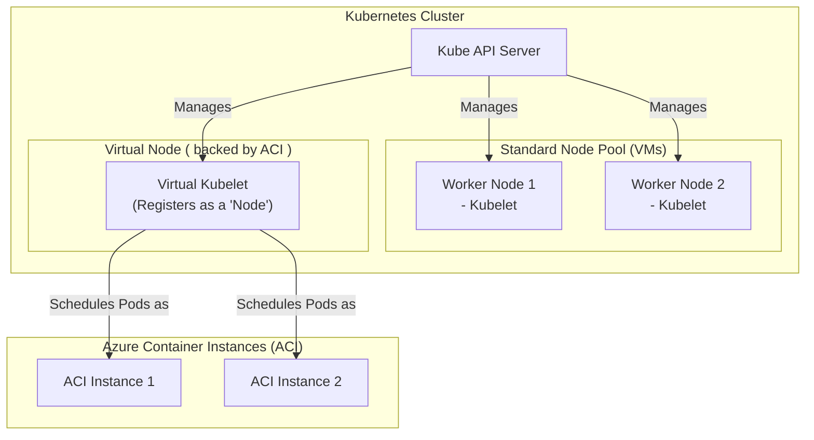

#Cloud #Azure #Kubernetes #AKS #Serverless #ACI #VirtualKubelet #VirtualNodes #Architecture

>  **Azure AKS Virtual Nodes** provide a way to run Kubernetes workloads on a **serverless container infrastructure**. By leveraging an open-source technology called **Virtual Kubelet** and a serverless container service called **Azure Container Instances (ACI)**, you can add "virtual" nodes to your AKS cluster. Pods scheduled on these virtual nodes run on ACI, and you are billed per-second for their resource consumption, eliminating the need to manage and pay for underlying Virtual Machines.

---

This is a powerful feature for handling bursting workloads or for simple, stateless applications where managing a full VM-based node pool is unnecessary overhead.

## 🏛️ The Core Components

The concept of AKS Virtual Nodes is a combination of two key technologies:

### 1. The Virtual Kubelet
-   **What it is:** An open-source implementation of the Kubernetes [[Kubernetes Architecture and Core Concepts#The Worker Node Components|`kubelet`]] that masquerades as a real `kubelet` but connects Kubernetes to other APIs instead of a local container runtime.
-   **How it works:** A Virtual Kubelet registers itself with the Kubernetes API server as a `Node`. When the scheduler decides to place a Pod on this "virtual" node, the Virtual Kubelet intercepts this request. Instead of starting a container locally, it translates the Pod specification into an API call to a backing service.
-   **The Primary Use Case:** To extend a Kubernetes cluster into serverless container platforms like **Azure Container Instances (ACI)** or **AWS Fargate**.

### 2. Azure Container Instances (ACI)
-   **What it is:** A serverless container hosting environment in Azure.
-   **How it works:** ACI allows you to run containers without managing the underlying VMs. Azure handles all the infrastructure management for you.
-   **Key Benefit (Billing):** You are charged **per-second** for the CPU and memory resources your container consumes. If no container is running, you are not charged.

---

## 🏗️ The Architecture: Virtual Kubelet + ACI = Virtual Nodes

> [!info] The Equation
> **Virtual Kubelet + Azure Container Instances (ACI) = Azure AKS Virtual Nodes**

When you enable the Virtual Nodes feature on an AKS cluster, a Virtual Kubelet is installed. This Virtual Kubelet is specifically configured to use ACI as its backend provider.

**The Workflow:**
1.  A Pod is scheduled to run on the `virtual-node`.
2.  The Virtual Kubelet receives the Pod specification from the API server.
3.  The Virtual Kubelet makes an API call to Azure to provision a new ACI instance with the container(s) defined in the Pod.
4.  The Pod now runs on the serverless ACI infrastructure, appearing to the Kubernetes cluster as if it's running on a regular node.

### The Benefits of This Model
-   **No Infrastructure Management:** You don't have to manage, patch, or scale the underlying VMs for your virtual nodes.
-   **Cost-Effectiveness:** You are billed per-second for the resources your ACI-backed pods consume, which can be much cheaper than paying for an always-on VM for workloads that are intermittent or bursty.
-   **Rapid Scaling:** ACI can provision new container instances very quickly, providing an "infinite" burst capacity for your cluster.

---

## ⚠️ Current Features and Limitations (As of the Lecture)

Virtual Nodes are a powerful but still evolving feature. As of the time of the lecture, there are important limitations to be aware of.

### Supported Features
-   **Volumes:**
    -   ✅ `gitRepo` (deprecated in newer K8s versions)
    -   ✅ `emptyDir`
    -   ✅ **`azureFile`** (using [[Persistent Storage in AKS with Azure Files|Azure Files]])
-   **Configuration:**
    -   ✅ Secure environment variables (from [[Managing Kubernetes Secrets|Secrets]])
    -   ✅ `ConfigMap`
-   **Networking:**
    -   ✅ "Bring your own VNET" support.
    -   ✅ Network Security Group (NSG) support.
-   **Monitoring:**
    -   ✅ Integration with Azure Monitor for logs and metrics (OMS).

### Critical Limitations
-   **❌ No Azure Disk Support:** The most significant limitation is that virtual nodes **do not support mounting [[Persistent Storage in AKS with Azure Disks|Azure Disks]]** (`ReadWriteOnce` volumes). This means you **cannot** run a stateful application like a persistent MySQL database directly on a virtual node.
-   **Limited Feature Set:** While core Pod functionalities work, more advanced Kubernetes features might not be fully supported.

### When to Use Virtual Nodes
Given the limitations, Virtual Nodes are best suited for:
-   **Stateless, Bursting Workloads:** Simple web frontends (like an Nginx proxy), API gateways, or batch processing jobs that can quickly scale up to handle a spike in traffic and then scale back down to zero.
-   **Simple, Stateless Applications:** Any application that doesn't require persistent block storage can be a good candidate.

---

> [!summary]
> In the next lecture, we will:
> 1.  Enable the Virtual Nodes feature on our AKS cluster.
> 2.  Deploy a sample application specifically to the virtual node.
> 3.  Observe how the Pod is scheduled and how it runs on the underlying ACI infrastructure, without appearing on any of our standard VM-based worker nodes.