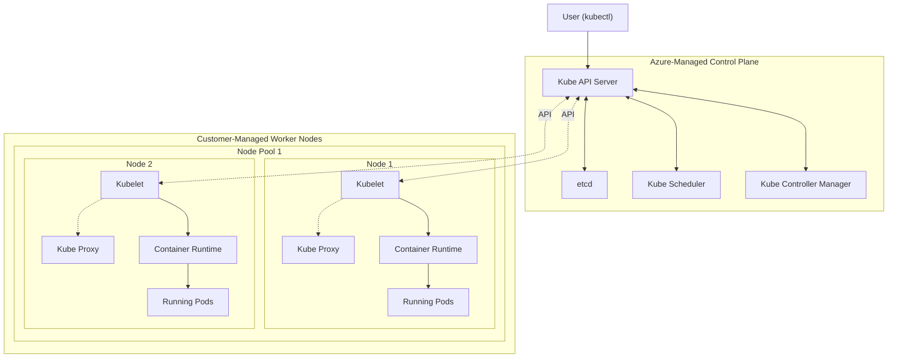

#Cloud #Azure #Kubernetes #AKS #Containerization #DevOps #HandsOn #Tutorial

> Azure Kubernetes Service (AKS) is a **highly available, secure, and fully managed Kubernetes service** on Microsoft Azure. It simplifies deploying and managing containerized applications by offloading the operational overhead of the Kubernetes control plane to Azure. This allows you to focus on your application's workloads, which run on worker nodes (called **Node Pools**) that you manage.

---

## ❓ What is Azure Kubernetes Service (AKS)?

AKS is Microsoft's managed offering for the popular container orchestrator, Kubernetes. It provides an enterprise-grade platform for running containerized applications at scale.

-   **Fully Managed Control Plane:** Azure manages the core Kubernetes control plane components (API Server, etcd, Scheduler, etc.) for you, handling tasks like health monitoring and maintenance. This is provided for free in the "Free" pricing tier.
-   **Highly Available:** AKS is available in more Azure regions (36+ and growing) than any other cloud provider's managed Kubernetes service.
-   **Versatile Workloads:** You can run a wide variety of workloads on AKS, including:
    -   **Windows-based applications** (e.g., .NET).
    -   **Linux-based applications** (e.g., Java, Node.js).
    -   IoT device deployments.
    -   Machine learning model training.

---

## 🏛️ High-Level AKS Kubernetes Architecture

While a deeper dive into Kubernetes architecture will come later, a high-level understanding is necessary to grasp what we are creating. Like all Kubernetes distributions, AKS has two main parts: the **Control Plane** and the **Worker Nodes**.



### Terminology in the Cloud World
| Standard Kubernetes | **Azure Kubernetes Service (AKS)** | Amazon Elastic Kubernetes Service (EKS) |
| :--- | :--- | :--- |
| Control Plane / Master Nodes | **Cluster Control Plane** (Managed by Azure) | Control Plane (Managed by AWS) |
| Worker Nodes | **Node Pools** | Managed Node Groups |

### Azure-Managed Control Plane Components
When you use AKS, Azure automatically provisions, manages, and abstracts away the complexity of these core components for you:
-   `etcd`: The highly available key-value store that acts as the backing database for all cluster data (node information, pod states, etc.).
-   `kube-scheduler`: Watches for newly created Pods that have no node assigned and selects a healthy worker node for them to run on.
-   `kube-api-server`: The front-end for the control plane. It exposes the Kubernetes API. All components—`kubectl`, the scheduler, controllers, and `kubelet`—communicate through the API server.
-   `kube-controller-manager`: Runs various controllers that are responsible for maintaining the desired state of the cluster. Examples include:
    -   **Node Controller:** Responds when nodes go down.
    -   **Replication Controller:** Ensures the correct number of pods are running for an application.
    -   **Endpoint Controller:** Populates the Endpoints object (joins Services & Pods).

### Customer-Managed Worker Node (Node Pool) Components
These components run on every virtual machine (VM) in your node pools.
-   `container-runtime`: The underlying software that runs containers (e.g., Docker, containerd).
-   `kubelet`: The primary agent that runs on each worker node. It communicates with the master's API server and ensures that the containers described in PodSpecs are running and healthy on its node.
-   `kube-proxy`: A network proxy that runs on each node and maintains network rules on the nodes. It enables the Kubernetes service concept by managing network communication to Pods.

---

## 🛠️ Hands-On: Creating an AKS Cluster

This guide follows the instructor's step-by-step process for creating an AKS cluster through the Azure Portal.

### Step 1: Navigate and Start Creation
1.  Log in to the Azure Portal (`portal.azure.com`).
2.  Search for "Kubernetes" and select **Kubernetes services**.
3.  Click **Create > Create a Kubernetes cluster**.

### Step 2: Configure the Basics Tab
1.  **Project Details:**
    -   **Subscription:** Choose a paid subscription. This is recommended to ensure all demo features are available.
    -   **Resource Group:** Create a new one (e.g., `aks-rg1`).
2.  **Cluster Details:**
    -   **Cluster preset configuration:** Choose **Standard**. This is for production-ready applications. Other options include `dev/test`, `cost-optimized`, and `batch processing`.
    -   **Kubernetes cluster name:** `aksdemo1`.
    -   **Region:** `Central US`.
    -   **Availability zones:** Select all zones (`Zone 1, 2, 3`) for high availability.
    -   **AKS pricing tier:** Select **Free**. This means the management of the control plane is free, but you still pay for the VMs (node pools), storage, and networking resources you consume.
    -   **Kubernetes version:** Leave as the recommended default.
    -   **Automatic upgrade:** Leave as the recommended default.
3.  **Primary Node Pool:**
    -   **Node size:** The default `Standard DS2 v2` (2 vCPUs, 7GB memory) is sufficient.
    -   **Scale method:** `Autoscale`.
    -   **Node count range:** `1` to `5`. The cluster will initially spin up with a few nodes but will scale down to 1 when idle, saving costs.

### Step 3: Configure Node Pools, Access, and Networking
1.  **Node Pools Tab:** Review the default `agentpool` created based on the previous settings. No changes are needed here.
2.  **Access Tab:** Leave all settings as default (e.g., `System-assigned managed identity`, `Local accounts with Kubernetes RBAC`).
3.  **Networking Tab:** This is a critical step.
    -   **Network configuration:** Change the setting from `kubenet` to **`Azure CNI`**.
    -   **Why Azure CNI?** The instructor strongly recommends `Azure CNI` because it provides native integration with Azure's Virtual Network (VNet). This means that Pods get IP addresses directly from the VNet's subnet, making it much easier and more performant for them to communicate with other Azure services (like Azure MySQL).
    -   Leave all the auto-populated VNet, subnet, and IP address ranges as default.

### Step 4: Configure Integrations, Advanced, and Create
1.  **Integrations Tab:** Leave all settings as default.
2.  **Advanced Tab:** Leave all settings as default. Note the **`Infrastructure resource group`**. AKS will create a *second* resource group (with a name like `MC_aks-rg1_aksdemo1_centralus`) to hold all the underlying infrastructure resources it creates (like VM Scale Sets, public IPs, etc.).
3.  **Review + create:** The portal will validate your configuration. Once validation passes, click **Create**. The cluster creation will take 3-5 minutes.

---

## 🔌 Connecting to the AKS Cluster with `kubectl`

After the cluster is created, you need to configure `kubectl` to communicate with it.

### Step 1: Use Azure Cloud Shell
1.  Open the Azure Cloud Shell by navigating to `shell.azure.com` or clicking the Cloud Shell icon in the Azure Portal header.
2.  Cloud Shell provides a pre-configured terminal environment with tools like the Azure CLI (`az`) and `kubectl` already installed.

### Step 2: Get Cluster Credentials
Run the following Azure CLI command to download the cluster's connection information and automatically configure your local `~/.kube/config` file.
```bash
az aks get-credentials --resource-group aks-rg1 --name aksdemo1
```
It will merge the new cluster's context into your `kubeconfig` file.

### Step 3: Verify the Connection with `kubectl`
Now you can run `kubectl` commands to interact with your cluster.
```bash
# Get the list of worker nodes in your cluster
kubectl get nodes

# Get more detailed information, including internal IP and OS image
kubectl get nodes -o wide
```
You should see one or more nodes from your `agentpool` listed, confirming that you are successfully connected.

---

## 🔬 Exploring the Cluster Components

### Using `kubectl`
-   **List Namespaces:**
    ```bash
    kubectl get namespaces
    # Alias: kubectl get ns
    ```
    This shows the default namespaces: `default`, `kube-system`, `kube-public`, etc.
-   **List All Pods (Workloads):** The core control plane components run as pods in the `kube-system` namespace.
    ```bash
    kubectl get pods --all-namespaces
    ```
    You will see pods related to `azure-cni`, `coredns`, `kube-proxy`, `metrics-server`, and the `kubernetes-dashboard`.
-   **List All Objects:** To see everything (Deployments, ReplicaSets, DaemonSets, Services, etc.) running in the cluster:
    ```bash
    kubectl get all --all-namespaces
    ```

### Using the Azure Portal
The Azure Portal provides a user-friendly way to explore the same resources.
1.  Navigate to your AKS cluster resource.
2.  Under **Kubernetes resources (preview)** in the left sidebar, you can explore:
    -   **Namespaces:** The same list as `kubectl get ns`.
    -   **Workloads:** A graphical view of all your Deployments, Pods, etc., which you can filter by namespace.
    -   **Services and ingresses:** View your ClusterIP services, etc.
    -   **Node pools:** View and manage your `agentpool`. From here, you can manually scale the number of nodes or upgrade the Kubernetes version.

### Verifying Enhanced Networking
A key benefit of using modern VM sizes with Azure CNI is **Accelerated Networking**.
1.  In the Azure Portal, search for **Virtual machine scale sets**.
2.  Find the scale set associated with your AKS agent pool (the name will be in the infrastructure resource group).
3.  Click on it and go to the **Networking** tab.
4.  You will see that **Accelerated networking** is **Enabled**. This is critical for high-performance communication between your AKS workloads and other Azure services.