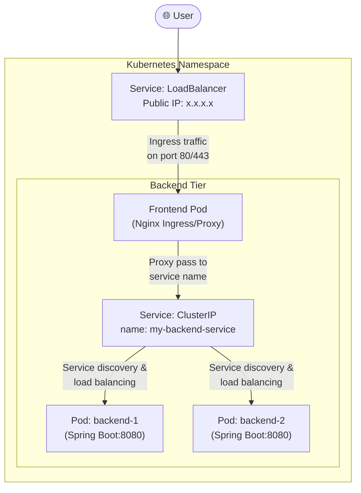

#DevOps #Containerization #Kubernetes #CoreConcept #Networking #Services #ClusterIP #LoadBalancer #HandsOn #Tutorial

>  A **Service** is a fundamental Kubernetes object that provides a stable network endpoint (a virtual IP address) to access a dynamic set of [[The Kubernetes Pod|Pods]]. It acts as an internal load balancer and enables communication between different parts of your application and exposes them to the outside world. The main types are **`ClusterIP`** (for internal communication) and **`LoadBalancer`** (for external access).

---

## 🏛️ The Five Core Kubernetes Service Types

Kubernetes offers several types of services, each designed for a specific use case.

| Service Type | Primary Use Case & Description |
| :--- | :--- |
| **`ClusterIP`** | **(Default)** Exposes the service on an IP address that is **only reachable from within the cluster**. This is the standard for internal, service-to-service communication (e.g., a frontend application talking to a backend API). |
| **`NodePort`** | Exposes the service on a static port on each worker node's IP address. While it allows external access, it's often used for development or debugging purposes. In production, `LoadBalancer` or `Ingress` are preferred. For Azure AKS, this requires enabling public IPs on nodes, a feature that is in preview. |
| **`LoadBalancer`** | Exposes the service externally using a cloud provider's load balancer. When you create a `LoadBalancer` service in a cloud environment like [[Azure Kubernetes Service (AKS)|AKS]] or AWS EKS, it automatically provisions a cloud load balancer (e.g., an Azure SLB or an AWS ELB) with a public IP address. |
| **`Ingress`** | Not a `Service` type itself, but a separate, more advanced API object that manages external access to services in the cluster. It provides L7 (HTTP/HTTPS) features like context-path based routing, SSL/TLS termination, and virtual hosting. It's an "advanced load balancer." |
| **`ExternalName`** | Creates a CNAME-like DNS record within the cluster, mapping a service name to an external DNS name (e.g., a cloud database like AWS RDS). This allows applications inside the cluster to access an external service using a consistent, internal service name. |

> [!info] For this fundamentals section, we will focus on **`ClusterIP`** and **`LoadBalancer`** types.

---

## 🏗️ Building a Frontend-Backend Application Architecture

This guide follows the instructor's hands-on demo to build a two-tier application:
1.  A **backend** Spring Boot REST API.
2.  A **frontend** Nginx reverse proxy that communicates with the backend.

### The Visual Architecture



### Step 1: Deploy the Backend Application
First, we create a [[The Kubernetes Deployment|Deployment]] for our backend REST API.

```bash
kubectl create deployment my-backend-rest-api --image=stacksimplify/kube-helloworld:1.0.0
```
-   This creates a Deployment that, by default, runs one Pod of our Spring Boot application.
-   You can verify the Pod is running and check its logs to see the Spring Boot application starting up.
    ```bash
    kubectl get pods
    kubectl logs -f <backend-pod-name>
    ```

### Step 2: Expose the Backend with a `ClusterIP` Service
Since the backend only needs to be accessed by the frontend (from *within* the cluster), we expose it using a `ClusterIP` service.

```bash
kubectl expose deployment my-backend-rest-api --port=8080 --target-port=8080 --name=my-backend-service
```
-   `expose deployment my-backend-rest-api`: We are creating a service that targets the Pods managed by this deployment.
-   `--port=8080`: The `ClusterIP` service itself will listen on port 8080.
-   `--target-port=8080`: Traffic will be forwarded to port 8080 on the backend containers.
-   `--name=my-backend-service`: This name is **critical**. The frontend Nginx container is pre-configured to proxy requests to this exact DNS name.

> [!tip] **`ClusterIP` is the Default Service Type**
> Notice we didn't specify `--type=ClusterIP`. This is because `ClusterIP` is the default service type in Kubernetes. If you don't specify a type, `ClusterIP` is what you get.

Verify the service creation:
```bash
kubectl get svc
```
You will see `my-backend-service` with a `TYPE` of `ClusterIP` and an internal `CLUSTER-IP` address. It has no `EXTERNAL-IP`.

### Step 3: Deploy the Frontend Application
Now, we create a Deployment for our frontend Nginx reverse proxy. This Nginx image has been custom-built with a configuration that includes `proxy_pass http://my-backend-service:8080;`.

```bash
kubectl create deployment my-frontend-nginx-api --image=stacksimplify/kube-frontend-nginx:1.0.0
```
Verify the frontend Pod is running with `kubectl get pods`.

### Step 4: Expose the Frontend with a `LoadBalancer` Service
To make the frontend accessible from the public internet, we expose its Deployment using a `LoadBalancer` service.

```bash
kubectl expose deployment my-frontend-nginx-api --type=LoadBalancer --port=80 --target-port=80 --name=my-frontend-service
```
-   `--type=LoadBalancer`: This tells our cloud provider (Azure) to provision an external load balancer.
-   `--port=80`: The external load balancer will listen on port 80 (standard HTTP).
-   `--target-port=80`: Traffic will be forwarded to port 80 on the Nginx containers.

Verify the service creation. It may take a minute for the `EXTERNAL-IP` to be assigned.
```bash
kubectl get svc
```

### Step 5: Access the Full Application
1.  Copy the `EXTERNAL-IP` of the `my-frontend-service`.
2.  Navigate to `http://<EXTERNAL-IP>/hello` in your browser.
3.  You should see the "Hello World V1" response from the **backend** Spring Boot application, served via the frontend Nginx proxy.

### Step 6: Test Internal Load Balancing
Let's scale the backend to see the `ClusterIP` service load balancing in action.

1.  Scale the backend deployment to 5 replicas:
    ```bash
    kubectl scale deployment/my-backend-rest-api --replicas=5
    ```
2.  Verify that 5 backend pods are running: `kubectl get pods`.
3.  Continuously refresh the application in your browser (`http://<EXTERNAL-IP>/hello`). You will see the unique Pod ID in the response change, proving that the `ClusterIP` service (`my-backend-service`) is distributing requests from the frontend proxy across all five available backend pods.

This successfully demonstrates the complete request flow:
**User → Azure Load Balancer → Frontend Nginx Pod → `ClusterIP` Service → Backend Spring Boot Pod**

---

> [!info] A Note on Building the Custom Nginx Image
> The instructor provides the source code for the custom Nginx proxy. The key part is the `default.conf` file, which contains the proxy rule. To build your own, you would create a `Dockerfile` that starts `FROM nginx` and `COPY`s your custom `default.conf` into `/etc/nginx/conf.d/`.