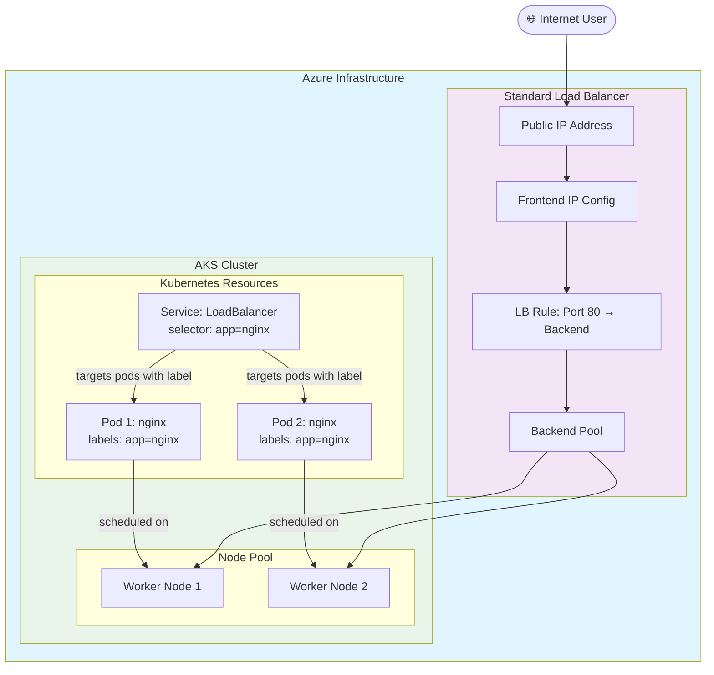

#Cloud #Azure #Kubernetes #AKS #Networking #CoreConcept #Services #LoadBalancer #HandsOn #Tutorial

>  A Kubernetes **Service** is an abstraction that provides a stable network endpoint to access a set of [[The Kubernetes Pod|Pods]]. The **`LoadBalancer`** service type is specifically designed for exposing an application to the public internet. When you create a `LoadBalancer` service in [[Azure Kubernetes Service (AKS)|AKS]], it automatically provisions and configures an **Azure Standard Load Balancer (SLB)** with a new public IP address, seamlessly integrating your Kubernetes workload with Azure's native networking infrastructure.

---

## 🏛️ Understanding Kubernetes Services

In Kubernetes, applications run in Pods, which are ephemeral and have changing IP addresses. A **Service** solves this problem by providing a stable, virtual IP address that sits in front of a group of Pods and acts as a load balancer.

### Types of Services in Kubernetes
-   **`ClusterIP`:** (Default) Exposes the service on an internal-only IP address within the cluster. This is for internal communication between services.
-   **`NodePort`:** Exposes the service on a static port on each worker node's IP address. While this makes it externally accessible, it's often considered a development-mode feature and is not the standard for production.
-   **`LoadBalancer`:** **(The focus of this guide)** Exposes the service externally using a cloud provider's load balancer. This is the standard way to expose a production service to the internet.
-   **`Ingress`:** Not a service type, but a separate, more advanced object that manages external access to services, typically providing L7 (HTTP/HTTPS) load balancing, SSL termination, and path-based routing.

---

## 🏗️ How `LoadBalancer` Service Integrates with Azure AKS

This is where the magic of a managed Kubernetes service shines. When you create a Kubernetes resource of `type: LoadBalancer`, AKS automatically orchestrates the creation of several Azure resources.

### The Visual Workflow



### The Sequence of Events (Theory)
1.  **Initial State:** When you create an AKS cluster, Azure automatically provisions a default **Azure Standard Load Balancer (SLB)** and a **Public IP** for it. This initial setup is used for administrative access to the cluster's `kube-api-server`, allowing you to run `kubectl` commands.
2.  **Deploy Your Application:** You deploy your application as a set of Pods using a [[Kubernetes#🧱 Fundamental Kubernetes Core Concepts|Deployment]].
3.  **Create the `LoadBalancer` Service:** You then create a Kubernetes Service of `type: LoadBalancer`.
4.  **Automatic Azure Provisioning:** The AKS control plane detects this new service and automatically performs the following actions in Azure:
    -   Creates a **new Public IP address**.
    -   Updates the existing Azure SLB:
        -   Adds a **new Frontend IP configuration** and associates it with the new Public IP.
        -   Creates a **new Load Balancing Rule** that maps the public IP and port to the backend pool (which consists of your AKS worker nodes).
5.  **Traffic Flow:** When an external user hits the new public IP, the Azure SLB receives the request, and its rule forwards the traffic to the corresponding `NodePort` on one of the worker nodes. `kube-proxy` on that node then routes the traffic to one of the healthy application Pods.

### `port` vs. `targetPort`

-   **`port`:** The port on which the Service itself listens for traffic (within the cluster's internal network).
-   **`targetPort`:** The port on the **container** inside the Pod that the traffic should be forwarded to. This must match the port your application is listening on.

---

## 🛠️ Hands-On: Exposing a Pod with a LoadBalancer Service

This guide follows the instructor's step-by-step process for creating a Pod and exposing it.

### Step 1: Verify the Initial State in Azure
Before creating the service, inspect the Azure resources to see the baseline.
1.  **Public IP Addresses:** In the Azure Portal, search for "Public IP addresses". You will see only **one** IP, the one created for the AKS cluster's administrative access.
2.  **Load Balancers:** Search for "Load balancers". You will see **one** SLB, named `kubernetes`.
    -   **Frontend IP configuration:** It will have only one configuration, associated with the single public IP.
    -   **Load balancing rules:** There will be no application-specific rules yet.

### Step 2: Create a Pod
Use the imperative `kubectl run` command to create a simple Pod running the demo Nginx application.
```bash
kubectl run my-first-pod --image=stacksimplify/kube-nginx:1.0.0
```

### Step 3: Expose the Pod with a LoadBalancer Service
Use the imperative `kubectl expose` command to create the Service.
```bash
kubectl expose pod my-first-pod --type=LoadBalancer --port=80 --name=my-first-service
```
-   `expose pod my-first-pod`: We are creating a service that targets this specific pod.
-   `--type=LoadBalancer`: This is the critical flag that tells AKS to provision an Azure SLB.
-   `--port=80`: The service will listen on port 80. Since `targetPort` is not specified, it defaults to the same value (`80`).
-   `--name=my-first-service`: The name of our new Service object.

### Step 4: Inspect the Kubernetes and Azure Resources
1.  **Check the Service in Kubernetes:**
    ```bash
    kubectl get service
    # Alias: kubectl get svc
    ```
    The output will show `my-first-service`. It may take a minute or two for the `EXTERNAL-IP` to be assigned.
    ```
    NAME                TYPE           EXTERNAL-IP      PORT(S)
    my-first-service    LoadBalancer   52.154.205.2     80:30751/TCP
    ```
2.  **Access the Application:** Copy the `EXTERNAL-IP` and paste it into your web browser. You will see the "Welcome to stack simplify..." application page.
3.  **Verify the New Azure Resources:**
    -   Go back to **Public IP addresses** in the Azure Portal. You will now see a **second** public IP has been created automatically.
    -   Go back to the `kubernetes` **Load Balancer**.
        -   **Frontend IP configuration:** A new configuration has been added for the new public IP.
        -   **Load balancing rules:** A new rule has been created, mapping the new frontend IP to the backend pool on the correct port.

This demonstrates the seamless, tight integration between the Kubernetes API and the underlying Azure cloud provider.

### Step 5: Exploring Resources in the AKS Dashboard
Modern AKS clusters provide a "Kubernetes resources (preview)" section in the Azure Portal, which acts as a lightweight, built-in Kubernetes dashboard.
-   You can navigate through **Namespaces**, **Workloads** (Pods, Deployments), and **Services** directly in the UI.
-   If you click on a Pod or Service, you can see its details and even view its live YAML manifest.
-   This provides a user-friendly way to explore the same information you get from `kubectl` commands.

> [!warning] Preview Feature Limitations
> The instructor notes that this preview feature can be buggy and may not work at all if the cluster is integrated with Azure AD for authentication. `kubectl` remains the definitive and most reliable tool.

### Step 6: Cleaning Up
It is a critical best practice to delete the resources you created. You can delete the individual Kubernetes objects.
```bash
# Delete the Service
kubectl delete service my-first-service

# Delete the Pod
kubectl delete pod my-first-pod
```
When you delete the `LoadBalancer` service, the AKS controller will automatically de-provision the associated Public IP and Load Balancing Rule in Azure, cleaning up the cloud resources for you.