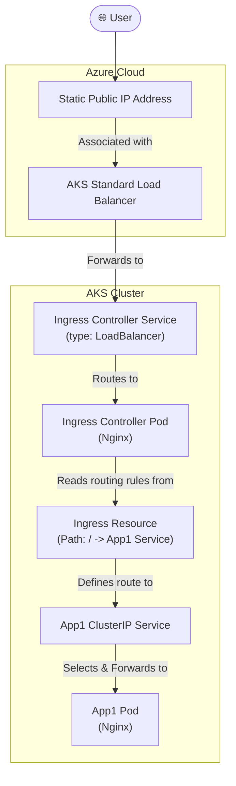

#Cloud #Azure #Kubernetes #AKS #Networking #CoreConcept #Ingress #IngressController #Nginx #HandsOn #Tutorial

>  This guide provides a hands-on introduction to implementing a basic [[An Introduction to Kubernetes Ingress|Ingress]] setup on [[Azure Kubernetes Service (AKS)|AKS]] using the popular **Nginx Ingress Controller**. We will provision a static public IP in Azure, install the Ingress Controller using a Helm chart, and then create an `Ingress` resource to route external traffic to a sample Nginx application.

---

## 🏛️ The Architecture We Will Build

This demo will create a robust, production-style setup for handling external traffic.


**The Workflow:**
1.  A user sends a request to a static, known public IP address.
2.  The request hits the Azure Standard Load Balancer associated with the AKS cluster.
3.  The SLB forwards the traffic to the **Nginx Ingress Controller's Service**, which is the single entry point for all web traffic.
4.  The Ingress Controller Pod receives the request. It looks at the `Ingress` resource we created.
5.  The `Ingress` resource has a rule: "traffic for the root path (`/`) should go to the `App1` Service."
6.  The Ingress Controller proxies the request to the `App1` `ClusterIP` Service, which then forwards it to the running `App1` Pod.

> [!tip] **Best Practice: Static Public IP**
> Instead of letting the Ingress Controller's service get a dynamic, unpredictable public IP, the best practice for production is to **pre-create a static public IP** in Azure. We can then configure the Ingress Controller during installation to use this specific, known IP address.

---

## ✍️ The Basic Ingress Manifest

An `Ingress` resource is a Kubernetes object that defines routing rules.

### The High-Level Template
```yaml
# 1. API Version for Ingress
apiVersion: networking.k8s.io/v1 # Note: Older versions used v1beta1
# 2. The kind of object
kind: Ingress
# 3. Metadata to identify the Ingress
metadata:
  name: nginx-app1-ingress-service
  annotations:
    # 4. This annotation is CRITICAL. It tells Kubernetes which Ingress Controller should handle this resource.
    kubernetes.io/ingress.class: "nginx"
spec:
  # 5. 'rules' defines the routing logic
  rules:
  - http:
      paths:
      - path: /
        pathType: Prefix
        backend:
          service:
            name: app1-clusterip-service
            port:
              number: 80
```
-   **`apiVersion`**: The modern and stable API version for Ingress is `networking.k8s.io/v1`.
-   **`annotations`**: This is a crucial part. The `kubernetes.io/ingress.class: "nginx"` annotation is a special instruction that tells the Nginx Ingress Controller (and not some other controller that might be running in the cluster) that it is responsible for implementing the rules in this manifest.
-   **`spec.rules`**: This is where you define the actual routing logic. This rule states that traffic for the path `/` should be sent to the backend `service` named `app1-clusterip-service` on port `80`.

---

## 🗺️ The Implementation Roadmap

This section outlines the step-by-step plan for the hands-on demo.

### 1. Create a Static Public IP in Azure
We will start by provisioning a dedicated public IP address in our Azure resource group that the Ingress Controller will use.

### 2. Create a Dedicated Namespace for the Ingress Controller
It's a best practice to install the Ingress Controller and its related components in their own dedicated namespace (e.g., `ingress-basic`) to keep them isolated from your applications.

> [!warning] A Note on Namespaces
> The **Ingress Controller** lives in its own namespace (`ingress-basic`). However, the **Ingress resources** (the YAML manifests that define routing rules for your apps) should live in the **same namespace as the applications** they are routing to. This is mandatory for the controller to correctly discover the backend services.

### 3. Install the Nginx Ingress Controller
We will use a **Helm chart** to install the Nginx Ingress Controller. During the installation, we will override some default settings to:
-   Tell it to use the static public IP we created in step 1.
-   Install it into our `ingress-basic` namespace.

The instructor provides the raw YAML manifests that the Helm chart will create for review purposes. This includes objects like `Namespace`, `ServiceAccount`, `ConfigMap`, `ClusterRole`, `Deployment` (for the controller pod), and a `Service` (of type `LoadBalancer`).

### 4. Deploy the Sample Application and its Service
We will deploy our sample Nginx `App1` as a `Deployment` and expose it internally with a `ClusterIP` Service.

### 5. Deploy the Ingress Manifest
We will `kubectl apply` our `ingress-basic.yaml` manifest. The Ingress Controller, which is watching for new Ingress resources, will detect it and automatically configure its internal Nginx proxy to start routing traffic according to our rules.

### 6. Test and Clean Up
Finally, we will access the static public IP in a browser to confirm that we are correctly routed to our `App1` application, and then we will clean up all the resources we created.