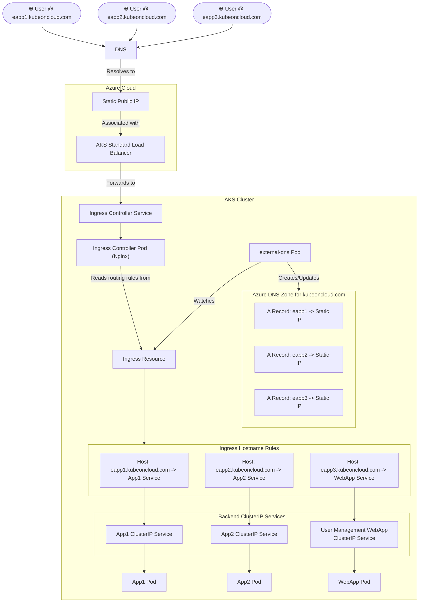

#Cloud #Azure #Kubernetes #AKS #Networking #CoreConcept #Ingress #Routing #DNS #ExternalDNS #HandsOn #Tutorial

>  **Hostname-based routing** is a powerful feature of [[An Introduction to Kubernetes Ingress|Kubernetes Ingress]] that allows you to route traffic to different backend services based on the **hostname** (domain name) of the incoming request. This enables you to host multiple, independent websites or applications on a single public IP address, a concept known as **name-based virtual hosting**.

---

## 🏛️ The Architecture We Will Build

This demo will build on our previous Ingress and DNS setups to deploy three separate applications, each accessible via its own unique subdomain, but all sharing the same Ingress Controller and public IP address.

### Prerequisites
This architecture assumes the following components are already in place from previous lectures:
-   An [[Installing the Nginx Ingress Controller on AKS|Nginx Ingress Controller]] is deployed and associated with a [[Creating a Static Public IP for an AKS Ingress Controller|static public IP address]].
-   An [[Azure DNS Zones and Domain Delegation|Azure DNS Zone]] is configured for a custom domain (e.g., `kubeoncloud.com`).
-   The **`external-dns`** controller is deployed in the cluster. It has permissions (via a Managed Service Identity - MSI) to automatically create and manage DNS records in our Azure DNS Zone.

### The Visual Architecture


**The Workflow:**
1.  We will deploy three distinct applications (`App1`, `App2`, `user-management-webapp`), each with its own internal `ClusterIP` Service.
2.  We will create a **single `Ingress` resource** that defines three **host-based rules**.
3.  The **`external-dns`** controller will see this new Ingress resource and automatically create three `A` records in our Azure DNS Zone, all pointing to the Ingress Controller's static public IP.
4.  When a user browses to `eapp1.kubeoncloud.com`:
    -   DNS resolves this hostname to the static public IP.
    -   The request hits the Ingress Controller.
    -   The Ingress Controller inspects the `Host` header of the request, sees `eapp1.kubeoncloud.com`, and matches it to the corresponding rule.
    -   It then proxies the request to the `App1` service, and the user sees the App1 application.
    -   Crucially, a user accessing `eapp1.kubeoncloud.com` **cannot** access the content of App2 or App3, as the Ingress rule restricts access for that hostname to only the App1 service.

---

## ✍️ The High-Level `Ingress` Manifest

The manifest for hostname-based routing involves adding a `host` key to each rule in the `rules` list.

```yaml
# high-level hostname-routing.yaml
apiVersion: networking.k8s.io/v1
kind: Ingress
metadata:
  name: hostname-routing-ingress
  annotations:
    kubernetes.io/ingress.class: "nginx"
spec:
  rules:
  # Rule 1 for eapp1.kubeoncloud.com
  - host: eapp1.kubeoncloud.com
    http:
      paths:
      - path: /
        pathType: Prefix
        backend:
          service:
            name: app1-clusterip-service
            port:
              number: 80
  # Rule 2 for eapp2.kubeoncloud.com
  - host: eapp2.kubeoncloud.com
    http:
      paths:
      - path: /
        pathType: Prefix
        backend:
          service:
            name: app2-clusterip-service
            port:
              number: 80
  # Rule 3 for eapp3.kubeoncloud.com
  - host: eapp3.kubeoncloud.com
    http:
      paths:
      - path: /
        pathType: Prefix
        backend:
          service:
            name: user-management-webapp-clusterip-service
            port:
              number: 80
```
-   **`host`:** This key is added to each rule. The rule will only apply to requests that have a matching `Host` HTTP header.

---

> [!summary]
> In the upcoming hands-on lectures, we will:
> 1.  Review the YAML manifests for all three application Deployments and their `ClusterIP` Services.
> 2.  Write the complete `Ingress` manifest with the three host-based rules.
> 3.  Deploy all the manifests to our AKS cluster.
> 4.  Verify that `external-dns` has successfully created the `A` records in our Azure DNS Zone.
> 5.  Test the routing by accessing `eapp1.kubeoncloud.com`, `eapp2.kubeoncloud.com`, and `eapp3.kubeoncloud.com` from a browser to confirm that we are correctly routed to each of the three different applications.