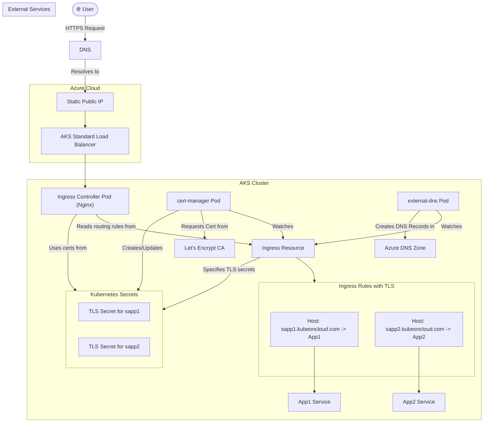

#Cloud #Azure #Kubernetes #AKS #Networking #Ingress #Security #SSL #TLS #CertManager #LetsEncrypt #HandsOn #Tutorial

>  **`cert-manager`** is a native Kubernetes certificate management controller that automates the entire lifecycle of SSL/TLS certificates. It can automatically issue valid, trusted certificates from sources like **Let's Encrypt**, store them in Kubernetes [[Managing Kubernetes Secrets|Secrets]], and configure your [[An Introduction to Kubernetes Ingress|Ingress]] resources to use them for TLS termination. It also automatically handles certificate renewal before they expire.

---

## 🏛️ What is `cert-manager`?

`cert-manager` is a powerful open-source tool that brings certificate management directly into your Kubernetes cluster. Instead of manually generating Certificate Signing Requests (CSRs), purchasing certificates, and configuring them, `cert-manager` automates the entire process.

-   **Native Kubernetes Integration:** It adds new resource types to your cluster, like `Issuer`, `ClusterIssuer`, and `Certificate`, allowing you to manage certificates declaratively with YAML.
-   **Multiple Issuers:** It supports a variety of certificate sources (Issuers):
    -   **Let's Encrypt:** (Our focus) For free, trusted, and publicly recognized certificates.
    -   HashiCorp Vault, Venafi.
    -   Simple signing keypairs or self-signed certificates for development.
-   **Automatic Renewal:** Its most powerful feature. `cert-manager` will monitor your certificates and automatically attempt to renew them at a configured time before they expire, ensuring your services remain secure without manual intervention.

---

## 🏗️ The Architecture We Will Build

This demo will build upon our previous [[Ingress Hostname-Based Routing|hostname-based routing]] setup to add automatic SSL/TLS termination for two separate applications.

### Prerequisites
This architecture assumes the following components are already in place:
-   An [[Installing the Nginx Ingress Controller on AKS|Nginx Ingress Controller]] is deployed.
-   An [[Azure DNS Zones and Domain Delegation|Azure DNS Zone]] is configured for a custom domain.
-   The **`external-dns`** controller is deployed and has permissions to manage records in the DNS Zone.

### The Visual Architecture


**The Automated Workflow:**
1.  We will install `cert-manager` into our cluster.
2.  We will create a `ClusterIssuer` resource that tells `cert-manager` how to communicate with Let's Encrypt.
3.  We will deploy our `App1` and `App2` applications.
4.  We will create a **single `Ingress` resource** that defines host-based rules for `sapp1.kubeoncloud.com` and `sapp2.kubeoncloud.com`. Crucially, this manifest will also include a **`tls` section**.
5.  **The Automation Kicks In:**
    -   The **`external-dns`** controller sees the `host` rules and creates the necessary `A` records in our Azure DNS Zone.
    -   The **`cert-manager`** controller sees the `tls` section. For each host, it:
        -   Automatically creates a `Certificate` resource.
        -   Generates a CSR and communicates with Let's Encrypt to solve a challenge (proving we own the domain).
        -   Receives the signed, valid SSL certificate from Let's Encrypt.
        -   Saves this certificate and its private key into a Kubernetes `Secret` with the name we specified in the `tls` section.
    -   The **Ingress Controller** sees that the secret specified in the `tls` section now exists and automatically loads it to begin terminating HTTPS traffic for that host.

> [!warning] Certificate Issuance Time
> This process is not instantaneous. It can take anywhere from **five minutes to an hour** for the DNS changes to propagate and for Let's Encrypt to issue the certificate. Any misconfiguration can cause significant delays or failures.

---

## ✍️ The High-Level `Ingress` Manifest with TLS

The manifest for enabling SSL is a small but critical addition to our previous hostname-based routing manifest.

```yaml
# high-level ingress-with-tls.yaml
apiVersion: networking.k8s.io/v1
kind: Ingress
metadata:
  name: ingress-with-ssl
  annotations:
    kubernetes.io/ingress.class: "nginx"
    # This annotation tells cert-manager which issuer to use for this Ingress
    cert-manager.io/cluster-issuer: "letsencrypt-staging" 
spec:
  # 1. The 'tls' block is the key for enabling SSL
  tls:
  - hosts:
    - sapp1.kubeoncloud.com
    # This is the name of the Kubernetes Secret where the certificate will be stored
    secretName: sapp1-tls-secret
  - hosts:
    - sapp2.kubeoncloud.com
    secretName: sapp2-tls-secret
  
  # 2. The 'rules' block remains the same as before
  rules:
  - host: sapp1.kubeoncloud.com
    http:
      paths:
        # ... backend service for app1 ...
  - host: sapp2.kubeoncloud.com
    http:
      paths:
        # ... backend service for app2 ...
```
-   **`tls` block:** This is a list where each item defines the TLS settings for one or more hosts.
    -   **`hosts`**: A list of hostnames that will be covered by the certificate.
    -   **`secretName`**: The name of the Kubernetes `Secret` that `cert-manager` will create to store the certificate and private key. The Ingress Controller will then use this secret to terminate TLS.

> [!info] **Staging vs. Production Issuers**
> The instructor mentions using a `staging` issuer from Let's Encrypt. This is a critical best practice. Let's Encrypt has strict rate limits on its production API. When you are first setting up and debugging, always use the **staging issuer**. It provides certificates that are not trusted by browsers but allows you to test your entire setup without hitting production rate limits. Once you confirm everything works, you can switch to the production issuer.

---

> [!summary]
> In the upcoming hands-on lectures, we will:
> 1.  Install `cert-manager` using its Helm chart.
> 2.  Create a `ClusterIssuer` manifest for the Let's Encrypt staging environment.
> 3.  Deploy our two sample applications.
> 4.  Write and deploy the complete `Ingress` manifest with the `tls` section.
> 5.  Verify that `cert-manager` successfully creates the `Certificate` resources and the corresponding `Secrets`.
> 6.  Test the setup by accessing `https://sapp1.kubeoncloud.com` and `https://sapp2.kubeoncloud.com` to confirm that our traffic is encrypted with a valid (though untrusted, because it's from staging) certificate.